# Backup e DataSync con SQL Azure e SQL Server

#### di [Roberto Freato](https://mvp.microsoft.com/en-us/PublicProfile/4028383?fullName=Roberto%20%20Freato)

*Marzo 2012*

In questo articolo verranno discussi i seguenti argomenti:

- Scenari Cloud-Ibridi
- Replica e sincronizzazione database

E le seguenti tecnologie:

- SQL Azure
- SQL Server

In questo articolo analizzeremo un tassello fondamentale di qualsiasi
prodotto Cloud oggi in circolazione: *lo storage relazionale*. Sebbene
siano i movimenti come NoSQL di interesse rinnovato, è rimasto oggi essenziale l’utilizzo di un qualsiasi database relazionale in qualsivoglia progetto o applicazione IT di medie dimensioni. SQL Azure è
così il database relazionale principe della piattaforma di Cloud Computing di Microsoft; si può però dire che, sebbene SQL Azure stia ad
una applicazione distribuita su Windows Azure come SQL Server stia ad
una applicazione on-premise, esso non sia uno strumento da usare esclusivamente in scenari cloud-driven o più generalmente cloud-oriented: SQL Azure infatti è assimilabile ad un database remoto,
portatore quindi dei vantaggi (e delle criticità) di questo genere di
prodotto nelle applicazioni distribuite.

Scenari di business in hybrid-cloud
-----------------------------------

L’introduzione era volta a portarci a considerare la possibilità di
implementare alcuni “nuovi modelli” in cui l’architettura cloud e
on-premise sia cooperante, noti anche come scenari di hybrid cloud. Il
termine ibrido ci porta a pensare ad una architettura “un po’ cloud” e
“un po’ on-premise”, organizzandone le parti in modo sinergico. Gli
scenari ibridi sono, per la loro intrinseca complessità (dovuta anche
solo al semplice fatto di dover avere a che fare con un numero maggiore
di tecnologie), uno scenario spesso non desiderato direttamente, ma
auspicato come coadiuvante di una fusione tra sistemi complessi o come
modello abilitante ad una complessa migrazione o in genere ove si voglia
preservare benefici di un precedente modello, affiancandone uno nuovo.

Alcuni scenari tipici, relativamente al piccolo insieme del Cloud
Computing, nel grande panorama IT sono:

- Architetture N-tier distribuite parzialmente su cloud e sistemi on-premise
- Software-as-a-service dipendente da alcuni elementi on-premise (autenticazione, sistemi legacy)
- Applicazioni on-premise con accesso ai dati in Cloud Replica dei dati sul Cloud per smart client o per dispositivi mobile

In tutti i casi sopra, l’abilità dell’architetto IT sarà quella di
identificare la tecnologia più “fitting” all’interno di un pool di
tecnologie compatibili, minimizzando la complessità implementativa e
quindi di riflesso i costi legati al mantenimento di una soluzione per
certi versi “doppia”.

Gli ultimi due scenari sono legati ai dati e sono esemplificativi di due
importanti realtà ben inquadrate: il primo evidenzia come i databases
Cloud e più in generale gli storage remoti possano essere un forte
backend per applicazioni disconnesse, a patto di avere una rete internet
affidabile; il secondo evidenzia la necessità di replicare i dati online
per l’accesso da dispositivi mobili o per necessità di ridondanza.

Necessità di backup, replica e sincronizzazione
-----------------------------------------------

SQL Azure è di fatto un endpoint TDS (Tabular Data Stream) fornito da
Azure, in alta disponibilità e alta affidabilità. I fini implementabili
a partire da un concetto così omnicomprensivo sono molti. A partire
dall’esempio del paragrafo precedente, si potrebbe utilizzare SQL Azure
come “semplice” SQL Server remoto a backend di una applicazione client,
il cui effort implementativo necessario sarebbe solo quello relativo
alla migrazione di un database on-premise e il relativo aggiornamento
delle stringhe di connessione.

In secondo piano, ma non di secondaria importanza, sono sorti alcuni
scenari interessanti per utilizzare SQL Azure come replica di SQL
Server. L’orientamento al disaster recovery più che la reale necessità
di soluzioni distribuite ha accelerato la migrazione dei propri database
su server esterni, remoti e “lontani dai pericoli”: se poi vogliamo
aggiungere a questo l’accessibilità diretta da dispositivi mobili*, il
differenziale della replica cloud diventa ancor più tangibile*. Ed ecco
perché Microsoft già dalla prima CTP di Azure parla di backup e
sincronizzazione su SQL Azure, oggi disponibili al grande pubblico con
un prodotto e un tool, rispettivamente il SQL Azure Data Sync e
l’Import/Export feature.

Panoramica su Import and Export 
--------------------------------

Import and Export Data è un tool molto utilizzato già in ambienti
on-premise per il trasferimento dei database objects da una sorgente ad
una destinazione. Si parla di Import/Export quando ci si voglia riferire
ad un caso in cui si debbano trasferire sia lo schema che i dati, ma in
particolare proprio i database objects del nostro database.

Con la funzione di Import nella console amministrativa di SQL Azure,
abbiamo la possibilità di importare un BACPAC (che conterrà schema e
dati) all’interno del nostro server, come in Figura 1.

Figura 1 - Importazione di un BACPAC su SQL Azure

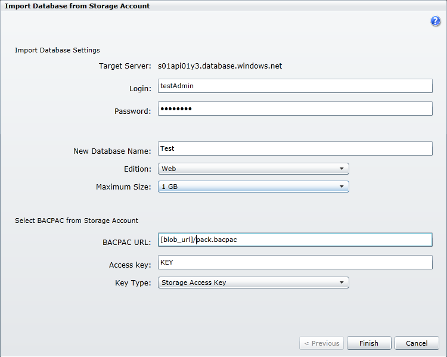

Al contrario, con la funzione di Export si è in grado di esportare un
intero database SQL Azure (in modalità assolutamente asincrona) verso un
bacpac destinazione sull’Azure Storage account dell’utente, come in
Figura 2.

Figura 2 - Procedura di Export di un database SQL Azure

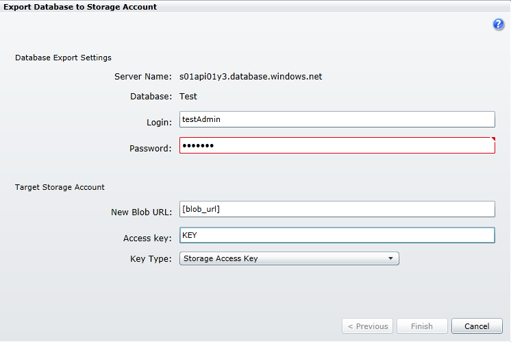

Questo tool permette quindi di importare ed esportare facilmente un
database on-premise da/verso il suo corrispondente on-the-cloud, senza
tool locali o complesse console amministrative. Infine, se si volessero
sincronizzare i dati con SQL Azure Data Sync, al fine di mantenere una
copia identica del database sul Cloud, questo procedimento di
importazione appena descritto è comunque necessario in via preliminare,
al fine di trasportare tutti gli oggetti database (stored procedures in
primis) che non vengono copiati dal Data Sync.

Panoramica di SQL Azure DataSync
--------------------------------

Una delle funzionalità più interessanti di Data Sync è la possibilità di
tenere sincronizzati N database SQL Azure tra essi stessi o con N
database on-premise su SQL Server.

Il resto è materia già trattata in qualsiasi teoria relativa alla
sincronizzazione dati: **porzioni di sincronizzare, strategie di
risoluzione dei conflitti e intervallo di aggiornamento** sono infatti
elementi comuni a tutti i contesti operativi in cui sia necessario
mantenere più copie allineate di un dato oggetto.

Figura 3 - SQL Azure Data Sync

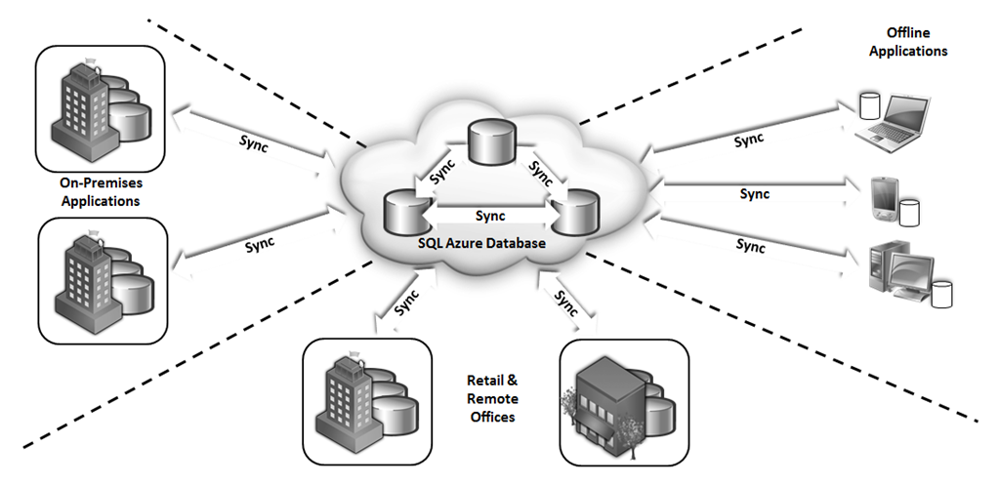
Per seguire passo-passo il tutorial a seguire, è necessario avere:

- SQL Server 2005 SP2 o superiori
- Connessione ad internet

SQL Azure Data Sync è uno strumento cloud completamente integrato nella
console amministrativa di Windows Azure; vedremo come sincronizzare un
database locale esistente con uno remoto, seguendo questi passi:

1.  Provisioning del server DataSync

2.  Configurazione dei membri SQL Server

3.  Configurazione dei membri SQL Azure

4.  Impostazione del gruppo di sincronizzazione e deploy

Provisioning del server DataSync
--------------------------------

La prima mossa da compiere è creare il server di sincronizzazione, sulla
falsa riga della creazione di un nuovo server SQL Azure. Da qualche
settimana è disponibile sul Management Portal di Windows Azure il tab
“Data Sync”, in cui in alto a sinistra è possibile cliccare su
“Provision” e creare il server come in Figura 4:

Figura 4 - Provisioning del server di Data Sync
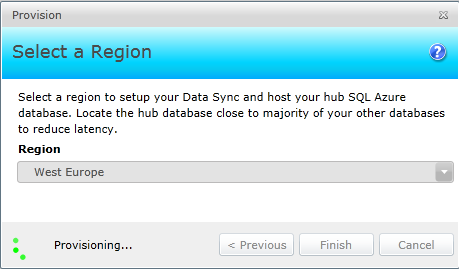

È ora necessario creare un Sync Group (gruppo di sincronizzazione)
cliccando “Create” dopo aver selezionato il server Data Sync nel menù in
Figura 5:

Figura 5 - Menù di Data Sync

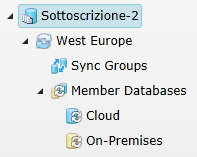

Vi si aprirà la Figura 6, dove potrete aggiungere i server cloud e
quelli on-premise.

Figura 6 - GUI del gruppo di sincronizzazione

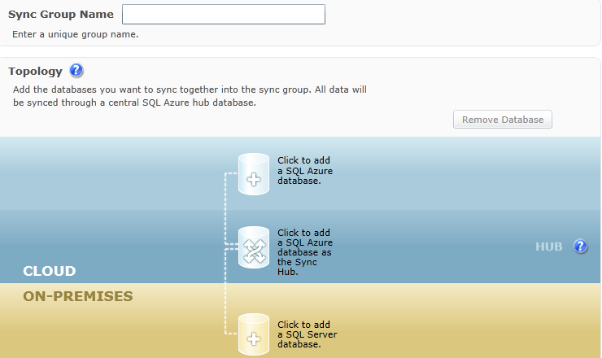

Configurazione dei membri SQL Server
------------------------------------

Per i nuovi database è necessario selezionare l’opzione in Figura 7, nel
wizard di aggiunta database:

Figura 7 - Aggiunta di un database on-premise al ring di sincronizzazione

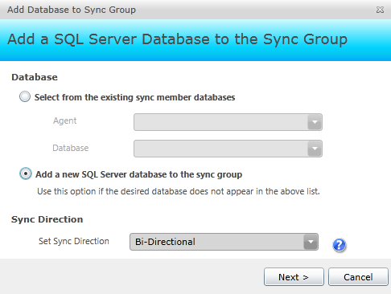

Se è la prima volta, occorrerà creare un nuovo agente, come un Figura 8:

Figura 8 - Installazione del nuovo agente sulla macchina on-premise

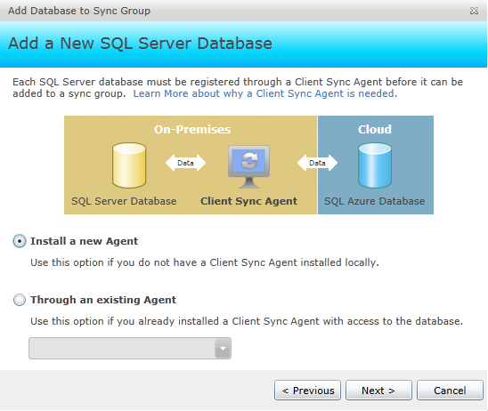

Seguendo tre passi: download ed installazione del client, inserimento
del nome dell’agente e copia negli appunti della chiave da fornire
all’agente locale per l’autenticazione con Data Sync.

Durante l’installazione del Client Sync Agent, vi verrà chiesto di
fornire una credenziale (che dovrà avere permessi di rete e di accesso a
SQL Server). Una volta installato, bisognerà avviare l’applicazione e
completare il setup con queste due operazioni:

1. Aggiunta della chiave
2. Aggiunta di ogni database che si voglia sincronizzare

La chiave verrà aggiunta come in Figura 9:

Figura 9 - Configurazione della chiave dell'agente

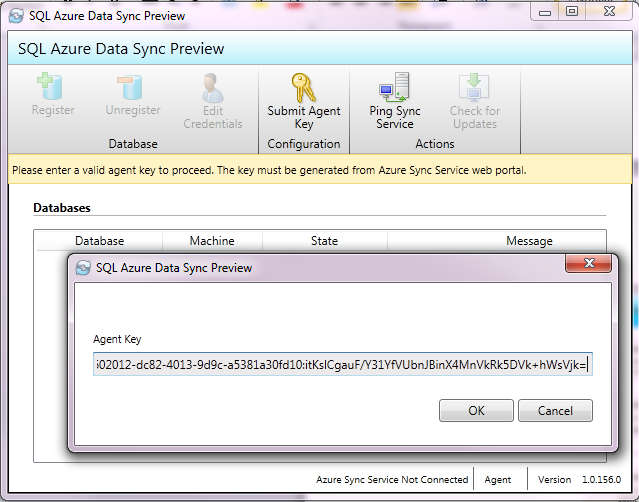

Dopodiché occorrerà seguire la procedura di “Register” per ogni database
desiderato, come in Figura 10:

Figura 10 - Registrazione di un DB nell'agente

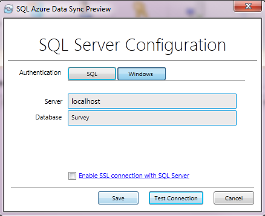

Ora l’agente sarà in esecuzione con un database registrato: possiamo
quindi tornare al wizard nell’Azure Portal e completare la procedura,
selezionando il database ora presente nella lista in Figura 11:

 
Figura 11 - Completamento della registrazione di un database lato Data Sync

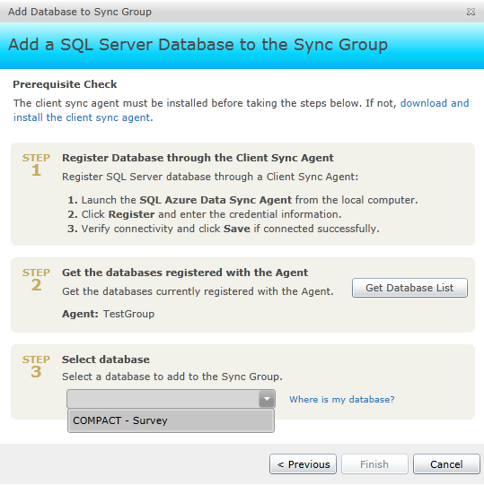

Otteniamo così un gruppo di sincronizzazione con un solo database
on-premise.

Configurazione dei membri SQL Azure
-----------------------------------

Per aggiungere i server membri su SQL Azure e/o l’HUB (il server
centrale su SQL Azure) è necessario tornare alla schermata in Figura 6 e
cliccare sul wizard relativo all’aggiunta di un nuovo database SQL
Azure, seguendo le istruzioni come in Figura 12:

Figura 12 - Aggiunta di un DB SQL Azure al ring

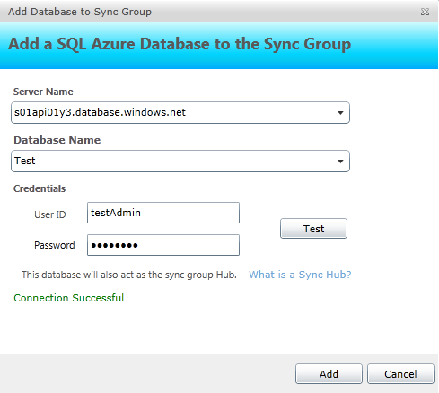

Ora i database del ring di *sincronizzazione* sono configurati e si può
procedere alle ultime impostazioni.

Impostazione del gruppo di sincronizzazione e deploy
----------------------------------------------------

Se sono stati effettuati i passi corretti, il Sync Group dovrebbe essere
simile a quello in Figura 13:

Figura 13 - GUI del ring di sincronizzazione configurato

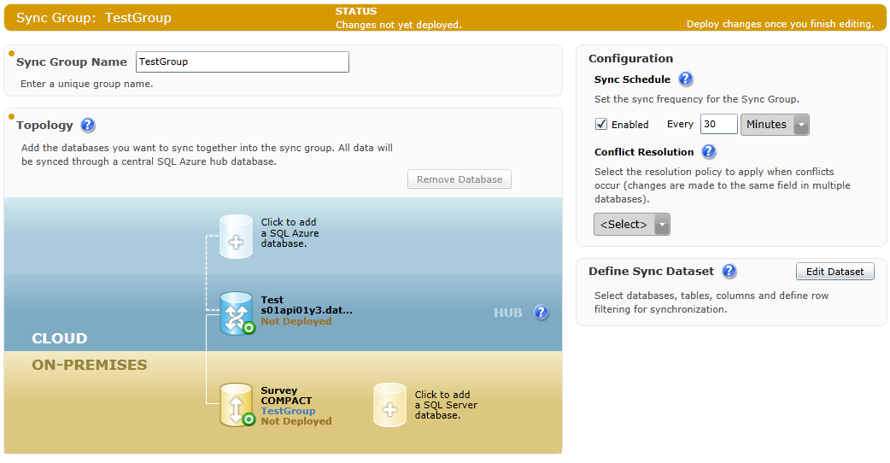

Rimane da definire che set di dati occorra sincronizzare, cliccando su
“Edit Dataset”. Nel nostro caso, come in Figura 14, decidiamo di
sincronizzare il contenuto del database on-premise (che consta della
sola tabella emps), impostando un intervallo di sincronizzazione di 30
minuti e una politica di gestione dei conflitti “Client Wins” (che
stabilisce che in caso di conflitto abbia la meglio il DB on-premise).

Figura 14 - Definizione del dataset di sincronizzazione

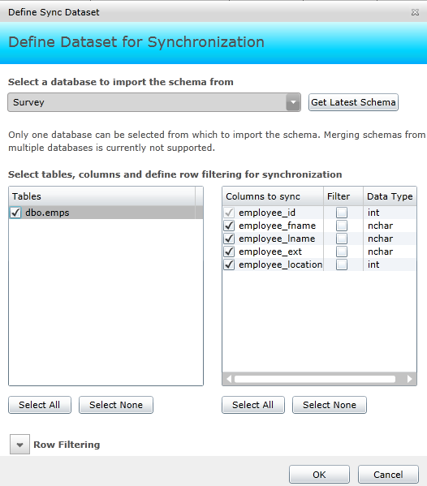

Alla fine, cliccheremo su “Deploy” per mettere in esecuzione il server
di Data Sync ed avremo concluso.

Conclusioni
-----------

In questo articolo abbiamo visto come utilizzare lo storage relazionale
di Windows Azure per sincronizzare il contenuto di un database
on-premise. Inoltre abbiamo esplorato il tool di Import/Export Data di
SQL Azure, per la migrazione in ingresso o in uscita dello schema e dei
dati da/verso database SQL Server.

#### di [Roberto Freato](https://mvp.microsoft.com/en-us/PublicProfile/4028383?fullName=Roberto%20%20Freato) - Microsoft MVP

