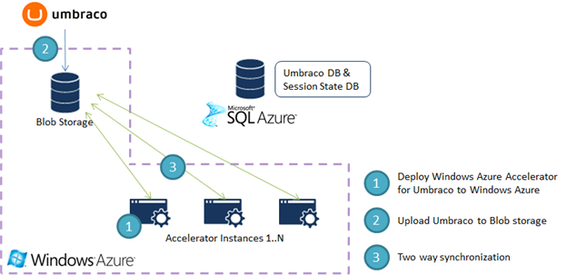
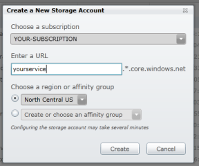
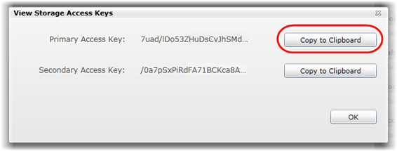
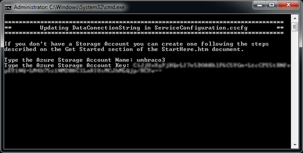
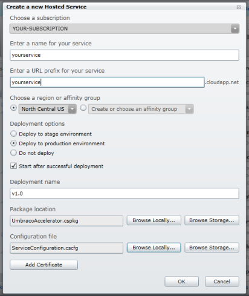
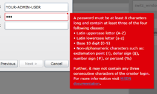
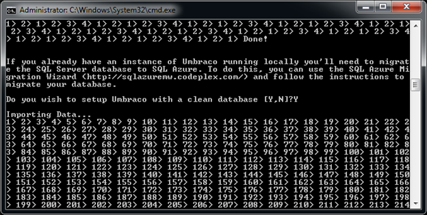
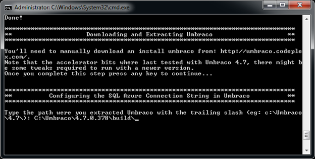
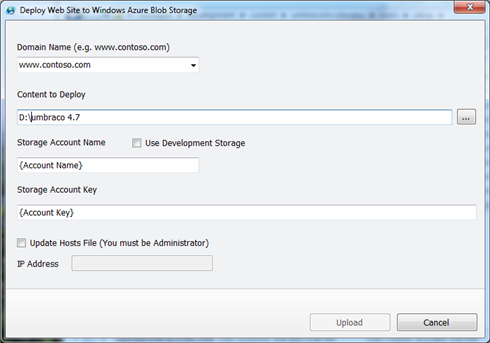

# Installazione su Windows Azure di Umbraco 4.7.x

#### Di [Roberto Freato](https://mvp.support.microsoft.com/profile=9F9B3C0A-2016-4034-ACD6-9CEDEE74FAF3)

*Marzo 2012*

In questo articolo verranno discussi i seguenti argomenti:

- Supporto di soluzioni Open-Source su Windows Azure
- Deployment del CMS Umbraco su Windows Azure
- Windows Azure Accelerator for Umbraco (CodePlex)

E le seguenti tecnologie:

- Windows Azure
- Windows Azure Storage
- SQL Azure

In questo articolo analizzeremo l’importanza dei CMS OpenSource e il
loro effettivo utilizzo negli ambienti commerciali, che ne hanno
decretato l’adozione di massa da parte di una serie di realtà di diverse
dimensioni, dalle PMI alle grandi realtà industriali. Partiremo con una
panoramica dei CMS OpenSource sviluppati in ambiente .NET, evidenziando
come essi siano nativamente compatibili con Windows Azure a meno di
alcune customizzazioni; parleremo poi del perché sia una scelta
ragionevole “portare” il proprio CMS sul Cloud Computing, di qualsiasi
vendor esso sia, con particolare focus su Windows Azure; vedremo perché
Umbraco CMS è diventato popolare e quali siano le sue caratteristiche in
un ambiente distribuito; arriveremo poi all’acceleratore di deployment
di Umbraco su Windows Azure, che ci permetterà di distribuire con
discreta semplicità la nostra installazione del popolare CMS sul Cloud
di Microsoft.

Panoramica dei CMS OpenSource in ambiente .NET
----------------------------------------------

Di progetti CMS in ASP.NET in circolazione ce ne sono parecchi, in
particolare progetti OpenSource ospitati su CodePlex. Spesso però i
progetti Open nascono con le migliori intenzioni e finiscono (magari
dopo pochi emozionanti attimi) con la bocciatura dal mondo community che
non mostra interesse e/o non supporta il progetto. Questo non significa
che ci siano prodotti oggettivamente migliori di altri, ma che per la
natura community-based dei progetti Open-Source, spesso quelli diventati
popolari lo sono diventati grazie anche ad un insieme di fattori che ne
hanno determinato l’interesse delle aziende e il coinvolgimento
gradualmente crescente della community di sviluppatori.

Uno di questi esempi è certamente DotNetNuke, uno dei più popolari CMS
multi-site e uno dei progetti dal retaggio più corposo, oggi in
circolazione e utilizzo. DotNetNuke permette la creazione di un Site
Host e di N Portal Sites subordinati, il che facilità enormemente quegli
scenari in cui una azienda di servizi deve centralizzare il controllo di
molte infrastrutture a portale per clienti diversi. Il concetto di
“moduli” permette l’estensione di DotNetNuke con discreta facilità,
utilizzando Visual Studio e ASP.NET.

Il debuttante Orchard CMS è stato oggetto di notevole investimento da
parte di Microsoft nell’ultimo anno ed ha visto la luce da relativamente
poco. Essendo basato sulle ultime tecnologie ed essendo già molto
adottato e ben recepito dalla community di sviluppatori, Orchard è oggi
il CMS scritto in .NET che più si potrà avvicinare al competitor
Wordpress, per la sua facilità di gestione, di layouting e di
provisioning dei plugin.

Infine trattiamo Umbraco, lasciato per ultimo solo perché da qui
partiremo in una indagine più approfondita volta a dimostrare la sua
semplicità di deployment in un ambiente “super-distribuito” come quello
del Cloud Computing di casa Microsoft, Windows Azure.

Panoramica su Umbraco
---------------------

Umbraco è un CMS molto popolare, scritto completamente in C\# e basato
su architetture e tecnologie Microsoft. Prima della versione 4.5 Umbraco
era rilasciato con una combinazione di licenze Open-Source, mentre oggi
è interamente rilasciato sotto licenza [OSI approved MIT
License](http://opensource.org/licenses/mit-license.html). La sua storia
decennale ebbe inizio nel 2000, quando fu sviluppato per la prima volta,
raggiungendo l’apice del successo nel 2010, quando la sua popolarità
(misurata in numero di download), era seconda solo a DotNetNuke. Il
backend di Umbraco è distribuito tra IIS e Microsoft SQL Server e
attualmente può girare in Full Trust e Medium Trust . La versione a cui
facciamo riferimento in questo articolo è la 4.7.1 anche se Umbraco è
disponibile fino alla versione 5 .

> **Nota: Esiste una versione staccata (branched) da quella mainstream
    che supporta il Medium Trust.**

> **Nota: La versione 5 di Umbraco ha un supporto nativo all’accesso
    allo storage di Azure, quindi per chi iniziasse una nuova
    implementazione, il consiglio è di usare nativamente il supporto al
    cloud introdotto di recente.**

Perché utilizzare Windows Azure per un CMS
------------------------------------------

Sebbene sembri almeno pretestuoso in questo contesto, nulla è più
indicato al deployment nel Cloud di un CMS. Il perché sta nell’obiettivo
che la stragrande maggioranza dei CMS ha, ovvero fornire un portale
scalabile cercando di ridurre al minimo lo sforzo per renderlo tale e
per attuare il ridimensionamento dell’infrastruttura in seguito ad
eventi esterni. Infatti è noto l’utilizzo dei CMS per le grandi testate
giornalistiche, le grandi riviste di moda e non solo; i blog e le fonti
di informazione secondarie e tutto un ecosistema di player dell’online
publishing, il cui scopo è fornire il servizio (l’informazione) al suo
lettore. Molti CMS vengono anche utilizzati nelle piccole intranet
aziendali, ma non è questo il caso in cui Windows Azure e il Cloud
Computing in generale possano essere sfruttati al meglio.

A latere della scelta strategica del CMS da utilizzare per la propria
soluzione è infatti noto che al crescere delle richieste, delle
“page-views”, degli utenti unici e più in generale, del traffico
internet, si dovranno allocare maggiori risorse, operazione che tolti i
problemi minori, introduce un effort amministrativo notevole per la
riconfigurazione di tutta l’infrastruttura a supporto delle logiche
web-farm. Se poi questo ridimensionamento dovesse essere variabile nel
tempo, anche con granularità giornaliera (si pensi alle testate
giornalistiche nei periodi di elettorali, per esempio) lo sforzo
diventerebbe difficilmente sostenibile, oppure a discapito di un altro
fattore importante: il costo.

Windows Azure si interpone tra la scelta strategica e quella IT relativa
all’ambiente di deployment, perché incapsula già un notevole risparmio
intrinseco dovuto al deployment forzato in ambiente web-farm e,
trattandosi di Cloud, perché il modello di billing rispecchierà
l’effettivo carico del nostro sistema. Ma rimane ancora un problema:
come dobbiamo configurare un prodotto come Umbraco, rilasciato pronto
per funzionare su ambiente single-server, per farlo funzionare con
Windows Azure, in completa assenza di controllo sulla/e macchina/e
destinazione e senza le semplificazioni del FileSystem? La complessa
soluzione è contenuta e mascherata da un altro progetto Open:
l’acceleratore di Umbraco per i deployment su Windows Azure o Windows
Azure Accelerator for Umbraco .

Acceleratore di Umbraco per Windows Azure
-----------------------------------------

L’acceleratore di Umbraco per Windows Azure è stato sviluppato per fare
in modo che le applicazioni Umbraco vengano facilmente distribuite su
Windows Azure, beneficiando quindi del ridotto effort amministrativo di
Azure, della sua alta affidabilità garantita e della scalabilità
by-design fornita.

La Figura 1 mostra come funziona l’acceleratore. Esso è una complessa
applicazione distribuita che sincronizza le istanze di Umbraco tra
l’Hosted Service e il Blob Storage di Windows Azure. Inoltre,
avvalendosi della struttura Full IIS di Azure (a partire dalla versione
1.3), è possibile ospitare più siti web nella stessa Hosted Application.
L’acceleratore si prenderà carico della sincronizzazione di ogni nuovo
Web Site, nel momento in cui esso verrà caricato nell’Azure Storage.

> Nota:
    https://github.com/WindowsAzure-Accelerators/wa-accelerator-umbraco
> Nota: SLA del 99.95% in configurazione normale, 2 istanze per ruolo.

Figura 1 - Architettura dell'acceleratore per Umbraco

Per utilizzare gli script che stiamo andando ad elencare ed analizzare è
necessario avere installato:

- [Visual Studio 2010 e .NET
    4.0](http://msdn.microsoft.com/vstudio/products/)
- [Windows Azure SDK e Visual Studio Tools for Windows Azure 1.4
    (o superiore)](http://go.microsoft.com/fwlink/?LinkID=128752)
- [SQL Express 2008 R2 (con SQL Server
    Management Studio)](http://www.microsoft.com/express/sql/download/)
- [Windows Azure Accelerator for
    Umbraco](https://github.com/WindowsAzure-Accelerators/wa-accelerator-umbraco)

Una volta eseguito l’archivio autoestraente dell’acceleratore, si devono
seguire questi passi:

1.  Creazione dello storage account per Umbraco
2.  Esecuzione dello script di setup
3.  Deployment dell’acceleratore su Azure
4.  Creazione di un server SQL Azure
5.  Configurazione di Umbraco nello script di setup

Creazione dello storage account per Umbraco
-------------------------------------------

Si comincia con la creazione di un account di storage dedicato
all’acceleratore. È necessario loggarsi al portale di Windows Azure e
selezionare New Storage Account . Nella Figura 2 specificare la
subscription, il nome dello storage e la regione di creazione.

> Note: Si è scelta la lingua inglese poiché la maggioranza del
    materiale informativo di riferimento è in inglese. Se il portale di
    Windows Azure fosse visualizzato in Italiano, sarebbe sufficiente
    cambiare la lingua di visualizzazione nella schermata principale
    di avvio.

Figura 2 – Creazione dell’Account di Storage

Una volta creato ottenere la chiave di accesso (primaria o secondaria)
come in Figura 3 e copiarla negli appunti.

Figura 3 - Copia negli appunti della chiave di accesso

Ora è il momento di eseguire lo script di setup (Setup.cmd) presente
nella directory dell’acceleratore ed inserire la coppia nome/key
dell’account di storage appena creato.

Figura 4 - Esecuzione dello script ed inserimento dei parametri

Deployment dell’acceleratore su Azure
-------------------------------------

È il momento di aprire Visual Studio ed in particolare la soluzione
“Umbraco” nella cartella Code dell’acceleratore. Una volta aperto il
progetto Cloud, selezionare Package su progetto “UmbracoAccelerator” .

> **Nota: di default, nella definizione del servizio è impostato
    l’utilizzo di macchine virtuali Extra-Small: per cambiarle
    modificare a mano o con Visual Studio il
    file ServiceDefinition.csdef.**

Procediamo ora con la creazione di un nuovo “Hosted Service” dal
pannello di controllo Windows Azure, come in Figura 5: selezioniamo il
nome del servizio, l’Url, la regione e il percorso del pacchetto di
deployment appena creato.

Figura 5 - Creazione del servizio Hosted di Azure

Prima di confermare, come in Figura 6, aggiungiamo il certificato
Remote.pfx, presente nella cartella assets dell’acceleratore (password:
q3&d3new7@0):

Figura 6 - Aggiunta del certificato

Infine aspettiamo 10-15 minuti che il deployment su Windows Azure sia
completato, prima di procedere.

Creazione di un server SQL Azure
--------------------------------

Se non è mai stato creato un SQL Azure Server prima d’ora, almeno nella
subscription utilizzata, è il caso di seguire queste veloci istruzioni.
Nel pannello di controllo di Azure, selezionare “New Database Server” e
poi “Create”, nell’area “Server” della ribbon. Selezionata la regione è
necessario specificare l’utenza di amministrazione e la password
amministrativa come in Figura 7 e confermare. Vedremo apparire
nell’elenco dei server il nostro, con al suo interno il solo database
master.

Figura 7 - Creazione del SQL Azure Server

    

È il momento di tenere nota del nome del server creato e delle
credenziali di accesso amministrativo e di aprire temporaneamente il
firewall del server per consentire l’accesso remoto dalla propria
macchina .

> **Nota: Per una apertura completa del firewall del server SQL Azure
    è necessario impostare una regola di grant che abbia come start ip
    0.0.0.0 e end ip 255.255.255.255. Si prega di considerare che questa
    configurazione è la più insicura possibile, pertanto modificarla non
    appena venga terminata la procedura.**

Configurazione di Umbraco nello script di setup
-----------------------------------------------

Ora torniamo alla shell che abbiamo lanciato poc’anzi dopo aver inserito
la configurazione dello storage; ci verranno chieste le credenziali di
accesso a SQL Azure, per cui riportiamo quelle appena annotate sopra (o
in caso di server pre-esistente, annotare quelle). Una volta confermato,
verrà creato lo schema del database e verrà chiesto se procedere ad una
installazione clean . In questo caso partirà uno script di creazione
della durata di qualche secondo, come in Figura 8.

> **Nota: L’alternativa è utilizzare un database esistente e migrarne
    i contenuti.**

Figura 8 - Creazione di un DB pulito su SQL Azure

Nel frattempo è necessario scaricare l’ultima versione di Umbraco
(l’ultima supportata è la 4.7) ed estrarla in una location nota; lo
script chiederà tale location una volta terminato lo script di
importazione dati su SQL Azure, come in Figura 9, per customizzare
automaticamente le impostazioni del Web.config di Umbraco.

Figura 9 - Individuazione del path di installazione di Umbraco

Alla fine verrà chiesto che database utilizzare per salvare la Session
State dell’applicazione; il server di destinazione sarà lo stesso
specificato prima.

*Il processo è ora quasi completato*: a questo punto la shell avvierà un
tool grafico utile ad inviare all’Azure Storage i file di Umbraco. Come
in Figura 10, bisognerà specificare dove si trovi l’installazione di
Umbraco customizzata, l’account dell’Azure Storage e l’Account Key.
Inoltre, siccome è necessario specificare a che Host Header dovrà
rispondere il portale appena creato, si può aggiungere una riga al
proprio file Hosts automaticamente, scegliendo l’opzione “Update Hosts
File”. Questo consentirà di raggiungere l’hostname indicato sul server
di Azure, prima di modificare effettivamente i DNS di produzione.

Figura 10 - Tool di upload di Umbraco su Azure Storage

Conclusioni
-----------

In questo articolo abbiamo analizzato i benefici derivanti dall’utilizzo
congiunto di un CMS e del Cloud Computing, in particolare il deployment
di Umbraco 4.7 su Windows Azure. Abbiamo inoltre utilizzato a tal scopo
un acceleratore Open-Source disponibile su CodePlex per semplificare le
attività di customizzazione. Per un dimostrazione della procedura
pratica spiegata in questo articolo, si rimanda alla visione del video:
“Installazione di Umbraco su Windows Azure”.

Riferimenti
-----------

Parte degli screenshot utilizzati per questo articolo sono stati presi
dalla documentazione ufficiale dell’acceleratore di Umbraco, presente al
sito:
https://github.com/WindowsAzure-Accelerators/wa-accelerator-umbraco.

Approfondimenti
---------------

- Aggiungere istanze alla soluzione Azure
- Implementare una architettura multi-site
- Utilizzare AppFabric per la gestione della Session State
- Utilizzare CDN peri contenuti statici
- Integrare ACS per l’autenticazione
- Creare i record DNS

#### di Roberto Freato ([blog](http://dotnetlombardia.org/blogs/rob/default.aspx)) - Microsoft MVP

