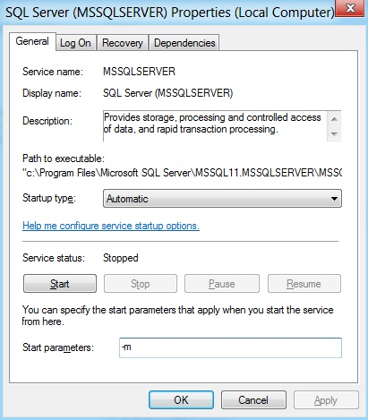
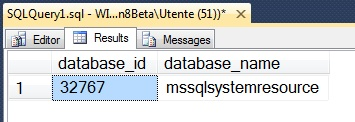
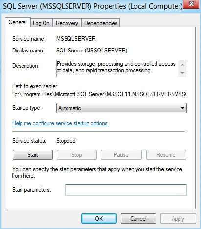
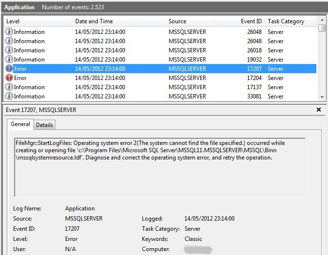

# SQL Server: Database Resource e gli oggetti di sistema

#### Di [Sergio Govoni](https://mvp.microsoft.com/en-us/PublicProfile/4029181?fullName=Sergio%20Govoni) – Microsoft Data Platform MVP

English Blog: <http://sqlblog.com/blogs/sergio_govoni/default.aspx>

UGISS Author: <https://www.ugiss.org/author/sgovoni>

Twitter: [@segovoni](https://twitter.com/segovoni)


*Maggio 2012*

Introduzione
============

Durante la sessione di approfondimento [Le 3 DMV fondamentali per tutti](http://www.sqlconference.it/events/2012/sessions.aspx#a83), che ho tenuto alla [SQL Server & Business Intelligence Conference 2012](http://www.sqlconference.it/events/2012/default.aspx), ho presentato le DMV dicendo che sono state implementate a partire da SQL Server 2005, sono disponibili in tutti i database, ma non esistono in nessun database utente! Infatti, l'esistenza reale di questi oggetti è all'interno del database **Resource**, che però non è visibile a occhio nudo neppure utilizzando SQL Server Management Studio.

Quest'affermazione ha stimolato la curiosità di alcuni partecipanti, che mi hanno chiesto informazioni più approfondite circa questo DB, che si aggiunge ai già noti database di sistema [master](http://msdn.microsoft.com/it-it/library/ms187837.aspx), [model](http://msdn.microsoft.com/it-it/library/ms186388.aspx), [msdb](http://msdn.microsoft.com/it-it/library/ms187112.aspx) e [tempdb](http://msdn.microsoft.com/it-it/library/ms190768.aspx).

In questo articolo parleremo quindi del DB Resource, non solo per la sua caratteristica di contenitore unico e unificato degli oggetti di sistema, ma anche per la sua importanza negli scenari di disaster recovery.


Database Resource 
=================

Il database Resource è un DB di sistema, accessibile in sola lettura, che contiene tutti gli oggetti di sistema disponibili in SQL Server. Gli oggetti che troviamo nello schema *sys* sono memorizzati fisicamente nel database Resource e questo garantisce la loro visibilità in ogni DB. Le DMV (DMVs e DMFs) appartengono allo schema *sys*, sono oggetti di sistema; da qui l'affermazione iniziale.

La presenza del database Resource semplifica la procedura di aggiornamento a una nuova versione di SQL Server, l'applicazione di un Service Pack o di un Cumulative Update. Nelle versioni di SQL Server precedenti a SQL Server 2005, l'aggiornamento o l'applicazione di un service pack prevedeva l'eliminazione e la creazione degli oggetti di sistema su ogni database presente nell'istanza al momento dell'aggiornamento. Da SQL Server 2005 in poi, poiché tutti gli oggetti di sistema sono contenuti nel database Resource, l'aggiornamento è centralizzato e limitato ai file fisici (MDF e LDF) di questo database che sono rispettivamente:

- mssqlsystemresource.mdf (master data file)
- mssqlsystemresource.ldf (log data file)


Dove si trovano i file del database Resource? 
=============================================

In SQL Server 2008 (R2) e SQL Server 2012, i file del database Resource si trovano rispettivamente in:

- *&lt;drive&gt;:\\Programmi\\Microsoft SQL
    Server\\MSSQL10\_50.&lt;nome\_istanza&gt;\\MSSQL\\Binn\\*

- *&lt;drive&gt;:\\Programmi\\Microsoft SQL
    Server\\MSSQL11.&lt;nome\_istanza&gt;\\MSSQL\\Binn\\*


In SQL Server 2005 i file del database Resource si trovano e devono risiedere sempre nella stessa directory in cui sono installati i file del database master, che by design si trovano qui:

- *&lt;drive&gt;:\\Programmi\\Microsoft SQL
    Server\\MSSQL.1\\MSSQL\\Data\\*

Nelle precedenti versioni di SQL Server, in particolare con SQL Server 2000, durante l'implementazione di un processo di disaster recovery eravamo abituati a trattare solo con i database di sistema "visibili" e in particolare il database master. Un piano di disaster recovery per SQL Server 2005+ deve necessariamente tener conto della presenza del database Resource perché i file di questo DB devono risiedere nella directory che ospita i file del database master, in seguito tratteremo l'accesso al database Resource e le modalità di backup.

La figura seguente illustra una parte del contenuto della cartella:

- *C:\\Program Files\\Microsoft SQL
    Server\\MSSQL11.MSSQLSERVER\\MSSQL\\Binn*

che ospita i file mssqlsystemresource.mdf e mssqlsystemresource.ldf per l'istanza MSSQLSERVER relativa ad una installazione di SQL Server 2012.


Figura 1 - Directory che ospita i file del database Resource

Il seguente frammento di codice in linguaggio T-SQL restituisce informazioni circa la versione del database Resource e la data/ora dell'ultimo aggiornamento.

```SQL
SELECT
    SERVERPROPERTY('ResourceVersion') ResourceVersion,
    SERVERPROPERTY('ResourceLastUpdateDateTime') ResourceLastUpdateDateTime;
GO
```

L'output è illustrato in figura 2:


Figura 2 - Versione e data/ora ultimo aggiornamento del database Resource


Accesso al database Resource 
============================

Ci sono due modi per accedere al database Resource, il primo consiste nel copiare i file mssqlsystemresource.mdf e mssqlsystemresource.ldf in una cartella diversa da quella in cui si trovano, dopo aver arrestato il servizio principale di SQL Server. Una volta copiati i file e riavviato il servizio, sarà possibile effettuare l'attach dei file copiati creando un nuovo DB con nome differente da "mssqlsystemresource". Il DB creato sarà accessibile e le modifiche effettuate su questa copia **non** avranno ovviamente effetto sul database Resource di sistema. Il secondo metodo consiste nell'avviare il servizio principale di SQL Server in single user mode ovvero con il flag "-m" nei parametri di avvio (del servizio), come illustrato in figura 3.



Figura 3 - Avvio del servizio principale di SQL Server in single user mode

SQL Server Management Studio non potrà comunque visualizzare il database Resource perché quest'ultimo è un DB nascosto; potrete però accedervi cambiando il database context con il comando:

```SQL
USE [mssqlsystemresource];
GO
```

Potrete quindi verificare di essere effettivamente connessi al database Resource eseguendo lo statement riportato di seguito, il cui output è illustrato in figura 4.

```SQL
SELECT
    DB_ID() AS database_id
    ,DB_NAME() AS database_name;
GO
```




Figura 4 - Connessione al database Resource

Si noti il valore di default assegnato all'ID che identifica in modo univoco il database Resource, by design questo valore è uguale a 32767.

Ora che abbiamo visto con i nostri occhi questo database "nascosto", riavviamo il servizio SQL Server in multi user mode senza specificare alcun flag nei parametri di avvio del servizio, come illustrato in figura 5.



Figura 5 - Avvio del servizio SQL Server in multi user mode


Importanza del database Resource 
================================

Come gli altri database di sistema anche il database Resource rappresenta un DB critico. Il servizio principale di SQL Server dipende anche da questo database; qualora non sia presente, il servizio principale non potrà essere avviato. Per dimostrarlo, dopo aver fermato i servizi di SQL Server, abbiamo rinominato i file mssqlsystemresource.mdf e mssqlsystemresource.ldf del database Resource (*operazione da non fare in produzione!*). Al successivo tentativo di riavvio del servizio principale, il sistema ha restituito il messaggio di errore illustrato in figura 6.



Figura 6 - Visualizzatore eventi applicativi: Errore durante l'avvio del servizio SQL Server


Backup del database Resource 
============================

Come si può leggere anche sulla guida in linea (Books On-Line), SQL Server non è in grado di eseguire il backup automatico del database Resource. Tuttavia, è possibile, **ma soprattutto consigliato**, salvare periodicamente una copia di backup dei file mssqlsystemresource.mdf e mssqlsystemresource.ldf trattandoli come file binari, eseguendo la copia manualmente oppure schedulando i comandi offerti dal file system per la copia dei file (xcopy). Anche il ripristino di un backup di questi file non può essere eseguito da SQL Server, l'unico modo per farlo è agire manualmente ripristinando i file del database Resource avendo cura di non sovrascrivere la versione corrente con una copia non aggiornata.


Conclusioni 
===========

Dall'edizione 2005 di SQL Server, i processi di disaster recovery devono tenere conto della presenza del database Resource perché il servizio principale di SQL Server dipende anche da questo database di sistema "nascosto".

È consigliabile che il database Resource sia modificato esclusivamente da o su indicazione di uno specialista del Servizio Supporto Tecnico Clienti Microsoft.


#### Di [Sergio Govoni](https://mvp.microsoft.com/en-us/PublicProfile/4029181?fullName=Sergio%20Govoni) – Microsoft Data Platform MVP

English Blog: <http://sqlblog.com/blogs/sergio_govoni/default.aspx>

UGISS Author: <https://www.ugiss.org/author/sgovoni>

Twitter: [@segovoni](https://twitter.com/segovoni)

