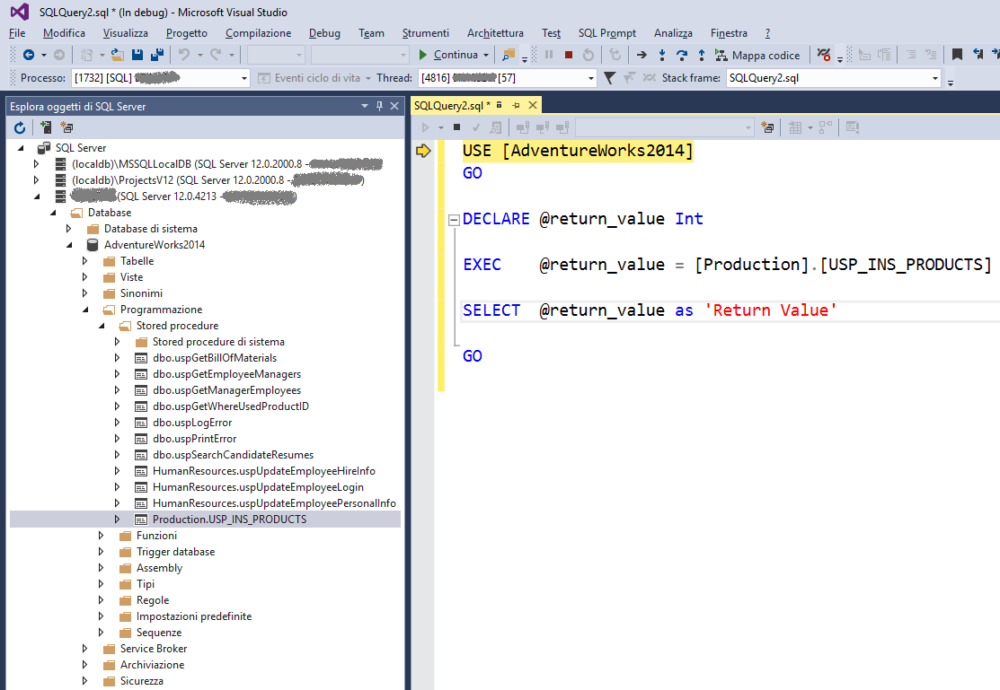
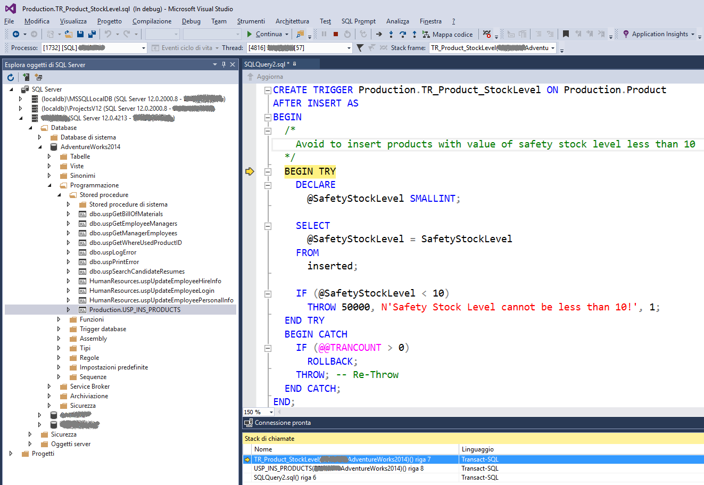

# Come effettuare il debug di un Trigger in SQL Server

#### Di [Sergio Govoni](https://mvp.microsoft.com/en-us/PublicProfile/4029181?fullName=Sergio%20Govoni) – Microsoft Data Platform MVP

English Blog: <http://sqlblog.com/blogs/sergio_govoni/default.aspx>

UGISS Author: <https://www.ugiss.org/author/sgovoni>

Twitter: [@segovoni](https://twitter.com/segovoni)


Introduzione
============

I più importanti linguaggi di programmazione hanno strumenti di debug integrati direttamente nell'IDE. Il debugger ha tipicamente un'interfaccia grafica che consente di esaminare i valori che assumono le variabili durante l'esecuzione, il flusso del programma step-by-step e permette di definire punti di interruzione in corrispondenza dei quali fermare l'esecuzione dell'applicazione.

Ogni sviluppatore ama gli strumenti di debug, specialmente quando deve capire perché un programma genera un errore o quando viene effettuato un calcolo errato.

Pensiamo ora ad un Trigger definito su una tabella SQL Server e supponiamo che tale Trigger esegua codice T-SQL talmente complesso da mettere in difficoltà persino l'autore. In presenza di un bug, segnalato ad esempio dal cliente presso il quale abbiamo installato il Trigger in questione, come possiamo intervenire? **È possibile eseguire il debug di un Trigger?** Se è possibile, come possiamo farlo?


Come effettuare il debug di un Trigger (T-SQL)
==============================================

Il debug di un Trigger è possibile attraverso l'ambiente di sviluppo Microsoft Visual Studio.

Consideriamo il Trigger (di esempio) TR\_Product\_StockLevel definito sulla tabella *Production.Product* del database *AdventureWorks*, il seguente frammento di codice T-SQL ne implementa la creazione. Lo scopo del Trigger è quello di impedire l'inserimento di nuovi prodotti aventi come Scorta di Sicurezza valori minori di dieci.

```SQL
USE [AdventureWorks];
GO

CREATE TRIGGER Production.TR\_Product\_StockLevel ON Production.Product AFTER INSERT AS
BEGIN
  /*
    Avoid to insert products with value of safety stock level lower than 10
  */
    
  BEGIN TRY
    DECLARE @SafetyStockLevel SMALLINT;
    SELECT @SafetyStockLevel = SafetyStockLevel FROM inserted;
    IF (@SafetyStockLevel < 10)
      THROW 50000, N'Safety Stock Level cannot be lower than 10!', 1;
  END TRY

  BEGIN CATCH
    IF (@@TRANCOUNT > 0)
      ROLLBACK;
    THROW; -- Re-Throw
  END CATCH;
END;
GO
```

Probabilmente, avrete già notato che il Trigger TR\_Product\_StockLevel non è stato pensato per lavorare su più righe, l'autore non ha considerato che la tabella virtuale *Inserted* potrà contenere più righe nello stesso momento, per la stessa attivazione del Trigger. Solo quando la tabella virtuale *Inserted* conterrà una sola riga, il Trigger lavorerà correttamente e impedirà l'inserimento di nuovi prodotti con valori della Scorta di Sicurezza non coerenti.

Il cliente presso cui abbiamo installato il Trigger lamenta però la presenza di Prodotti, appena inseriti, con valori minori di dieci nella colonna *SafetyStockLevel*. Vorremmo quindi poter effettuare il debug del Trigger nello stesso modo in cui uno sviluppatore è abituato ad eseguire il debug del codice di un'applicazione.

La prima cosa da fare, quando si desidera effettuare il debug di un Trigger, è creare una stored procedure che sia in grado di attivare il Trigger in questione. In questo esempio, trattandosi di un Trigger attivo sull'evento *ON INSERT* della tabella *Production.Product*, è necessario creare una stored procedure che contenga il comando di *INSERT* per la tabella *Production.Product*.

Il seguente frammento di codice T-SQL implementa la creazione della stored procedure *USP\_INS\_PRODUCTS* nel database *AdventureWorks*.

```SQL
USE [AdventureWorks];
GO

CREATE PROCEDURE Production.USP_INS_PRODUCTS AS 
BEGIN
  /*
    INSERT statement to fire Trigger TR_Product_StockLevel
  */

  INSERT INTO Production.Product
  (
    Name, ProductNumber, MakeFlag, FinishedGoodsFlag, SafetyStockLevel,
    ReorderPoint, StandardCost, ListPrice, DaysToManufacture,
    SellStartDate, rowguid, ModifiedDate
  )
  VALUES
  (
    N'BigBike8', N'BB-5388', 0, 0, 10 /* SafetyStockLevel */,
    750, 0.0000, 78.0000, 0, GETDATE(), NEWID(), GETDATE()
  ),
  (
    N'BigBike9', N'BB-5389', 0, 0, 1 /* SafetyStockLevel */,
    750, 0.0000, 62.0000, 0, GETDATE(), NEWID(), GETDATE()
  );
END;
```

Dopo aver creato la stored procedure in grado di attivare il Trigger, dovremo eseguirla attraverso l'IDE di Microsoft Visual Studio come descritto di seguito.

-   Eseguire Microsoft Visual Studio

-   Accedere alla finestra "Esplora oggetti di SQL Server" e collegare l' istanza SQL Server che ospita il database nel quale risiedono il Trigger e la Stored Procedure appena creata

-   Espandere il ramo relativo al database AdventureWorks

-   Espandere i rami "Programmazione" e "Stored procedure" per individuare la stored procedure USP\_INS\_PRODUCTS

-   Premere il tasto destro del mouse in corrispondenza della stored procedure USP\_INS\_PRODUCTS, verrà visualizzato un menu pop-up, selezionare quindi la voce "Debug Procedura...". Verrà aperta automaticamente una nuova pagina di query pronta per eseguire il debug della stored procedure selezionata

La figura seguente illustra la pagina di query creata automaticamente per effettuare il debug della stored procedure.



Figura 1 – Debug della stored procedure che scatena l'attivazione del Trigger

Il puntatore è posizionato sulla prima istruzione dello script T-SQL generato automaticamente dal debugger di Visual Studio. Utilizzando l'esecuzione "passo-passo" (tasto funzione F11), sarà possibile eseguire tutte le istruzioni dello script e della stored procedure fino al comando di *INSERT* che attiverà il Trigger; a quel punto, premendo F11 sul comando di *INSERT*, l'**execution pointer verrà trasferito sulla prima istruzione contenuta nel Trigger**, come illustrato nella figura seguente.



Figura 2 – Debug del Trigger TR\_Product\_StockLevel

Continuando con l'esecuzione "passo-passo" (F11) sarà possibile eseguire tutto il codice T-SQL contenuto nel Trigger. Osservando il valore assunto dalle variabili si intuisce facilmente l'anomalia presente nel codice. La variabile *@SafetyStockLevel* potrà contenere e verificare soltanto una delle righe interessate dal comando di *INSERT*, assumendo valide o non valide tutte le altre in funzione del risultato ottenuto per la prima riga... abbiamo trovato il bug!!

Si osservi la finestra "Stack di chiamate", mostra la catena di chiamate che hanno portato ad attivare il Trigger, è molto utile in presenza di Trigger multipli sulla stessa tabella o di Trigger nidificati.

Il seguente frammento di codice T-SQL corregge l'anomalia emersa nella fase di debug.

```SQL
USE [AdventureWorks];
GO

ALTER TRIGGER Production.TR_Product_StockLevel ON Production.Product AFTER INSERT AS
BEGIN
  /*
    Avoid to insert products with value of safety stock level less than 10
  */

  BEGIN TRY
    -- Testing all rows in the "Inserted" virtual table
    IF EXISTS (
               SELECT ProductID
               FROM inserted
               WHERE (SafetyStockLevel < 10)
             )
      THROW 50000, N'Safety Stock Level cannot be less than 10!', 1;
  END TRY

  BEGIN CATCH
    IF (@@TRANCOUNT > 0)
      ROLLBACK;
    THROW; -- Re-Throw
  END CATCH;
END;
GO
```

Gli esempi contenuti in questo articolo si basano sul database di AdventureWorks che è possibile scaricare dal sito CodePlex a questo [*link*](http://msftdbprodsamples.codeplex.com/releases/view/125550).

#### Di [Sergio Govoni](https://mvp.microsoft.com/en-us/PublicProfile/4029181?fullName=Sergio%20Govoni) – Microsoft Data Platform MVP

English Blog: <http://sqlblog.com/blogs/sergio_govoni/default.aspx>

UGISS Author: <https://www.ugiss.org/author/sgovoni>

Twitter: [@segovoni](https://twitter.com/segovoni)
