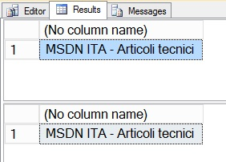
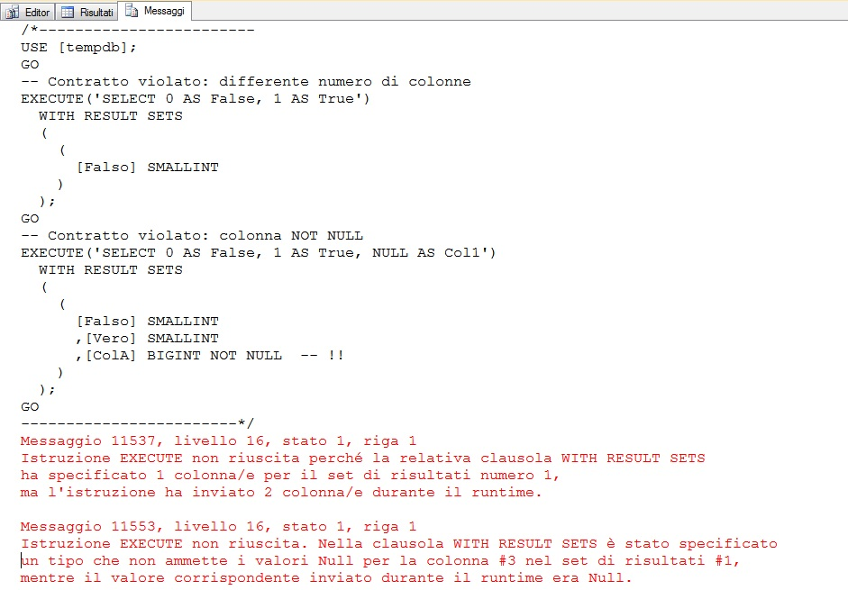
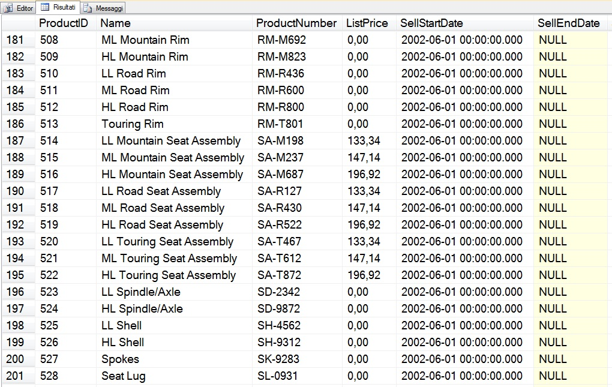
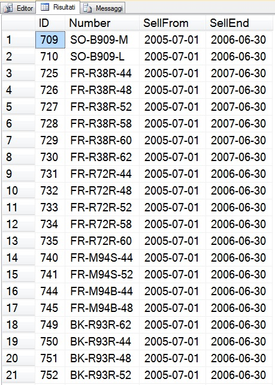
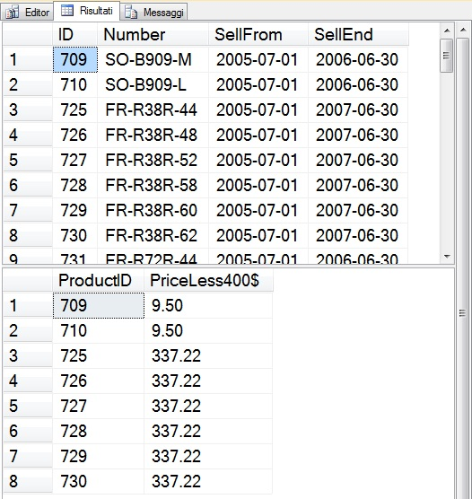

# EXECUTE statement in SQL Server 2012

#### di [Sergio Govoni](http://mvp.microsoft.com/profiles/Sergio.Govoni) - Microsoft MVP ([blog](http://www.ugiss.org/sgovoni/))


*Dicembre, 2012*

Introduzione
============

In questo articolo parleremo del nuovo gruppo di opzioni RESULT SETS
implementate per la clausola WITH del comando
[EXECUTE](http://msdn.microsoft.com/en-us/library/ms188332(v=SQL.110).aspx)
in SQL Server 2012.

Quante volte avete avuto la necessità di utilizzare il result-set
restituito, ad esempio, da una stored procedure? E quante volte il
result-set restituito era esattamente come ve lo aspettavate? Pensando
alle risposte a queste domande probabilmente vi verranno in mente le
situazioni in cui avete dovuto “sistemare” il result-set restituito in
output dal comando EXECUTE, e uno dei workaround più tipici per
risolvere il problema è quello di scaricare tale result-set in una
tabella temporanea per poterlo adeguare alle vostre esigenze. L’opzione
RESULT SETS garantisce metadati specifici per i result-set di una stored
procedure o di un batch T-SQL implementando un “contratto” tra il
comando EXECUTE (chiamante) e la relativa stored procedure o batch T-SQL
(chiamato).

Le opzioni supportate da RESULT SETS
====================================

RESULT SETS supporta le seguenti opzioni:

- UNDEFINED
- NONE
- (&lt;result\_set\_definition&gt;)

che descriviamo di seguito.

RESULT SETS UNDEFINED 
=====================

L’opzione RESULT SETS UNDEFINED rappresenta il default; specificando
questa opzione oppure omettendo RESULT SETS, il comando EXECUTE mantiene
il comportamento che aveva nelle precedenti edizioni di SQL Server
ovvero fino all’edizione 2008 R2. By default, quindi, lo statement
EXECUTE non fornisce garanzie sui metadati restituiti dall’esecuzione di
una stored procedure o di un batch T-SQL.

Nel seguente frammento di codice si osserva che i due statement EXECUTE
restituiscono lo stesso output dimostrando che l’opzione RESULT SETS
UNDEFINED rappresenta il comportamento di default.

```SQL
USE [tempdb];
GO

-- RESULT SETS UNDEFINED (default)

EXECUTE('SELECT ''MSDN ITA - Articoli tecnici''');
GO

EXECUTE('SELECT ''MSDN ITA - Articoli tecnici''')
WITH RESULT SETS UNDEFINED;
GO
```

L’output è illustrato in Figura 1.



Figura 1 – L’opzione RESULT SETS UNDEFINED rappresenta il default

RESULT SETS NONE 
================

L’opzione RESULT SETS NONE garantisce che non vengano restituiti
result-set per il comando EXECUTE; verrà generato un errore qualora la
stored procedure o il batch T-SQL invocati con EXECUTE tentino la
restituzione di un result-set. Nel seguente frammento di codice viene
utilizzata l’opzione RESULT SETS NONE per garantire al chiamante che
nessun result-set venga restituito.

```SQL
USE [tempdb];
GO
-- RESULT SETS NONE
-- Garantisce che non venga restituito alcun result-set
EXECUTE('SELECT ''MSDN ITA - Articoli tecnici''')
WITH RESULT SETS NONE;
GO
```

L’output è illustrato in Figura 2, il batch T-SQL tenta di restituire al
chiamante una colonna con il testo “MSDN ITA - Articoli tecnici”, ma
vista la presenza dell’opzione RESULT SETS NONE, che garantisce non
vengano restituiti result-set, l’esecuzione verrà respinta con un
errore.


Figura 2 – L’opzione RESULT SETS NONE garantisce che non vengano
    restituiti result-set

RESULT SETS ({…}) 
=================

L’opzione RESULT SET (&lt;result\_set\_definition&gt;) permette di
definire esattamente i metadati attesi per tutti i result-set restituiti
dal comando EXECUTE; garantisce che i metadati restituiti siano in
accordo, per numero e tipo, con quelli definiti. Nel seguente frammento
di codice, vengono definiti metadati specifici per l’unico result-set
restituito dallo statement EXECUTE.

```SQL
USE [tempdb];
GO

-- RESULT SETS ({...})
-- Definisce i metadati per uno o più result-set
-- Garantisce che i metadati restituiti siano in accordo con quelli attesi
EXECUTE('SELECT 0 AS False, 1 AS True')
    WITH RESULT SETS
    (
        (
        [Falso] SMALLINT
        ,[Vero] SMALLINT
        )
    );
GO
```

L’output è illustrato in figura 3.


Figura 3 – L’opzione RESULT SET ({…}) definisce esattamente i
    metadati per il result-set

Nel prossimo esempio vedremo cosa accade quando si tenta di violare il
“contratto”, stabilito con l’opzione RESULT SET, tra chiamate e chiamato
che individuiamo rispettivamente nel comando EXECUTE e nell’oggetto
eseguito, sia esso una stored procedure o un batch T-SQL.

```SQL
USE [tempdb];
GO

-- Contratto violato: differente numero di colonne
EXECUTE('SELECT 0 AS False, 1 AS True')
 WITH RESULT SETS
  (
    (
      [Falso] SMALLINT
    )
  );
GO

-- Contratto violato: colonna NOT NULL
EXECUTE('SELECT 0 AS False, 1 AS True, NULL AS Col1')
  WITH RESULT SETS
  (
    (
      [Falso] SMALLINT
      ,[Vero] SMALLINT
      ,[ColA] BIGINT NOT NULL -- !!
    )
  );
GO
```

L’output è illustrato in Figura 4.



Figura 4 – Violazione del “contratto” definito tra chiamante e
    chiamato

Entrambi gli statement in Figura 4, sono stati respinti; il primo
statement ha restituito un result-set composto da due colonne, la
colonna “False” e la colonna “True”, attraverso l’opzione RESULT SETS,
la prima colonna è stata rinominata in “Falso” e il relativo tipo di
dato convertito in SMALLINT, della seconda colonna però non vi è traccia
nella definizione del risultato, da qui la violazione del “contratto” e
la generazione dell’errore. Nel secondo statement, invece, il numero
delle colonne attese è uguale al numero delle colonne restituite, una di
essere però, la colonna “ColA” è definita NOT NULL mente il batch
eseguito tenta proprio la restituzione di un NULL, anche in questo caso
il “contratto” è stato violato.

EXECUTE … WITH RESULT SETS in azione 
====================================

Nel prossimo esempio, dopo averla creata, utilizzeremo la stored
procedure Production.uspGetProductForSell che interroga la tabella
Production.Product del database di esempio
[AdventureWorks2012](http://msftdbprodsamples.codeplex.com/releases/view/55330).
La stored procedure può restituire in output due result-set; il primo
result-set, sempre presente, è rappresentato dai prodotti vendibili,
dall’azienda, alla data passata nel parametro @vDate. Il secondo
result-set, la cui presenza è condizionata da valori maggiori di zero
nel parametro @vPrice, restituisce i prodotti vendibili, dall’azienda,
alla data passata nel parametro @vDate e che hanno Prezzo di Listino
minore o uguale al valore passato in @vPrice.

Prendiamo confidenza con i dati memorizzati nella tabella
Production.Product del database AdventureWorks2012, la Figura 5 illustra
alcuni dei record presenti in tabella.



Figura 5 – Dati contenuti nella tabella Production.Product

Definiamo ora la stored procedure Production.uspGetProductForSell
utilizzata dagli operatori commerciali per conoscere i prodotti
vendibili in un determinato momento. Come accennato precedentemente, la
stored procedure accetta in input due parametri: @vDate rappresenta il
giorno per il quale si desidera conoscere i prodotti vendibili e @vPrice
rappresenta il parametro di filtro sulla colonna ListPrice. Il seguente
frammento di codice implementa la CREATE della stored procedure nel
database di esempio AdventureWorks2012.

```SQL
USE [AdventureWorks2012];
GO

CREATE PROCEDURE Production.uspGetProductForSell
(
  @vDate AS DATE
  ,@vPrice AS DECIMAL(8, 2) = 0
)
AS
BEGIN
  /*
  Stored procedure di esempio
  Restituisce i prodotti vendibili alla data passata
  come parametro
  */

  IF (ISNULL(@vDate, '') = '')
  BEGIN
    PRINT ('Errore: Valore del parametro @vDate non valido')
    RETURN
  END

-- Primo result-set
-- Prodotti vendibili alla data passata come parametro
SELECT
  ProductID
  ,ProductNumber
  ,SellStartDate
  ,SellEndDate
FROM
  Production.Product
WHERE
  (@vDate BETWEEN SellStartDate AND SellEndDate)

-- Secondo result-set
-- Prodotti vendibili alla data passata come parametro
-- con prezzo di listino minore o uguale al valore
-- passato come parametro
IF (ISNULL(@vPrice, 0) > 0)
BEGIN
  SELECT
    ProductID
    ,ListPrice
  FROM
    Production.Product
  WHERE
    (ListPrice <= @vPrice)
    AND (@vDate BETWEEN SellStartDate AND SellEndDate)
  END
END;
```

Eseguiamo ora la stored procedure Production.uspGetProductForSell per
ottenere in output gli articoli vendibili al 31/12/2005, utilizzeremo il
comando EXECUTE specificando la clausola RESULT SETS per assegnare un
nome ed un tipo di dato specifico ad ogni colonna restituita.

```SQL
EXECUTE Production.uspGetProductForSell
@vDate = '20051231'
WITH RESULT SETS
(
  -- Primo result-set
  -- Definizione dei metadati
  (
    ID VARCHAR(20)
    ,Number VARCHAR(40)
    ,SellFrom DATE
    ,SellEnd DATE
  )
);
```

L’output ottenuto è illustrato in Figura 6 dove si può osservare come le
colonne della query eseguita all’interno della stored procedure siano
state rinominate in accordo con quanto specificato nel comando EXECUTE.



Figura 6 – Prodotti vendibili al 31/12/2005, metadati specifici per
    il risultato

Oltre agli articoli vendibili ad una certa data, nel prossimo esempio
desideriamo ricevere in output anche il secondo un result-set, che deve
contenere, come nel caso del primo, gli articoli vendibili alla data
passata in @vDate, ma che hanno Prezzo di Listino minore o uguale al
valore passato nel parametro @vPrice. Nel prossimo esempio, illustriamo
come sia possibile definire nome delle colonne e tipi di dato, anche per
il secondo result-set (con la stessa logica mutuata per il primo).

```SQL
EXECUTE Production.uspGetProductForSell
    @vDate = '20051231'
    ,@vPrice = 400.00
    WITH RESULT SETS
    (
        -- Definizione dei metadati
        -- Primo result-set
        (
            ID VARCHAR(20)
            ,Number VARCHAR(40)
            ,SellFrom DATE
            ,SellEnd DATE
        ),

        -- Secondo result-set
        (
            ProductID VARCHAR(20)
            ,PriceLess400$ DECIMAL(8, 2)
        )
    );
```

L’output ottenuto è illustrato in Figura 7.



Figura 7 – Prodotti vendibili al 31/12/2005 con prezzo di listino
    minore di 400,00\$, metadati specifici

Pulizia database 
================

```SQL
USE [AdventureWorks2012];
GO

IF OBJECT_ID('Production.uspGetProductForSell', 'P') IS NOT NULL
    DROP PROCEDURE Production.uspGetProductForSell;
GO
```

Conclusioni 
===========

L’opzione RESULT SETS implementata per il comando EXECUTE in SQL Server
2012, permette di definire metadati specifici per tutti i result-set
restituiti; implementa un “contratto” tra il comando EXECUTE (chiamante)
e i risultati restituiti da stored procedure o batch T-SQL (chiamato);
l’Engine di SQL Server respingerà l’esecuzione dello statement qualora
il “contratto” venga violato.

#### di [Sergio Govoni](http://mvp.microsoft.com/profiles/Sergio.Govoni) - Microsoft MVP ([blog](http://www.ugiss.org/sgovoni/))


