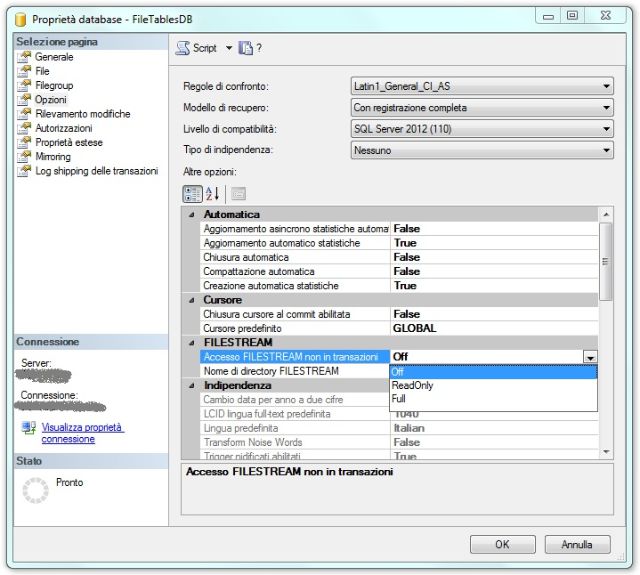
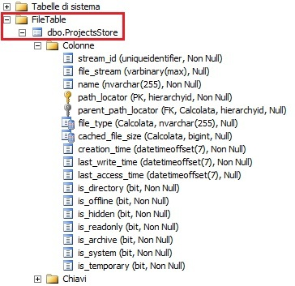
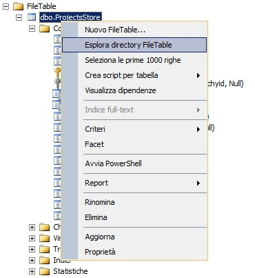
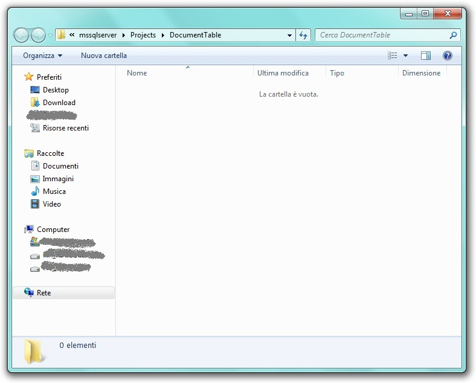

# FileTable in SQL Server 2012

#### di Sergio Govoni – [Microsoft MVP](http://mvp.microsoft.com/profiles/Sergio.Govoni)

Blog: <http://community.ugiss.org/blogs/sgovoni/>


*Giugno, 2012*

Introduzione
============

Alcuni di voi avranno sicuramente apprezzato l’attributo
[FILESTREAM](http://technet.microsoft.com/it-it/library/bb933993(v=sql.105).aspx)
introdotto nella versione 2008 di SQL Server. FILESTREAM rappresenta il
punto di contatto tra il mondo del file system e il mondo del database,
concilia i vantaggi delle due tecnologie con una struttura dati gestita
da SQL Server, ma appoggiata sul file system.

Abbiamo illustrato l’utilizzo del supporto FILESTREAM nello screencast
[SQL Server 2008 R2: FILESTREAM Attribute](http://www.microsoft.com/italy/beit/Generic.aspx?video=67310424-c6c7-47f6-906a-b8851345c8cc)
disponibile sul portale Microsoft BEIT – MSDN/TechNet.

Tuttavia, un limite evidente del supporto FILESTREAM è rappresentato dal
fatto che le applicazioni tradizionali, che non sanno nulla di SQL
Server, non possono accedervi. L’accesso al supporto FILESTREAM, su SQL
Server 2008, doveva essere eseguito utilizzando il linguaggio T-SQL
oppure tramite speciali API .NET Win32. Molti clienti hanno quindi
chiesto il potenziamento di questa tecnologia e l’implementazione del
tradizionale accesso ai file, come avviene nelle applicazioni Office o
con Esplora Risorse di Windows, mantenendo però i vantaggi del supporto
FILESTREAM, ovvero la possibilità di includere, nel backup del DB, i
file memorizzati nelle colonne VARBINARY(MAX) con attributo FILESTREAM e
di poter eseguire ricerche con il servizio full-text search.

La risposta di Microsoft è arrivata con SQL Server 2012, che implementa
[FileTable](http://msdn.microsoft.com/it-it/library/ff929144(v=sql.110).aspx).

FileTable
=========

FileTable permette ad una applicazione d’integrare la memorizzazione dei
propri file all’interno di SQL Server, dove sarà possibile eseguire
ricerche full-text e semantiche, anche su dati e metadati non
strutturati. In altre parole sarà possibile memorizzare file e documenti
in speciali tabelle di SQL Server chiamate FileTables; le applicazioni
Windows potranno accedere a tali file come se fossero memorizzati (solo)
nel file system senza implementare alcuna modifica.

La nuova caratteristica FileTable è basata sulla tecnologia FILESTREAM;
una FileTable è una tabella speciale, con uno schema fisso, creata
dall’utente e utilizzata per la memorizzazione di dati FILESTREAM
(documenti, file o cartelle).

Prerequisiti 
============

Per utilizzare FileTable è necessario aver attivato il supporto
FILESTREAM, dapprima a livello di sistema operativo e poi a livello
d’istanza. Vedremo di seguito, che sarà inoltre necessario aggiungere al
database, su cui vogliamo usare FileTable, un Filegroup dedicato.

Setup 
=====

Procediamo con il setup del database di esempio FileTablesDB, il
seguente frammento di codice in linguaggio T-SQL implementa la creazione
di questo database. Osserviamo la definizione del Filegroup aggiuntivo
FileStreamGroup dedicato al supporto FILESTREAM.

```SQL
------------------------------------------------------------------------
-- Setup database
------------------------------------------------------------------------

-- Drop database if exists
use [master];
go

if DB_ID('FileTablesDB') is not null
    begin
    alter database FileTablesDB
        set single_user with rollback immediate;
    drop database FileTablesDB;
    end;
go

-- Create database
create database FileTablesDB on primary
(
    name = FileTablesDB_Data
    ,filename = N'C:\Program Files\Microsoft SQL Server\MSSQL11.MSSQLSERVER\MSSQL\DATA\FileTablesDB_Data.mdf'
    ,size = 5MB
    ,maxsize = 50MB
    ,filegrowth = 10%
),

-- This filegroup contains filestream data
FILEGROUP FileStreamGroup CONTAINS FILESTREAM
(
    -- This folder
    -- 'C:\Program Files\Microsoft SQL
    Server\MSSQL11.MSSQLSERVER\MSSQL\DATA\' must exists on the file
    system
    -- This subfolder '\FileTablesDB' is created by SQL Server
    name = FileTablesDB_FileStream
    ,filename = N'C:\Program Files\Microsoft SQL
    Server\MSSQL11.MSSQLSERVER\MSSQL\DATA\FileTablesDB_FileStream'
)

LOG ON
(
    name = FileTablesDB_Log
    ,filename = N'C:\Program Files\Microsoft SQL
    Server\MSSQL11.MSSQLSERVER\MSSQL\DATA\FileTablesDB_Log.ldf'
    ,size = 3MB
    ,maxsize = 10MB
    ,filegrowth = 3MB
);

go
```

Dopo aver creato il database che ospiterà FileTable, modifichiamo
l’opzione NON\_TRANSACTED\_ACCESS sul DB appena creato (FileTablesDB).
Il valore FULL assegnato a NON\_TRANSACTED\_ACCESS indica a SQL Server
che tutti gli accessi a FileTable, derivanti dal file system, non
saranno transazionali; non sarà quindi possibile ripristinare i dati di
FileTable in un punto preciso (point-in-time restore). La non
transazionalità delle modifiche è applicata solo agli accessi che
avvengono tramite la condivisione file di Windows, qualsiasi altro
accesso tramite T-SQL o API sarà completamente transazionale, anche se
attiva l’opzione NON\_TRANSACTED\_ACCESS.

I valori supportati da NON\_TRANSACTED\_ACCESS sono:

- FULL
- READONLY
- OFF


Il seguente frammento di codice T-SQL imposta l’accesso non
transazionale (FULL) per FileTable sul database di esempio FileTablesDB.

```SQL
------------------------------------------------------------------------
-- Set NON_TRANSACTED_ACCESS to FULL
------------------------------------------------------------------------

-- Change database context
use [FileTablesDB];
go

-- Alter database
alter database FileTablesDB
set filestream (NON_TRANSACTED_ACCESS = FULL, DIRECTORY_NAME =
N'Projects');

go
```

E’ possibile ottenere lo stesso risultato anche da SQL Server Management
Studio (SSMS) impostando il valore desiderato per l’opzione “Accesso
FILESTREAM non in transazioni” nella finestra Proprietà database, scheda
Opzioni, come illustrato in figura 1.



Figura 1 – Scheda Opzioni della finestra Proprietà database di SQL
Server Management Studio

Creazione di una FileTable 
==========================

Procediamo ora con la creazione di una FileTable (letteralmente “tabella
di file”) nel database di esempio FileTablesDB; il seguente frammento di
codice T-SQL implementa la creazione della tabella dbo.ProjectsStore.
```SQL
------------------------------------------------------------------------
-- Setup FileTable
------------------------------------------------------------------------
create table dbo.ProjectsStore as FileTable
with (
    FileTable_Directory = 'DocumentTable'
    ,FileTable_Collate_Filename = database_default
);
go
```

Una delle particolarità che possiamo osservare nel precedente statement
è l’assenza di definizione dello schema; la tabella dbo.ProjectsStore è
stata creata con lo schema predefinito per FileTable, che potete
consultare sui BOL di SQL Server 2012 a [questo
link](http://msdn.microsoft.com/en-us/library/gg492084(v=SQL.110).aspx).

Come descritto in precedenza, l'aggiunta o la rimozione di colonne allo
schema fisso di un oggetto FileTable non è consentita. Il seguente
frammento di codice T-SQL sarà quindi respinto da SQL Server:

```SQL
-- Alter FileTable schema... does not work
alter table dbo.ProjectsStore add test int null;
go
```

In output, il messaggio di errore sarà:

    Messaggio 33422, livello 16, stato 1, riga 2

    Impossibile aggiungere la colonna 'test' alla tabella
    'dbo.ProjectsStore' perché si tratta di un oggetto FileTable.
    L'aggiunta di colonne allo schema fisso di un oggetto FileTable non
    è consentita.

Nello schema della tabella dbo.ProjectsStore troviamo colonne che
descrivono le proprietà dei file di Windows (attributo di sola lettura,
archivio, file temporaneo, file di sistema, ecc.), troviamo il path
relativo rispetto alla root directory, memorizzato nella colonna
path\_locator di tipo HIERARCHYID; il file effettivo, invece, si trova
nella colonna file\_stream di tipo VARBINARY(MAX).

La figura 2 illustra la struttura della tabella dbo.ProjectsStore, si
osservi il ramo dedicato a FileTable, posto allo stesso livello di
quello dedicato alle tabelle di sistema.



Figura 2 – Schema predefinito per le tabelle FileTable

Per esplorare il contenuto della directory associata alla tabella
dbo.ProjectsStore è sufficiente eseguire un click destro del mouse sulla
FileTable e selezionare la voce “Esplora directory FileTable” dal menù
contestuale. La figura 3 descrive graficamente l’operazione da eseguire.



Figura 3 – Menu click destro eseguito su un oggetto FileTable

L’output di questa operazione è illustrato in figura 4.



Figura 4 – Contenuto della directory associata alla FileTable dbo.ProjectsStore

La cartella ora è vuota; osserviamo il suo path, che contiene il nome
della condivisione Windows (MSSQLSERVER) specificata durante la
configurazione del supporto FILESTREAM, su cui si basa la tecnologia
FileTable.

Eseguiamo ora la copia di tutti i file contenuti in C:\\Temp\\Font,
specificando come cartella di destinazione la directory associata alla
FileTable dbo.ProjectsStore; il seguente comando XCOPY permette di
eseguire l’operazione di copia:

    xcopy c:\temp\font\*.* \\nome_server\mssqlserver\Projects\DocumentTable /E


Figura 5 – Copia file da C:\\temp\\font a FileTable

Nella cartella di destinazione ci aspettiamo di trovare tutti i file
copiati, ma nella FileTable, cosa ci aspettiamo di trovare?

Il seguente frammento di codice interroga il contenuto della FileTable
dbo.ProjectsStore:

```SQL
select
    name as [file_name]
    ,file_type
    ,is_directory
    ,file_stream.GetFileNamespacePath() as spacePath
    from
    dbo.ProjectsStore;

go
```

L’output è illustrato in figura 6:


Figura 6 – Contenuto della FileTable dbo.ProjectsStore

La copia dei (due) file, dalla cartella C:\\Temp\\Font alla directory
collegata alla FileTable ha eseguito anche l’inserimento di un record,
per ogni file copiato, nella tabella dbo.ProjectsStore memorizzando, di
fatto, tali file nel database FileTablesDB, grazie al supporto
FILESTREAM.

Con FileTable sono state rilasciate anche alcune funzioni che permettono
di gestire e interrogare i dati attraverso il linguaggio T-SQL, un
esempio è rappresentato dalla funzione FileTableRootPath() che fornisce
il path di origine del file salvato su FileTable.

Con T-SQL è inoltre possibile:

- Creare nuove cartelle
- Aggiornare gli attributi di un file
- Spostare i file da una cartella ad un’altra
- Modificare il file vero e proprio


Conclusioni
===========

FileTable, una delle novità di SQL Server 2012, completa la tecnologia
FILESTREAM e rappresenta una potente combinazione tra il linguaggio
T-SQL e l’accesso classico al file system da parte delle applicazioni
Windows che ora possono salvare con estrema facilità i propri documenti
all’interno di SQL Server.

#### di Sergio Govoni – [Microsoft MVP](http://mvp.microsoft.com/profiles/Sergio.Govoni)

