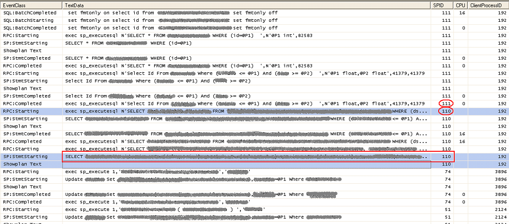
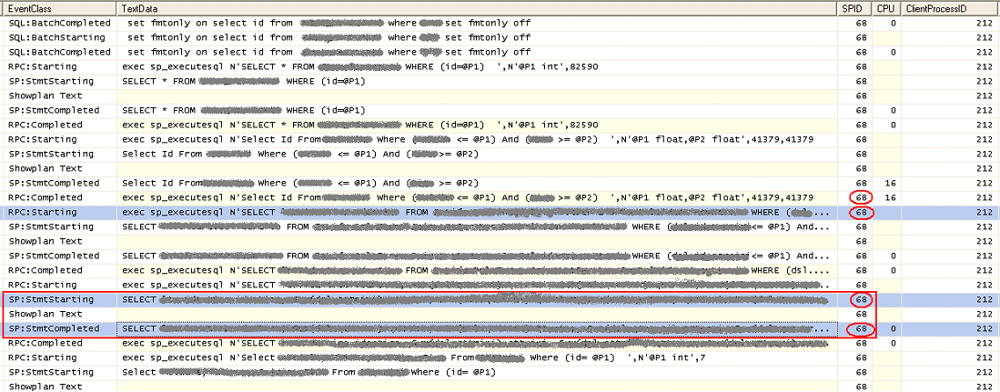

# Una inaspettata variazione di SPID (SQL Server, Session Process ID)

#### Di [Sergio Govoni](https://mvp.microsoft.com/en-us/PublicProfile/4029181?fullName=Sergio%20Govoni) – Microsoft Data Platform MVP

English Blog: <http://sqlblog.com/blogs/sergio_govoni/default.aspx>

UGISS Author: <https://www.ugiss.org/author/sgovoni>

Twitter: [@segovoni](https://twitter.com/segovoni)

*Aprile 2014*

Introduzione
============

Un po' di tempo fa, ho avuto l'opportunità di analizzare una situazione in cui si verificava un inaspettato cambiamento dello SPID relativo ad una connessione aperta da un'applicazione verso un database SQL Server. Lo [SPID](http://technet.microsoft.com/en-us/library/ms189535.aspx) rappresenta l'identificativo numerico assegnato da SQL Server ad ogni nuova sessione.

Inaspettata variazione dell’identificativo sessione (SPID)
==========================================================

Tutto è iniziato con la segnalazione di un cliente, che lamentava
rallentamenti nell’Applicazione, blocchi e talvolta errori di lock
time-out. I rallentamenti e i blocchi non erano ovviamente sistematici e
attribuibili ad un eccezionale carico di lavoro; si verificavano però
principalmente su una determinata funzione Applicativa. Dopo svariati
tentativi nel cercare di catturare questi tipi di lock, siamo finalmente
riusciti a riprodurre il problema.

Siamo riusciti ad avere due file di traccia SQL Profiler relativi a due
elaborazioni della stessa funzione Applicativa eseguita dallo stesso
operatore, sullo stesso client e con gli stessi criteri. La prima
elaborazione non è stata portata a termine a causa di un errore di lock
time-out, mentre la seconda elaborazione è stata completata senza
errori.

Confrontando i due file di traccia SQL Profiler, in uno dei due, si è
osservata una “inaspettata variazione” dello SPID relativo alla sessione
del processo che si stava monitorando, proprio nell’elaborazione che non
è stata portata a termine. Ho scritto “inaspettata variazione” perché
l’applicazione utilizza una sola connessione per eseguire tutte le query
catturate da SQL Profiler.

La figura 1 illustra il file di traccia relativo all’elaborazione
terminata con l’errore di lock time-out.

Figura 1 – File di traccia SQL Profiler con inaspettata variazione
    di SPID

Osserviamo le righe aventi ClientProcessID uguale a 192, in
corrispondenza della prima riga selezionata c’è stata la variazione di
SPID passato dal numero 111 al numero 110. L’elaborazione prosegue fino
all’ultima query eseguita con lo SPID 110 che ha soltanto l’evento
SP:StmtStarting senza il rispettivo SP:StmtCompleted. Questa query
attende il rilascio dei lock posti sulle risorse accedute dall’ultima
query eseguita con lo SPID 111. L’Applicazione risulta quindi bloccata;
ovviamente l’ultima query eseguita con lo SPID 111 e la prima eseguita
con lo SPID 110 sono state inviate a SQL Server utilizzando la medesima
connessione.

La figura 2 illustra il file di traccia SQL Profiler catturato durante
la stessa elaborazione, eseguita a distanza di pochi minuti dalla
precedente, sullo stesso client, dallo stesso utente e con gli stessi
criteri.

Figura 2 – File di traccia SQL Profiler elaborazione senza
    variazione di SPID

Osserviamo ora le righe aventi ClientProcessID uguale a 212; come si può
notare, tutte le query inviate a SQL Server vengono eseguite con lo SPID
numero 68. Questa elaborazione è stata portata a termine senza errori ne
rallentamenti.

Qual è la ragione di questa inaspettata variazione di SPID?
===========================================================

Parlando di questo problema con l’amico [Erland
Sommarskog](http://www.sommarskog.se/), ad un certo punto mi ha chiesto:
“Quali API usa l’applicazione?”, “OLE DB” è stata la mia risposta, e lui
ha replicato: “Abbiamo la risposta!”.

Quando si utilizza OLE DB, o qualcos’altro basato su OLE DB e si esegue
una query su una connessione **che non ha completamente consumato
l’intero data-set del precedente comando**, il comportamento di default
è l’apertura, dietro le quinte, di una nuova connessione. La nuova
connessione avrà uno SPID differente, che però potrà incontrare i lock
posti dal suo predecessore.

Questo comportamento rappresenta un tentativo di ottimizzazione,
applicato da OLE DB in alcune situazioni, che però non sempre produce
l’effetto desiderato!

di [Sergio
Govoni](http://mvp.microsoft.com/en-us/mvp/Sergio%20Govoni-4029181) –
Microsoft MVP

Blog (Italiano): [http://www.ugiss.org/sgovoni
/](http://www.ugiss.org/sgovoni%20/) Blog (Inglese): <http://sqlblog.com/blogs/sergio_govoni>

Twitter: [@segovoni](https://twitter.com/segovoni)

