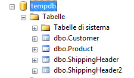
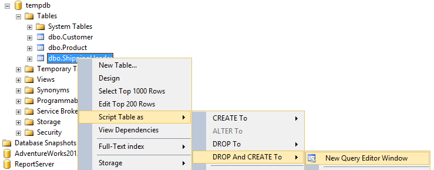

# SQL: CREATE e DROP di colonne temporanee

#### di [Sergio Govoni](http://mvp.microsoft.com/en-us/mvp/Sergio%20Govoni-4029181) - Microsoft Data Platform MVP

English Blog: <http://sqlblog.com/blogs/sergio_govoni/default.aspx>

UGISS Author: <https://www.ugiss.org/author/sgovoni/>

Twitter: [@segovoni](https://twitter.com/segovoni)


*Giugno, 2013*

Introduzione
============

La vista di sistema [sys.columns](http://msdn.microsoft.com/en-us/library/ms176106.aspx), come citano i books on-line, restituisce una riga per ogni colonna contenuta negli oggetti di un database che possono contenere colonne come, ad esempio, viste o tabelle. Gli oggetti database in grado di contenere colonne sono i seguenti:

-   Funzioni assembly con valori di tabella
-   Funzioni in-line con valori di tabella
-   Tabelle interne
-   Tabelle di sistema
-   Funzioni con valori di tabella
-   Tabelle utente
-   Viste


In particolare la colonna column\_id della vista sys.columns espone l'identificativo univoco (ID) assegnato ad ogni colonna presente
all'interno di un oggetto, che da questo momento in poi ipotizziamo, per semplicità, essere una tabella.

Scenario 
========

Un po' di tempo fa, ho avuto l'occasione di occuparmi del problema che sta alla base del Messaggio di Errore 1714 illustrato nella figura
seguente (su una istanza SQL Server 2005).


Figura 1 – Messaggio di Errore 1714 (SQL Server 2005)

L'errore è stato riscontrato in una stored procedure che gestisce la generazione dei documenti di trasporto. L'ipotetico cliente che ha
segnalato questo errore, emette ogni giorno migliaia di DdT; la segnalazione è pervenuta proprio durante la generazione di un nuovo
documento. Per la memorizzazione delle testate dei documenti di trasporto, si utilizza la tabella dbo.ShippingHeader.

Messaggio di Errore 1714 (SQL Server 2005)
==========================================

Il seguente frammento di codice T-SQL implementa la creazione (semplificata) della tabella dbo.ShippingHeader nel database di sistema
tempdb. Per completezza vengono create anche le tabelle dbo.Product (anagrafica prodotti) e dbo.Customer (anagrafica clienti).

```SQL
USE [tempdb];
GO

-- dbo.Product
CREATE TABLE dbo.Product
(
 ProductID VARCHAR(25) NOT NULL
 ,SafetyStockLevel SMALLINT NOT NULL
 ,Size VARCHAR(5) NULL
 ,ModifiedDate DATETIME NOT NULL DEFAULT GETDATE()
 ,Status BIT NOT NULL DEFAULT(1)
 ,CONSTRAINT PK_Product PRIMARY KEY(ProductID)
);
GO

-- dbo.Customer
CREATE TABLE dbo.Customer
(
 CustomerID INT IDENTITY(1, 1) NOT NULL PRIMARY KEY
 ,CustomerName VARCHAR(40) NOT NULL
);
GO

-- dbo.ShippingHeader
CREATE TABLE dbo.ShippingHeader
(
 ShippingID INTEGER IDENTITY(1, 1) NOT NULL
 ,ProductID VARCHAR(25) NOT NULL FOREIGN KEY (ProductID) REFERENCES dbo.Product(ProductID)
 ,ShipDate DATETIME DEFAULT GETDATE() NOT NULL
 ,ShipNumber VARCHAR(20)
 ,CustomerID INT DEFAULT(1) NOT NULL FOREIGN KEY (CustomerID) REFERENCES dbo.Customer(CustomerID)
 ,ShipName VARCHAR(20) DEFAULT('Name')
 ,ShipAddress VARCHAR(40) DEFAULT('Address')
 ,ShipCity VARCHAR(20) DEFAULT('City')
 ,ShipPostalCode VARCHAR(20) DEFAULT('Postal code')
 ,ShipCountry VARCHAR(20) DEFAULT('Country')
 ,DeliveryDate DATETIME DEFAULT GETDATE() PRIMARY KEY(ShippingID)
);
GO
```

La tabella dbo.ShippingHeader è utilizzata per memorizzare i documenti di trasporto emessi dall'azienda. Su questa tabella, **per ogni nuovo documento**, viene **creata e distrutta la colonna temporanea TestField**, utilizzata per salvare alcune informazioni durante la
generazione del DdT.

La stored procedure di generazione DdT eseguiva un frammento di codice T-SQL simile a quello riportato di seguito, dove nei tratti commentati c'era la logica di generazione del documento.

```SQL
BEGIN
-- ...
-- Creazione colonna temporanea
ALTER TABLE dbo.ShippingHeader ADD TestField INTEGER;

-- ...
-- ...
-- ...

-- Memorizzazione di un valore temporaneo
UPDATE
  dbo.ShippingHeader
SET
  TestField = @value
WHERE
  (<condizione>)

-- ...
-- ...
-- ...

-- Utilizzo del valore memorizzato
SELECT
  TestField
FROM
  dbo.ShippingHeader
WHERE
  (<condizione>)

-- ...
-- ...
-- ...

-- Eliminazione colonna temporanea
ALTER TABLE dbo.ShippingHeader DROP COLUMN TestField

-- ...
-- ...
-- ...

END;
GO
```

Dopo alcuni mesi di lavoro della stored procedure (in produzione), è stato raggiunto il limite massimo degli identificativi univoci (ID)
assegnabili in fase di creazione di una nuova colonna.

**Non** era quindi più possibile **aggiungere colonne** alla tabella dbo.ShippingHeader. SQL Server restituiva il messaggio di errore
indicato in precedenza perché il contatore **colid** della tabella di sistema sys.syscolpars **non poteva essere incrementato** in quanto raggiunto il limite massimo di valori rappresentabili.

La colonna colid, nella versione 2005 di SQL Server, è di tipo smallint e con questo tipo di dato si possono rappresentare positivamente 2\^15 - 1 elementi, ossia 32.767. Dopo qualche mese, il cliente aveva inserito più di 32.767 documenti di trasporto!

Messaggio di Errore 1701 (SQL Server 2012)
==========================================

Da SQL Server 2012, il tipo di dato della colonna column\_id della vista sys.columns è Integer, può quindi rappresentare positivamente 2\^31 - 1 elementi, molti di più di quelli che potevano essere rappresentati in precedenza, ma la nostra stored procedure prima di raggiungere il limite massimo restituisce il messaggio di errore illustrato nella figura seguente.


Figura 2 – Messaggio di Errore 1701 (SQL Server 2012)

Dopo aver modificato la stored procedure che implementa la logica digenerazione dei documenti di trasporto, per non eseguire l'ADD e il DROP di una colonna temporanea ad ogni esecuzione, ci siamo subito posti il problema di come poter applicare futuri aggiornamenti (aggiunta di nuove colonne) alla tabella dbo.ShippingHeader.

Soluzione
=========

La soluzione adottata consiste nel ricreare la tabella dbo.ShippingHeader. Ricreando la tabella, il contatore colid (column\_id
nella vista sys.columns) verrà inizializzato. L'assegnazione dei prossimi identificativi univoci (ID) ripartirà dal valore successivo a quello estratto nella colonna MAX\_ColID nel seguente comando T-SQL:

```SQl
USE [tempdb];
GO
SELECT
  MAX(c.column_id) AS MAX_ColID
FROM
  sys.columns AS c
WHERE
  (c.object_id = object_id('dbo.ShippingHeader'));
GO
```

Per ricreare la tabella dbo.ShippingHeader possiamo eseguire, nell'ordine, le seguenti attività:

-   Duplicazione della tabella (e copia dei dati)
-   Eliminazione delle integrità referenziali definite su dbo.ShippingHeader
-   Eliminazione della tabella dbo.ShippingHeader
-   Rinomina (in dbo.ShippingHeader) della tabella precedentemente copiata
-   Applicazione delle integrità referenziali

Duplicazione della tabella e copia dei dati 
===========================================

Per duplicare (copiando i dati) la tabella dbo.ShippingHeader abbiamoutilizzato il Tool di [Importazione/Esportazione guidata di SQL
Server](http://msdn.microsoft.com/it-it/library/ms188032(v=sql.105).aspx).

Completata la procedura, il database conterrà una nuova tabella che inquesto esempio abbiamo chiamato dbo.ShippingHeader2 come illustra la figura seguente.



Figura 3 – Tabella dbo.ShippingHeader2 (copia dalle tabella dbo.ShippingHeader)

Eliminazione delle integrità referenziali definite su dbo.ShippingHeader
========================================================================

Per ottenere, in modo semplice e veloce, i comandi di eliminazione delle integrità referenziali definite sulla tabella dbo.ShippingHeader abbiamo utilizzato le funzioni di scripting di SQL Server, in particolare abbiamo utilizzato la funzione di generazione del codice per le
istruzioni DROP e CREATE, come illustrato in figura 4.



Figura 4 – Funzioni di scripting di SQL Server

Abbiamo quindi eseguito la cancellazione dei vincoli definiti sulla tabella dbo.ShippingHeader, il seguente frammento di codice T-SQL
riporta gli statement eseguiti:

```SQL
USE [tempdb]
GO

ALTER TABLE [dbo].[ShippingHeader] DROP CONSTRAINT [FK__ShippingH__Produ__1A14E395]
GO

ALTER TABLE [dbo].[ShippingHeader] DROP CONSTRAINT [FK__ShippingH__Custo__1CF15040]
GO

ALTER TABLE [dbo].[ShippingHeader] DROP CONSTRAINT [DF__ShippingH__Deliv__22AA2996]
GO

ALTER TABLE [dbo].[ShippingHeader] DROP CONSTRAINT [DF__ShippingH__ShipC__21B6055D]
GO

ALTER TABLE [dbo].[ShippingHeader] DROP CONSTRAINT [DF__ShippingH__ShipP__20C1E124]
GO

ALTER TABLE [dbo].[ShippingHeader] DROP CONSTRAINT [DF__ShippingH__ShipC__1FCDBCEB]
GO

ALTER TABLE [dbo].[ShippingHeader] DROP CONSTRAINT [DF__ShippingH__ShipA__1ED998B2]
GO

ALTER TABLE [dbo].[ShippingHeader] DROP CONSTRAINT [DF__ShippingH__ShipN__1DE57479]
GO

ALTER TABLE [dbo].[ShippingHeader] DROP CONSTRAINT [DF__ShippingH__Custo__1BFD2C07]
GO

ALTER TABLE [dbo].[ShippingHeader] DROP CONSTRAINT [DF__ShippingH__ShipD__1B0907CE]
GO
```

Eliminazione della tabella dbo.ShippingHeader
=============================================

Dopo aver eliminato i vincoli (integrità referenziali e di dominio), è stato possibile eliminare la tabella dbo.ShippingHeader.

```SQL
USE [tempdb]
GO

DROP TABLE [dbo].[ShippingHeader]
GO
```

Rinomina (in dbo.ShippingHeader) della tabella precedentemente copiata
======================================================================

Per rinominare la tabella dbo.ShippingHeader2 in dbo.ShippingHeader, abbiamo utilizzato la stored procedure di sistema [sp\_rename](http://msdn.microsoft.com/en-us/library/ms188351.aspx) che consente di modificare il nome di un oggetto creato dall'utente, nel database corrente. Il seguente comando T-SQL illustra l’utilizzo di sp\_rename:

```SQL
USE [tempdb];
GO

EXEC sp_rename @objname = 'dbo.ShippingHeader2', @newname = 'ShippingHeader';
GO
```

Applicazione delle integrità referenziali
=========================================

L'ultimo step consiste nel ripristinare la PRIMARY KEY e i vincoli della tabella dbo.ShippingHeader. I comandi di creazione della PRIMARY KEY e delle integrità sulla tabella dbo.ShippingHeader rigenerata sono stati precedentemente generati (nello step 2), vengono ora utilizzati come illustrato di seguito:

```SQL
USE [tempdb]
GO

ALTER TABLE [dbo].[ShippingHeader] ADD PRIMARY KEY([ShippingID])
GO

ALTER TABLE [dbo].[ShippingHeader] ADD DEFAULT (getdate()) FOR [ShipDate]
GO

ALTER TABLE [dbo].[ShippingHeader] ADD DEFAULT ((1)) FOR [CustomerID]
GO

ALTER TABLE [dbo].[ShippingHeader] ADD DEFAULT ('Name') FOR [ShipName]
GO

ALTER TABLE [dbo].[ShippingHeader] ADD DEFAULT ('Address') FOR [ShipAddress]
GO

ALTER TABLE [dbo].[ShippingHeader] ADD DEFAULT ('City') FOR [ShipCity]
GO

ALTER TABLE [dbo].[ShippingHeader] ADD DEFAULT ('Postal code') FOR [ShipPostalCode]
GO

ALTER TABLE [dbo].[ShippingHeader] ADD DEFAULT ('Country') FOR [ShipCountry]
GO

ALTER TABLE [dbo].[ShippingHeader] ADD DEFAULT (getdate()) FOR [DeliveryDate]
GO

ALTER TABLE [dbo].[ShippingHeader] WITH CHECK ADD FOREIGN KEY([CustomerID]) REFERENCES [dbo].[Customer] ([CustomerID])
GO

ALTER TABLE [dbo].[ShippingHeader] WITH CHECK ADD FOREIGN KEY([ProductID]) REFERENCES [dbo].[Product] ([ProductID])
GO
```

Conclusioni
===========

L'utilizzo **ciclico** di una **colonna temporanea creata** e **distrutta** su una tabella, ad esempio, per ogni esecuzione di una stored procedure o in generale per ogni esecuzione di una determinata elaborazione **non è una buona pratica di programmazione**.

Lo scenario descritto rappresenta una semplificazione di un caso reale, non abbiamo trattato la rigenerazione di eventuali indici definiti nella tabella dbo.ShippingHeader.

Prima di eseguire la procedura descritta in un ambiente di produzione è necessario averla provata in modo completo su un backup del DB in ambiente di test.

#### di [Sergio Govoni](http://mvp.microsoft.com/en-us/mvp/Sergio%20Govoni-4029181) - Microsoft Data Platform MVP

Blog: <http://sqlblog.com/blogs/sergio_govoni/default.aspx>

UGISS Author: <https://www.ugiss.org/author/sgovoni/>

Twitter: [@segovoni](https://twitter.com/segovoni)

