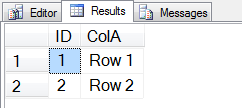

# SQL: OUTPUT clause and Triggers

#### Di [Sergio Govoni](https://mvp.microsoft.com/en-us/PublicProfile/4029181?fullName=Sergio%20Govoni) – Microsoft Data Platform MVP

English Blog: <http://sqlblog.com/blogs/sergio_govoni/default.aspx>

UGISS Author: <https://www.ugiss.org/author/sgovoni>

Twitter: [@segovoni](https://twitter.com/segovoni)


*Agosto, 2012*

Introduzione
============

Recentemente, ho avuto l'occasione di apprezzare la clausola OUTPUT per determinare il valore degli identificativi univoci restituiti da un'operazione di INSERT, per una colonna di tipo Integer (ID) con proprietà [IDENTITY](http://msdn.microsoft.com/en-us/library/aa933196(v=sql.80).aspx). L'esigenza era quella di determinare il valore assegnato alla colonna ID di una tabella per le nuove righe inserite.

Come indicano i books on-line, la [clausola OUTPUT](http://msdn.microsoft.com/en-us/library/ms177564.aspx), implementata nell'edizione 2005 di SQL Server:

> "Restituisce le informazioni da (o le espressioni basate su) ogni riga interessata da un'istruzione INSERT, UPDATE, DELETE o MERGE. Questi risultati possono essere restituiti all’applicazione di elaborazione per l'utilizzo nei messaggi di errore, l'archiviazione e altri scopi simili dell'applicazione. I risultati possono anche essere inseriti in una tabella o in una variabile di tabella. Inoltre, è possibile acquisire i risultati di una clausola OUTPUT in un'istruzione nidificata INSERT, UPDATE, DELETE o MERGE e inserire tali risultati in una vista o tabella di destinazione."


Un esempio di utilizzo della clausola OUTPUT
============================================

Di seguito, riportiamo un esempio (opportunamente semplificato) di utilizzo della clausola OUTPUT. Ipotizziamo di avere a disposizione la tabella *dbo.TableA* e di voler ottenere in output, per ogni statement di tipo INSERT, i valori assegnati alle OUTPUT clause and Triggers *ColA* e *ID* (in particolare quelli assegnati alla colonna ID), per ogni riga inserita.

Il seguente frammento di codice in linguaggio T-SQL esegue il setup della tabella dbo.TableA sul database di sistema tempdb.

```SQL
USE [tempdb];
GO

-- Creazione tabella dbo.TableA
CREATE TABLE dbo.TableA
(
  ID INTEGER IDENTITY(1, 1) NOT NULL PRIMARY KEY
  ,ColA VARCHAR(64)
);
GO
```

Eseguiamo ora un'operazione di INSERT, sulla tabella *dbo.TableA*, aggiungendo la clausola OUTPUT in modo che siano restituite le informazioni richieste, relative alle righe inserite; la figura 1 illustra l'output (atteso) del seguente comando di INSERT:

```SQL
USE [tempdb];
GO

-- Inserimento dati di prova con restituzione delle informazioni inserite
INSERT INTO dbo.TableA
(
  ColA
)
OUTPUT
  inserted.ID
  ,inserted.ColA
VALUES
  ('Row 1'), ('Row 2');
GO
```



Figura 1 – Inserimento dati di prova con utilizzo della clausola OUTPUT

Ipotizziamo ora che questo comando di INSERT sia stato utilizzato all'interno di un'applicazione, distribuita a un cliente. Dopo qualche tempo, l'assistenza clienti riceve una segnalazione di errore proveniente proprio dal cliente presso il quale è stato fatto il deploy dell'applicazione nel cui codice sorgente è contenuto lo statement precedente (illustrato in figura 1).

Il messaggio di errore segnalato all'assistenza è quello illustrato in figura 2, che abbiamo riprodotto su SQL Server Management Studio (SSMS):


Figura 2 – SQL Server Error Message 334

Che cosa è successo all'applicazione? Che è in produzione già da molto tempo senza alcun problema? Non sono state eseguite modifiche al codice sorgente! Queste sono le prime domande che uno sviluppatore (tipicamente) si pone in questi casi.

Uno dei comandi di INSERT, inviati dall'applicazione a SQL Server, ora fallisce perché è stato creato un oggetto Trigger, attivo sulla tabella *dbo.TableA*, per l'evento INSERT.

La clausola OUTPUT, con la sintassi illustrata in figura 2, non può restituire informazioni relative alle righe inserite proprio per la presenza del Trigger. Il messaggio di errore suggerisce di utilizzare la clausola INTO per memorizzare le informazioni riguardanti le righe inserite in una variabile di tipo tabella oppure in una tabella temporanea.

Il seguente frammento di codice T-SQL contiene i comandi di creazione del Trigger *TR\_LogTableA* e della tabella di Log *dbo.LogTableA* su cui il Trigger tenta di memorizzare (inserire) altre informazioni.

```SQL
USE [tempdb];
GO

-- Creazione tabella dbo.LogTableA
CREATE TABLE dbo.LogTableA
(
  LogID INTEGER NOT NULL
  ,LogColA VARCHAR(64)
  ,Operation VARCHAR(1) NOT NULL DEFAULT 'I'
);
GO

-- Creazione trigger TR_LogTableA
CREATE TRIGGER TR_LogTableA on dbo.TableA
FOR INSERT
AS BEGIN
  /*
    Log degli INSERT eseguiti sulla tabella dbo.TableA
  */

  INSERT INTO dbo.LogTableA
  (
    LogID
    ,LogColA
    ,Operation
  )
  SELECT
    ID
    ,ColA
    ,'I'
  FROM
    INSERTED
END;
GO
```

Dopo aver adeguato il codice dell'applicazione attraverso l'utilizzo dell'opzione INTO per la clausola OUTPUT, abbiamo cercato di comprendere i motivi dell'errore, che sono da ricercarsi nel numero di result-set restituiti per lo statement.

Il codice ODBC, per eseguire la restituzione dei result-set, utilizza cicli di chiamate alle seguenti API: *SQLFetch*, *SQLNumResultCols*, *SQLRowCount* e *SQLMoreResults*.

Con il Trigger attivo, il primo result-set restituito riguardava il numero di righe inserite dal Trigger e non il numero di righe inserite dal comando che ha scatenato il Trigger! Il secondo result-set riguardava il numero di righe interessate dal nostro comando di INSERT (quello eseguito dall'applicazione) e l'ultimo result-set riguardava le informazioni relative alle righe inserite dallo statement che ha scatenato il Trigger, sostanzialmente quello che volevamo in primo luogo!


Conclusioni
===========

Ricordiamoci che l'implementazione di un Trigger avrà effetto sugli statement INSERT, UPDATE, DELETE e MERGE qualora in questi ultimi venga utilizzata la clausola OUTPUT. Per evitare potenziali errori si può usare l'opzione INTO (della clausola OUTPUT) specificando la destinazione dell'output. L'applicazione dovrà essere progettata in modo da poter leggere tutti i result-set restituiti. Una best practices da ricordare quando si realizza un Trigger è quella di aggiungere lo statement SET NOCOUNT ON per evitare venga restituito il result-set che descrive il numero di righe interessare dalle operazioni eseguite nel Trigger, tipicamente il testo "Affected number of rows".

#### Di [Sergio Govoni](https://mvp.microsoft.com/en-us/PublicProfile/4029181?fullName=Sergio%20Govoni) – Microsoft Data Platform MVP

English Blog: <http://sqlblog.com/blogs/sergio_govoni/default.aspx>

UGISS Author: <https://www.ugiss.org/author/sgovoni>

Twitter: [@segovoni](https://twitter.com/segovoni)
