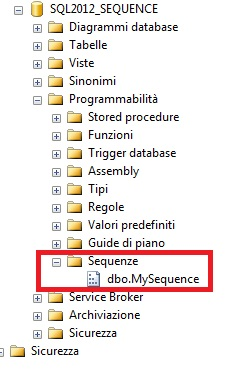
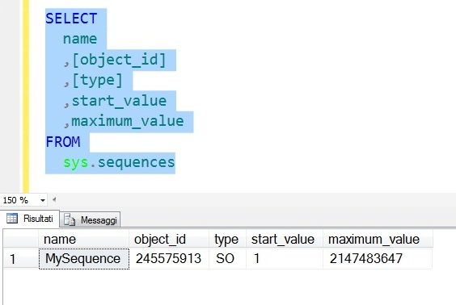
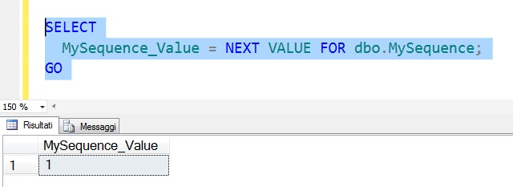
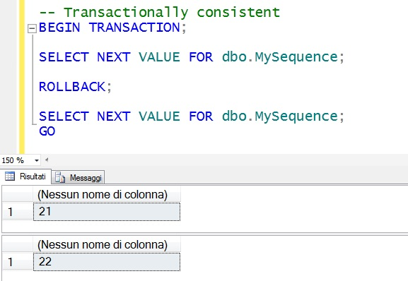
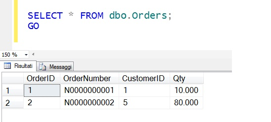

# SEQUENCE in SQL Server 2012

#### Di [Sergio Govoni](https://mvp.microsoft.com/en-us/PublicProfile/4029181?fullName=Sergio%20Govoni) – Microsoft Data Platform MVP

English Blog: <http://sqlblog.com/blogs/sergio_govoni/default.aspx>

UGISS Author: <https://www.ugiss.org/author/sgovoni>

Twitter: [@segovoni](https://twitter.com/segovoni)


*Ottobre, 2012*


Introduzione 
============

Questo articolo fornisce una overview dell'oggetto SEQUENCE che, implementato con SQL Server 2012, è in grado di generare una sequenza di valori numerici in funzione delle specifiche definite in fase di creazione. A differenza di una colonna di tipo IDENTITY, un oggetto SEQUENCE **non è associato** ad alcuna tabella; le eventuali relazioni con una o più tabelle del DB dovranno essere eventualmente gestite dall'applicazione.


Utilizzi Tipici 
===============

Un oggetto SEQUENCE può essere utilizzato in sostituzione di una colonna IDENTITY quando:

- L'applicazione richiede un numero (valore) prima che un comando di INSERT sia eseguito
- L'applicazione richiede che sia condivisa una singola sequenza di valori numerici tra più tabelle o tra più colonne all’interno della stessa tabella
- L'applicazione deve resettare la sequenza (valore corrente) quando si raggiunge un determinato numero. Ad esempio, dopo aver assegnato ad ogni nuova riga di un ordine di vendita valori compresi tra 1 e 20, le (eventuali) successive righe inserite dovranno ricevere ancora valori numerici compresi tra 1 e 20, e così via...
- L'applicazione richiede una sequenza di valori ordinati in funzione di un'altra colonna


Limitazioni 
===========

- Diversamente da una colonna IDENTITY, i cui valori tipicamente non possono essere modificati; i valori di una sequenza non sono protetti by design da eventuali UPDATE eseguiti ad esempio dopo aver inserito tali valori in un tabella
- Non ci sono vincoli automatici di univocità sui valori di una sequenza
- Gli oggetti di tipo SEQUENCE, dopo aver generato i valori coerentemente con la loro definizione, non sono in grado di controllare come tali valori saranno utilizzati
- I valori di una sequenza, inseriti ad esempio in una tabella, possono non essere contigui per effetto di eventuali ROLLBACK


L'oggetto SEQUENCE 
==================

Per creare un oggetto SEQUENCE è necessario utilizzare il nuovo statement [CREATE SEQUENCE](http://msdn.microsoft.com/en-us/library/ff878091(v=SQL.110).aspx) come riportato nel seguente frammento di codice in linguaggio T-SQL:

```SQL
USE [master];
GO

IF EXISTS(SELECT * FROM sys.databases WHERE NAME = 'SQL2012_SEQUENCE')
BEGIN
  ALTER DATABASE [SQL2012_SEQUENCE]
    SET SINGLE_USER WITH ROLLBACK IMMEDIATE;
  DROP DATABASE [SSDENALI_SEQUENCE];
END
GO

-- Create database
CREATE DATABASE [SQL2012_SEQUENCE];
GO

-- Change database context
USE [SQL2012_SEQUENCE];

-- Create new SEQUENCE object (drop if exists)
IF OBJECT_ID('dbo.MySequence', 'SO') IS NOT NULL
  DROP SEQUENCE dbo.MySequence;
GO

CREATE SEQUENCE dbo.MySequence
AS
  INT
  MINVALUE 1
  NO MAXVALUE
  START WITH 1;
GO
```

L'oggetto *dbo.MySequence*, appena creato sul database di esempio SQL2012\_SEQUENCE, è consultabile sia attraverso l'Object Explorer di SQL Server Management Studio (SSMS), sia attraverso la vista di sistema [sys.sequences](http://msdn.microsoft.com/en-us/library/ff877934.aspx), come illustrato rispettivamente in figura 1 e in figura 2.



Figura 1 – Oggetto *dbo.MySequence* in SSMS (Object Explorer)



Figura 2 – Query sulla vista di sistema sys.sequences

Il seguente frammento di codice T-SQL rappresenta un esempio di utilizzo della funzione [NEXT VALUE FOR](http://msdn.microsoft.com/en-us/library/ff878370(v=SQL.110).aspx) per l'oggetto SEQUENCE, in particolare il comando restituirà il prossimo valore delle sequenza numerica *dbo.MySequence*, che sarà uguale a uno in quanto questa occorrenza rappresenta la prima chiamata alla funzione NEXT VALUE FOR per la sequenza *dbo.MySequence*:

```SQL
SELECT MySequence_Value = NEXT VALUE FOR dbo.MySequence;
GO
```

L'output è illustrato in figura 3:



Figura 3 – Utilizzo della funzione NEXT VALUE FOR sulla sequenza *dbo.MySequence*

Osserviamo che per creare ed utilizzare l'oggetto *dbo.MySequence* non è stato necessario disporre di una tabella, non ci siamo neppure preoccupati di salvare su disco le informazioni relative alla sequenza (al momento, il database di esempio SQL2012\_SEQUENCE non contiene user-table).

Un problema tipico delle colonne IDENTITY è quello che si riferisce al reset dei valori della sequenza. Per resettare i valori di una sequenza numerica di un oggetto SEQUENCE si potrà utilizzare l'opzione RESTART WITH come riportata il seguente comando T-SQL:

```SQL
ALTER SEQUENCE dbo.MySequence RESTART WITH 20;
```

I prossimi valori restituiti, da *dbo.MySequence*, partiranno dal valore 20:

```SQL
SELECT next_mysequence_value = NEXT VALUE FOR dbo.MySequence;
GO
```

L'output è illustrato in figura 4:


Figura 4 – Valori restituiti dalla sequenza *dbo.MySequence* dopo il comando RESTART WITH

Ritengo sia importante segnalare che gli oggetti SEQUENCE non assicurano la transazionalità dei valori e quindi la continuità degli stessi ad esempio quando una transazione viene respinta (ROLLBACK) oppure quando più tabelle condividono valori provenienti dalla stessa sequenza. Nel prossimo esempio dimostreremo che i valori della sequenza *dbo.MySequence* rimangono "consumati" anche dopo il ROLLBACK del contesto transazionale in cui sono stati generati.

```SQL
-- Transactionally consistent
BEGIN TRANSACTION;

SELECT NEXT VALUE FOR dbo.MySequence;

ROLLBACK;

SELECT NEXT VALUE FOR dbo.MySequence;
GO
```

La figura 5 illustra l'output del precedente frammento di codice T-SQL.



Figura 5 - Valori della sequenza *dbo.MySequence* in un contesto transazionale

Vediamo ora uno degli utilizzi più tipici per un oggetto SEQUENCE, nel prossimo esempio verrà creata la tabella *dbo.Orders* in cui abbiamo evitato di utilizzare la proprietà IDENTITY per la colonna *OrderID* che rappresenta la Primary Key della tabella. La generazione dei valori univoci, da assegnare alla colonna *OrderID* della tabella *dbo.Orders*, è gestita attraverso la sequenza dbo.SO\_OrderID.

E' importante osservare l'utilizzo della funzione NEXT VALUE FOR nello statement INSERT INTO usato per popolare la tabella.

```SQL
-- Using of sequence instead of IDENTITY

-- Create a table (drop if exists)
IF OBJECT_ID('dbo.Orders', 'U') IS NOT NULL
  DROP TABLE dbo.Orders;
GO

CREATE TABLE dbo.Orders
(
  OrderID INT NOT NULL PRIMARY KEY
  ,OrderNumber VARCHAR(20) NOT NULL
  ,CustomerID INT NOT NULL
  ,Qty DECIMAL(8, 3) NOT NULL
);
GO

-- Create a sequence (drop if exists)
IF OBJECT_ID('dbo.SO_OrderID', 'SO') IS NOT NULL
  DROP SEQUENCE dbo.SO_OrderID;
GO

CREATE SEQUENCE dbo.SO_OrderID
AS
  INT
  START WITH 1
  INCREMENT BY 1;
GO

-- Insert some records
INSERT INTO dbo.Orders
(
  OrderID
  ,OrderNumber
  ,CustomerID
  ,Qty
)
VALUES
(
  NEXT VALUE FOR dbo.SO_OrderID
  ,'N0000000001'
  ,1
  ,10
),
(
  NEXT VALUE FOR dbo.SO_OrderID
  ,'N0000000002'
  ,5
  ,80
);
GO
```

Visualizziamo ora il contenuto della tabella *dbo.Orders*, ci aspettiamo due record, e per ognuno ci aspettiamo che la colonna *OrderID* sia stata valorizzata correttamente.

```SQL
-- Query the table
SELECT * FROM dbo.Orders;
GO
```
L'output ottenuto è illustrato in figura 6.



Figura 6 – Contenuto della tabella *dbo.Orders*

Conclusioni 
===========

SEQUENCE è un oggetto definito dall'utente, legato soltanto allo schema, in grado di generare una sequenza di valori numerici in accordo con la sua definizione. Attraverso questa overview è possibile valutare l'utilizzo di SEQUENCE nell'implementazione di un database SQL Server.

Per maggiori informazioni potete consultare la documentazione in linea [Sequence Numbers](http://msdn.microsoft.com/en-us/library/ff878058%28v=SQL.110%29.aspx).

#### Di [Sergio Govoni](https://mvp.microsoft.com/en-us/PublicProfile/4029181?fullName=Sergio%20Govoni) – Microsoft Data Platform MVP 

English Blog: <http://sqlblog.com/blogs/sergio_govoni/default.aspx>

UGISS Author: <https://www.ugiss.org/author/sgovoni>

Twitter: [@segovoni](https://twitter.com/segovoni)
