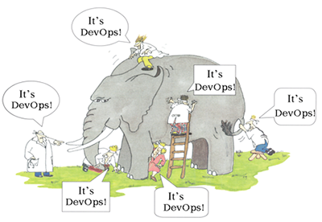
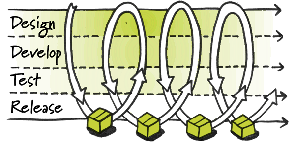
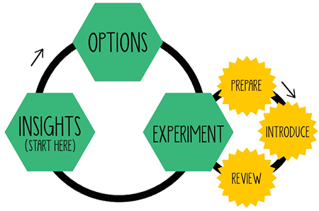
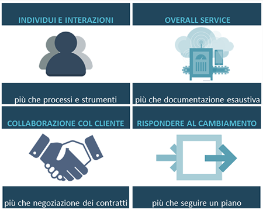
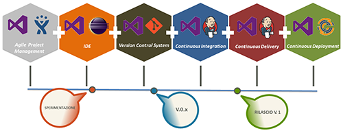
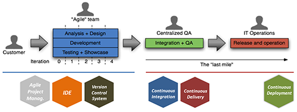

---
title: DevOps Jump Start - L'approccio DevOps
description: DevOps Jump Start - L'approccio DevOps
author: felicepescatore
ms.date: 08/01/2016
ms.topic: how-to-article
ms.service: ALM
ms.custom: CommunityDocs
---

# DevOps Jump Start - L'approccio DevOps

#### di [Felice Pescatore](https://mvp.microsoft.com/it-it/mvp/Felice%20%20Pescatore-5001016) - Microsoft MVP

Blog/Sito Personale: [http://www.felicepescatore.it/](http://www.felicepescatore.it/)

ALM Blog: [http://www.getlatestversion.it](http://www.getlatestversion.it)

*Gennaio 2016* 

Introduzione
------------

**DevOps** è il nuovo cambiamento *Culturale* che sta invadendo il mondo
dell’IT.

Si tratta dell’abbattimento dei *silos* aziendali, non solo quelli che
tipicamente caratterizzano Developers e Operation ma dell’intera *Line
Of Business* in un’ottica di visione olistica delle attività. Ancora una
volta si rafforza la consapevolezza che nessuna moderna iniziativa di
Business può prescindere dal supporto delle soluzioni IT.

Come ogni trasformazione, DevOps viene spesso utilizzata in modo
generico in differenti contesti, dai blog agli eventi, associandola
spesso, impropriamente, in modo esclusivo alle soluzioni teconcologiche,
senza però coglierne la vera essenza e le reali motivazioni abilitanti.

Partendo proprio da questo aspetto, in questa serie di post andremo a
vedere cos’è realmente DevOps e darmo uno sguardo a come *Microsoft
Release Managment*, insieme ad altre soluzioni spesso provenienti dal
mondo Open Source, consenta di ottimizzare il *Value Stream*.

Cos’è realmente DevOps
----------------------

L’enorme confusione che ruota intorno a *DevOps* suggerisce di iniziare
il viaggio alla sua scoperta con un approccio inverso, andando prima a
chiarire cosa non è DevOps, attraverso l’ottima sintesi fatta da *Gene
Kim*:

1.  **DevOps non sostituisce un approccio Agile**. Quello che cambia è
    l’estensione del concetto di “Done”: quanto realizzato è considerato
    completato solo quando i test di accettazione sono superati e quando
    la soluzione è in erogazione. L’Agile è tipicamente concentrato
    sugli aspetti dello sviluppo e, anche se fortemente consigliato, non
    è una condizione obbligatoria per poter abbracciare DevOps;

2.  **DevOps non rimpiazza la metodologia ITIL**. Nel marasma generale,
    spesso si pensa che l’ampia documentazione e i diversi livelli di
    certificazione ITIL, non possano andare d’accordo con metodologie
    meno “burocratizzate”. In realtà ITIL nasce dai risultati sul campo
    ed è pienamente in sintonia con DevOps, spingendo ad automatizzare
    quanto più possibile *processi*, *configurazioni*, *deployment*,
    oltre ad una opportuna governance di *Change Management*;

3.  **DevOps non significa NoOps**. Esattamente come accaduto per il
    Cloud, i sistemisti non diventano “inutili” ma innalzano l’asticella
    delle proprie competenze e delle proprie attività. L’obiettivo è
    infatti quello di abbattere il *Lead Time (o Time-to-Market)* e
    migliorare la produttività degli sviluppatori in relazioni al
    deploy: invece di aprire un ticket ed attendere che Ops si preoccupi
    del deploy, andando ad interpretare decine di pagine di
    documentazione, tali attività diventa un *servizio di commodity*;

4.  **DevOps non è applicabile solo al mondo dell’Open Source**. Anche
    se il movimento DevOps trova molti casi di successo nel mondo Open
    Source, con i relativi strumenti a disposizione, tutto il mondo
    dello sviluppo software oggi offre soluzioni per abbracciare questo
    paradigma e i relativi pattern applicativi: *Test Automatizzati*,
    *Continuous Integration*, *Versioning delle Configurazioni degli
    ambienti*, ecc. In questo ambito Microsoft con *VSTS/TFS* e *Release
    Management* sta realizzando una delle soluzioni più robuste ed
    integrate che si possano trovare sul mercato;

5.  **DevOps non significa solo “infrastructure as a code” o
    automatizzazione**. Benché l’automatizzazione sia alla base di molti
    pattern applicativi DevOps, il cuore di questo approccio è la
    condivisione degli obiettivi lungo l’intero *Stream di Valore* che
    sottende la realizzazione delle soluzioni IT;

6.  **DevOps non è solo per le Startup e le Unicorn.** DevOps è un
    approccio applicabile a qualsiasi realtà aziendale, soprattutto
    quelle che riconoscono nell’IT la propria dorsale di supporto (note
    anche come *Horse*), al fine di garantire qualità, affidabilità
    e sicurezza. Chiaramente, in un’azienda strutturata si tratta di un
    cambiamento radicale che riavvicina la mentalità della divisione IT
    a quella di una Unicorn al fine di garantire una maggiore efficienza
    di quanto realizzato in ottica del Valore per il cliente, interno o
    esterno che sia

Ma allora cos’è relamente DevOps? Spulciando tra le risposte che spesso
vengono date in merito nei vari eventi e nei vari blog/forum, si
evidenziano molti elementi:
-   *DevOps … is a movement, a philosophy, a way of thinking;*
-   *DevOps … is a person who can perform both Dev and Ops roles;*
-   *DevOps … means cross skilling people;*
-   *DevOps … is continuous delivery;*
-   *DevOps … is a team of developers and operation staff;*
-   *DevOps …is a culture movement;*
-   *DevOps … is monitoring.*

Figura 1 - It's DevOps!

che trovano tutti un loro spazio nella seguente definizione, a cui
faremo riferimento anche nel seguito:

> **DevOps** è un* **approccio Culturale** *in cui l’intera Line of Business si assume la responsabilità della creazione di **Valore** per il cliente.
>
> In tale scenario, Developers e Operations sperimentano continuamente nuovi modi di lavorare insieme, andando a standardizzare e padroneggiare i processi attraverso la **_ripetitività_** e  la **_pratica_**.

Questa definizione sposa anche i due punti focali di DevOps evidenziati
sempre da *Gene Kim*:

1.  *enfatizzare le performance dell’intero sistema*, ovvero avere una
    visione olistica di quanto si sta realizzando;
2.  *creare più percorsi di feedback*, per assicurarsi di essere sempre
    allineati rispetto agli obiettivi di qualità e di valore.
arrivando a trasformare il termine DevOps in un vero e proprio acronimo:

> **_DevOps_**: **D**elivery **E**nhanced **V**alues **O**ver **P**rocesses **S**mells 
> \[F.P.\]

Come ogni trasformazione Lean che si rispetti, il Team che realizza la
soluzione è il primo destinatario della trasformazione, aspetto che
viene colto egregiamente da *Jim Stoneham* di *Opsmatic*: **We
transformed from a team of employees to a team of owners**.

Proprio questo è il punto: non si tratta di ragionare in termini di
sviluppo o di operation, ma in termini di *Valore* prodotto per il
cliente, andando a ridurre il Lead-Time, e creando un circolo virtuoso
in cui il cliente si fida ed è soddosfatto della capacità dell’azienda
di rispondere alle proprie esigenze. In tale ottica, tutti diventano
responsabili in prima persona del successo dell’intero *Value Stream*.

Ma perché è così importante, anzi fondamentale, arrivare ad
un’integrazione automatizzata delle attività di sviluppo e di quelle
sistemistiche a supporto del prodotto? Ebbene, facciamo un esempio tipo
che ricalca un comune modello organizzativo di un’azienda IT, o una
divisione IT:

> *Il Team di Sviluppo realizza la nuova soluzione o una nuova feature,
> casomai lo fa con un approccio Agile/Lean volto alla qualità e
> all’ottenimento di un prodotto che rispecchia quanto desiderato dal
> cliente. Quando il Product Owner decide che è arrivato il momento di
> consegnare la soluzione nelle mani del cliente, è necessario
> pianificare la messa in esercizio con il Team di Operations che deve
> configurare i vari ambienti necessari, se non lo ha già fatto in
> precedenza. Pronti gli ambienti, il Team di Operations schedula il
> rilascio in produzione, effettua il deploy…. ma qualcosa non funziona
> cosa dovrebbe! *
>
> *Cos’è accaduto? Gli ambienti di sviluppo e produzione non sono
> allineati tra loro? La soluzione presenta qualche bug? Chi deve
> intervenire? Chi coordinata queste attività di verifica risoluzione
> incrociata?*

Ecco, qui troviamo il nocciolo della questione: i due team asseriscono,
separatamente, di aver completato correttamente quanto dovevano e non si
capisce chi deve fare cosa. Intanto il Time-to-Market si allunga, si
crea caos e il cliente vede ritardarsi la disponibilità della nuova
soluzione, cominciando ad innervosirsi non poco.

Attenzione: per il cliente è indifferente che il problema sia nel codice
o negli ambienti di esercizio perché lui non riesce ad utilizzare il
prodotto, per cui **il Valore di quello che faticosamente è stato
realizzato è pari zero**!

Risulta quindi evidente come la responsabilità del **deployment**,
inteso come momento di reale completamento della realizzazione di una
nuova soluzione, è una responsabilità condivisa, finanche al
middle-management che rappresenta la frontiera di dialogo e
comunicazione con il cliente, interno o esterno che sia.

Va da sé che il modo migliore per ragionare in chiave *Customer Value* è
quello di estendere all’intera catena IT un approccio Lean based,
ripensando all’idea del **deploy Big-Bang**, ovvero “effettuo il deploy
solo quando ho tutto pronto e funzionante sugli ambienti di QA”, in
favore di un approccio di **Continuous Deployment**, in cui i deploy
avvengono frequentemente (anche più volte al giorno) al fine di
rilasciare soluzioni incrementali in produzione.

Figura 2 - Continuous Deployment

In tal modo l’utente finale può realmente trarre benefico immediato
dalle nuove funzionalità introdotte e fornire feedback significativi per
focalizzare i nuovi obiettivi o rivedere parti di quanto realizzato.

I quattro Pilastri di DevOps
----------------------------

Cominciamo a concretizzare il nostro viaggio nel mondo DevOps,
descrivendo quelli che sono i 4 pilastri portanti: **_Comunicazione_**,
**_Integrazione_**, **_Collaborazione_** e **_Automazione_**.

Ognuno di questi elementi condensa dei fattori che vanno analizzati e
contestualizzati per ottenere il giusto bilanciamento degli interventi
da effettuare e tracciare il percorso da intraprendere per il
cambiamento. In chiave *Lean Change Management*, è possibile operare
secondo il ciclo **Insights-Options-Experiment** che permette di
ponderare i vantaggi rispetto ai rischi ed i costi del cambiamento
proposto.

Figura 3 - Insights-Options-Experiment \[rif. Lean Change Management\]

Così, tra i fattori su cui intervenire nella **_Comunicazione_**
troviamo:
-   *Abbattere le barriere tra le aree funzionali aziendali;*
-   *Condividere le responsabilità individuando nuovi ruoli;*
-   *Distillare la conoscenza aziendale;*
-   *Focalizzarsi sui servizi a supporto del business, non sulla tecnologia;*
-   *Creare un senso di fiducia reciproco.*

per l’**_Integrazione_**:
-   *Abbattimento delle barriere tra Sviluppo e Operation;*
-   *Migliorare e automatizzare la collaborazione tra le varie Aree funzionali;*
-   *Rimuovere gli Ostacoli e i Colli di Bottiglia;*
-   *Favorire il flusso informativo dall’Idea alla Consegna al Cliente;*
-   *Creare Loop di Feedback ad ogni fase.*

per la **_Collaborazione_**:
-   *Relazioni Face-to-face, real time;*
-   *Ridurre al minimo, idealmente abolire, le comunicazioni formali;*
-   *Team di piccole dimensioni focalizzati sul Business;*
-   *Condividere i problemi con i pari e gli altri colleghi;*
-   *Utilizzare strumenti di Visual Management / Information Radiator.*

per l’**_Automazione_**:
-   *Automatizzare l’Esecuzione dei Task, soprattutto quelli ripetitivi;*
-   *Automatizzare i Processi, connettendo task e decisioni;*
-   *Automatizzare Delivery e Deployment, in funzione del Business;*
-   *Trigger Decisionali, sfruttando Analytics e Monitoraggio delle Applicazioni.*

Ogni contesto applicativo è chiaramente diverso, per cui è necessario
lavorare con estrema attenzione e dedizione all’interno della propria
organizzazione per sviluppare il proprio modello operativo:

> *“DevOps isn’t something you can buy -- it’s something you have to do,
> and you have to do it yourself.” \[John Michelsen, CTO, CA
> Technologies\]*

Figura 4 – DevOps… It’s something you have to do!

Ognuno dei quattro pilastri va valutato in funzione del bilanciamento
*costi-benefici-rischi* che si vuole ottenere, ma anche rispetto
all’impatto che ha su tutti coloro coinvolti nella filiera di business.
Tale bilanciamento è supportato da un set di *Valori*, *Principi* e
*Pratiche* che fanno da cappello a tre aspetti primari:
-   *enfatizzare le performance dell’intero sistema, ovvero avere una visione olistica di quanto si sta realizzando;*
-   *consentire una rapida disponibilità delle nuove soluzioni a servizio del business;*
-   *ridurre i rischi ed i costi andando ad aumentare la qualità.*

I **Valori** sono praticamente gli stessi del *Manifesto Agile*, anche
se con una estensione nel caso del secondo (“Software funzionate più che
documentazione esaustiva”) che si trasforma in **_Overall Service più che documentazione esaustiva_**, ponendo l’accento sulla necessità di
creare un servizio complessivo al cliente e non limitarsi a creare
software che funziona.

Figura 5 - DevOps Values

I **Principi** ci avvicinano alle pratiche, concentrandosi su aspetti
che pervadono l’intero assett aziendale: *Focus Aziendale, Lean,
Integrazione, Condivisione, Monitoraggio, Miglioramento continuo*.

Proprio come un ponte collega due diverse sponde di un fiume, i principi
consentono di “trasferire” i Valori in **Pratiche** quotidiane:
-   *Partecipazione attiva degli Stakeholder;*
-   *Testing automatizzato;*
-   *Gestione della Configurazione Integrata;*
-   *Change Management;*
-   *Continuous Integration; *
-   *Continuous Delivery;*
-   *Planning del Deployment Integrato;*
-   *Continuous Deployment;*
-   *Supporto alla Produzione;*
-   *Monitoraggio delle Applicazioni;*
-   *Dashboard automatizzate.*

Figura 6 - Value-Principles-Practice bridge

È evidente come l’obiettivo sia quello di ottenere una forte
integrazione (idealmente completa) di tutti gli aspetti relativi allo
sviluppo di una soluzione IT, responsabilizzato l’intero Team dedicato e
non soltanto la parte dedicata allo sviluppo o al delivery.

Agile Deployment Pipeline
-------------------------

Per collocare correttamente DevOps all’intero dell’intero del ciclo di
*Application Lifecycle Management*, è utile sfruttare la seguente
schematizzazione che sintetizza un tipico flusso operativo di *product
delivery*:

Figura 7 – Product Delivery

In questa *Value Chain* possiamo identificare l’**Agile Deployment
Pipeline (ADP)** che descrive gli step che portano il software dal
Version Control System nelle «mani» dell’utente finale, andando a
formare l’*ultimo miglio* della nostra attività di creazione del Valore:

ADP si ispira al “Value Stream Maps” di Lean Software Development: *ogni
step produce un output che è prelevato (pull) dallo step successivo solo
quando quest’ultimo è pronto ad elaborarlo.*

Nello specifico, abbiamo 6 *Work Center* associati ad altrettanti fasi
specifiche dello sviluppo della soluzione e a una serie di tool di
supporto specificamente ideati:

-   **Agile Project Management**, accompagna la fase di governance del
    progetto (o dei progetti) sfruttando metodologie e tool che consento
    di legare direttamente i vari *artefatti* alle attività annesse al
    *processo*;
-   **Integrated Development Environment** **(IDE)**, è un ambiente
    omnicomprensivo che permette di sviluppare nel linguaggio di
    riferimento, sfruttando le funzionalità dei framework
    interconnettendosi con i vari sistemi a supporto;
-   **Version Control System (VCS)**, consente una gestione efficace
    della propria code-base, persistendo i file, tracciando le modifiche
    e gestendo l’history di sviluppo. Tutte le build devono avvenire
    prelevando gli artefatti esclusivamente dal VCS;
-   **Continuous Integration** si tratta una pratica di sviluppo
     software dove i membri di un team integrano il lavoro
     frequentemente, almeno una volta al giorno, supportato da appositi
     tool di automazione.;
-   **Continuous Delivery**, è un set di principi e di pratiche volte a
     rilasciare il software in ambiente di pre-produzione, velocemente
     e frequentamene. Il tutto avviene sfruttando strumenti
     automatizzati di building e testing;
-   **Continuous Deployment**, è la fase successiva alla Continuous
     Delivery, incentrata sul rilascio automatizzato in ambiente di
     produzione della soluzione precedentemente convalidata
     in pre-prod. Solo le build che superano gli UAT (User
     Acceptance Test) e i QA Test (Quality Assurance Test) vengono
     messe in erogazione automaticamente.

La **Continuous Deployment** dovrebbe essere l’obiettivo per la
maggioranza delle aziende, se non vincolate da obblighi normativi,
contrattuali o altre limitazioni. È evidente, quindi, come Il deploy
manuale del software è assimilabile ad un *anti-pattern*, soffrendo di
una serie rilevante di problemi:
-   *richiede molta documentazione che dettaglia ogni singola attività
    da eseguire;*
-   *non viene tipicamente avvallato da test in un ambiente di
    pre-produzione simili a quelli di produzione;*
-   *vengono effettuate correzioni ai package durante il deploy;*
-   *il deploy non è confermato da test automatizzati;*
-   *l’attività di rilascio di una nuova versione richiede diverse ore;*
-   *frequenti rollback per malfunzionamento: sulla mia macchina
     funzionava!*
-   *tipicamente fatti di notte.*

Attenzione a non confondere la Continuous Deployment con la pessima
abitudine di modificare direttamente il codice sorgente in produzione e
con l’obbligatorietà che ogni singola modifica deve essere resa
disponibile immediatamente su tale ambiente.

Anche se non esiste una definizione del tutto univoca di Continuous
Deployment, quello che ne contraddistingue il processo, e gli ambienti
afferenti, è tipicamente una maggiore **stabilità generale**.
