---
title: Conflitti durante lo sviluppo concorrente
description: Conflitti durante lo sviluppo concorrente
author: MSCommunityPubService
ms.date: 08/01/2016
ms.topic: how-to-article
ms.service: ALM
ms.custom: CommunityDocs
---

# Conflitti durante lo sviluppo concorrente

#### di [Gian Maria Ricci](http://mvp.microsoft.com/en-us/mvp/Gian%20Maria%20Ricci-4025635) – Microsoft MVP

*Maggio, 2013*

Gestione conflitti in sistemi centralizzati
-------------------------------------------

I conflitti possono accadere in entrambe le tipologie di VCS (Version
Control Systems), sia in quello centralizzato sia in quello distribuito,
è comunque interessante capire a fondo come i vari sistemi riescano ad
identificarli per permetterne la risoluzione.

Nel source control standard di Team Foundation Server i conflitti
vengono rilevati sia durante la fase di Check-In, sia durante la fase di
Get-Latest. Durante un Get-Latest infatti, per ogni file modificato nel
server e che viene quindi scaricato per aggiornare la versione locale,
Visual Studio verifica se il file ha modifiche pendenti ed in caso
affermativo si ha un conflitto, poiché il file è stato modificato da due
distinte parti.

In caso di conflitto Visual Studio cerca di capire se è possibile
effettuare un merge automatico delle modifiche, senza richiedere dunque
l’intervento manuale dell’utente. Questo accade ad esempio se le
modifiche riguardano parti differenti di un file.

    

Nel caso non sia possibile procedere ad un merge automatico, lo
sviluppatore viene notificato e si procede ad effettuare un merge
manuale utilizzando Visual Studio o altri strumenti equivalenti. Come
nota si consiglia comunque di controllare sempre dopo il Get-Latest se
sono state scaricate nuove modifiche ed in caso affermativo, anche se
non vi sono conflitti, è sempre buona norma rieseguire gli Unit Test per
vedere se le modifiche scaricate sono compatibili con le modifiche
pendenti locali.

Durante un check-in la situazione è invece leggermente differente; si
supponga infatti che Marco abbia fatto un Get-Latest recuperando il
changeset con id 100 ed inizi a lavorare su di un file. Nel frattempo
Giorgio modifica lo stesso file effettuando Check-In e creando quindi un
changeset con id superiore, supponiamo il 101. Per correttezza Marco
dovrebbe sempre effettuare un Get-Latest e risolvere eventuali conflitti
prima di tentare un check-in; supponiamo invece che utilizzi la
procedura meno corretta e tenti di effettuare direttamente il check-in
senza curarsi di eseguire un Get-Latest.

In questo caso durante le operazioni di check-in, per ogni file viene
associato il numero di versione che tale file aveva nel workspace locale
quando sono iniziate le modifiche, nel nostro esempio 100. Il server
verifica quindi la versione attuale del file (in questo caso la 101
perché è stato modificato da Giorgio), e se le due versioni non
corrispondono il file è stato modificato da entrambi. Anche in questo
caso è possibile che le modifiche possano essere risolte da un
automerge, ma in caso non siano compatibili, il check-in viene bloccato.

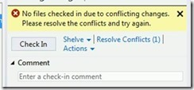
    

Questo blocco è fondamentale, perché se non ci fosse Marco avrebbe
erroneamente sovrascritto ed annullato le modifiche di Giorgio. Quando
il check-in viene bloccato, si rende necessario procedere ad un
Get-Latest e risolvere i conflitti localmente prima di tentare
nuovamente un check-in.

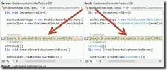
    

Gestioni conflitti in git
-------------------------

In un sistema distribuito la gestione dei conflitti è molto simile, ma
complicata dal concetto di commit locale. In questo scenario di esempio
si hanno due utenti: Gian Maria Ricci ed alkampferOutook, i quali
possono modificare entrambi lo stesso file e fare commit in locale
contemporaneamente. Questo accade perché il commit è locale, ogni
sviluppatore ha una linea di codice composta dai suoi commit e quindi
nessun conflitto si genera se due sviluppatori modificano e fanno commit
di uno stesso file. Si supponga che entrambi gli sviluppatori abbiano
fatto un clone di un repository, costituito per ora da un singolo commit
con id 202396b ed abbiano fatto alcune modifiche creando ognuno due
commit nel proprio repository locale.

NOTA: Nella descrizione seguente, ogni qualvolta si parla di **origin**
si intende implicitamente il server remoto predefinito collegato al
repository locale, che di base è il server da cui si è effettuato il
clone. Data la sua natura distribuita, è possibile che il proprio
repository locale Git si sincronizzi con più server (detti remote) e
quindi la dicitura server può risultare ambigua, non esistendo di fatto
il concetto di un unico server centralizzato.

Sebbene non si sia ancora parlato di branch, per ora si consideri
semplicemente che quando si effettua il primo commit in un repository
Git, viene automaticamente creata una prima branch chiamata master che
costituisce l’unica branch attiva.

Quando Gian Maria Ricci tenta di effettuare il **push** verso il server
origin, git non fa altro che verificare la posizione della branch
corrispondente nel sistema destinazione e se non ci sono stati
cambiamenti dall’ultima volta che è stato fatto **pull** esegue un
fast-forward, ovvero copia semplicemente i commit nel sistema
destinazione.

Quello che accade in dettaglio è: quando uno sviluppatore effettua un
pull (o il clone iniziale), tutti i commit del sistema remoto vengono
scaricati nel repository locale, cosi che i due repository siano
perfettamente allineati ed identici (nei sistemi distribuiti infatti
ogni sviluppatore ha una copia completa del repository). Quando uno
sviluppatore effettua commit locali, questi vengono aggiunti
sequenzialmente alla branch attiva ed ognuno ha un id (costituito da un
hash SHA1), come si può vedere con un git logf. (il comando logf non è
altro che un alias creato con l’istruzione git config --global
alias.logf "log --graph --oneline --all --decorate")

    

Il dato interessante è dato dalla colorazione, che identifica in maniera
univoca la situazione del repository. In primo luogo, in verde, è
mostrata la branch attiva locale; la master è attualmente pari alla HEAD
(è infatti l’unica branch ed è quella attiva), ed è associata all’ultimo
commit con hash *ca9fd1e*. La master remota, ovvero quella del TF
Service, è invece mostrata in rosso ed è chiamata **origin/master** ad
indicare appunto che è la branch master del remote chiamato origin.
Avendo effettuato due commit, la branch master locale è due commit più
avanti della master remota, che invece è ferma al *202396b*.
L’operazione di **push** non fa altro che tentare di inviare i due
commit locali al server e se nel frattempo nessuno ha effettuato
operazioni di push, questi commit locali vengono semplicemente copiati
nel server.

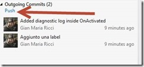
    

Effettuando di nuovo un log da riga di comando si può notare come ora la
origin/master sia allineata alla master locale, ed i due commit sono
stati correttamente copiati nel server.

    

Supponiamo ora che l’altro sviluppatore (AlkampferOutlook) abbia anche
lui effettuato due commit e tenti di effettuare l’operazione di push. In
questo caso i due commit sono sempre successivi al commit *202396b*, ma
nel frattempo la branch master del server è stata aggiornata ed ora
punta al commit *ca9fd1e*. In questo caso l’operazione viene fermata,
dato che non è più possibile effettuare il fast-forward;
AlkampferOutlook deve quindi effettuare il merge con le modifiche che
nel frattempo sono state inviate da Gian Maria Ricci. L’interfaccia
suggerisce quindi di effettuare un pull (operazione analoga al
get-latest) ed effettuare la merge in locale.

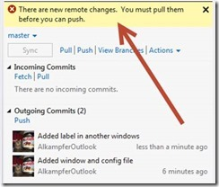
    

Tentando il push da command line il messaggio è molto più esplicito

    

Fetch, pull e risoluzione di conflitti in locale
------------------------------------------------

La soluzione al conflitto è fare un pull, ma prima di procedere in
questa direzione è preferibile entrare più a fondo nel funzionamento di
git per comprendere più in dettaglio cosa accade durante questa
operazione.

Una volta che il suo tentativo di Push è stato rigettato,
AlkampferOutlook può effettuare un log a riga di comando per capire lo
stato del suo repository.

    

La situazione è esattamente omologa a quella vista da Gian Maria Ricci
precedentemente, ovvero la master locale è due commit più avanti della
branch remota, ma questa informazione è purtroppo oramai obsoleta,
perché nel frattempo Gian Maria Ricci ha fatto push sulla master remota.
Per aggiornare la situazione del repository locale e scaricare i commit
che nel frattempo sono stati aggiunti al server è necessario usare il
comando *fetch* (git fetch)

Questo comando contatta il server remoto, scaricando le eventuali
modifiche effettuate dall’ultimo aggiornamento. Visual Studio ha il
vantaggio di mostrare una comoda visualizzazione grafica di quello che è
cambiato dopo che viene effettuato il fetch

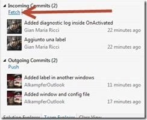
    

Dall’immagine precedente è immediatamente chiaro che Gian Maria Ricci ha
fatto due commit rispetto il nostro ultimo aggiornamento ed è necessario
dunque procedere ad un merge.

La stessa visualizzazione si può avere in command line:

    

In questo caso è leggermente più difficile comprendere cosa sia
successo, ma la rappresentazione grafica premette comunque di capire che
la branch master locale è partita dal commit *202396b*, ed è evoluta con
due commit (*806c743* e *d9f7cc7*), mentre la origin/master, partita
anche essa dal commit *202396b* è ora evoluta con altri due commit
(*8374733* e *ca9fd1e*) che sono stati effettuati da Gian Maria Ricci.

Un tool utile per familiarizzare con questi concetti ed avere una chiara
visualizzazione è stato scritto da Phil Haack e permette di avere una
visualizzazione grafica del proprio repository, in maniera analoga alle
varie immagini che si vedono sui tutorial o libri su Git. Il tool si
chiama SeeGit ed è possibile trovarlo qui
([*http://haacked.github.io/SeeGit/*](http://haacked.github.io/SeeGit/))

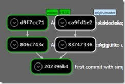
    

Se invece si vuole una visualizzazione grafica veramente completa è
possibile utilizzare un altro tool completamente gratuito chiamato
SourceTree, il quale permette di gestire un repository Git o Mercurial
fornendo una interfaccia molto intuitiva e che permette facilmente di
visualizzare le differenze tra i file.

A discapito del tool utilizzato, una volta effettuato il fetch, è
necessario procedere al merge tra le proprie modifiche e quelle appena
scaricate con il comando

    git merge origin/master

Questo comando non fa altro che effettuare una merge tra la branch
locale correntemente attiva (la master in questo caso) e la
origin/master. Se non vi sono conflitti, ovvero le modifiche nei vari
commit non riguardano le stesse porzioni di file, il merge viene
eseguito in maniera automatica e lo sviluppatore dovrà quindi procedere
alla verifica del merge stesso, in maniera analoga a quello che si fa
dopo un merge su un VCS centralizzato.

Le operazioni di fetch e merge sono comuni per allineare la propria
branch con quella di un server di upstream, per cui in git è presente il
comando **pull** *che effettua entrambi i comandi in uno*. In Visual
Studio infatti abbiamo la possibilità di effettuare il fetch o
direttamente il pull. Sia che venga fatto a riga di comando o da Visual
Studio o con qualsiasi altro tool questa è la situazione che si ha dopo
un fetch+merge (o pull)

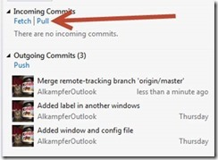
    

La situazione è ancora più chiara utilizzando l’utility di Phil Haack.

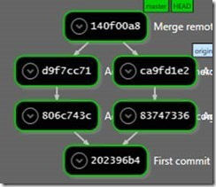
    

Dato che ogni sviluppatore possiede un repository locale, è molto comune
la situazione in cui, partendo da un singolo commit, si abbia la
divergenza con più linee di codice, una sviluppata in locale e l’altra
in uno dei remote con cui si sta lavorando. In questo caso quindi il
commit *140f00a8* ha due commit padri, perché costituisce la merge dei
due distinti rami di codice che si sono generati dal primo commit
*202396b4*. A tutti gli effetti quindi quando avvengono conflitti quello
che si fa è fare un merge della branch locale con la corrispondente
branch remota che è stata portata in locale con il comando *fetch.*

Una volta che la correttezza del merge è stata verificata (Unit Test e/o
verifica manuale), è possibile effettuare il push. Se nel frattempo
nessuno ha inviato altri commit, i tre commit (i due effettuati in
locale ed il risultato della merge) verranno inviati al server,
altrimenti sarà necessario procedere nuovamente ad un nuovo pull.

Risoluzione di conflitti all’interno di Visual Studio
-----------------------------------------------------

Naturalmente è possibile che entrambi gli sviluppatori abbiano
modificato lo stesso file, in questo caso durante il merge git
notificherà l’utente della presenza di uno o più conflitti.

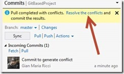
    

La comodità di uno strumento grafico come Visual Studio è capire con
facilità tutti i file che hanno attualmente generato conflitti ed avere
quindi un quadro preciso della situazione. È comunque possibile
utilizzare la command line anche per le operazioni di merge, dato che
gli eventuali conflitti vengono comunque risolti con un tool visuale,
lanciato in automatico dalla command line stessa.

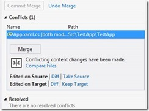

In questo caso il conflitto è su un singolo file, è possibile premere
sul link Compare Files per lanciare il compare tools di Visual Studio e
capire cosa è cambiato.

    

Di base però si preme il bottone Merge e si gestiscono i conflitti
direttamente da Visual Studio

    

Se avete installato precedentemente msysgit o i tool di GitHub è
possibile che premendo il bottone Merge vi si apra il KDiff3 o qualche
altro strumento di risoluzione conflitti. Questo accade perché git
memorizza nelle configurazioni gli strumenti da usare per il compare e
la risoluzione di conflitti, in modo che possano essere lanciati durante
il merge da command line. Dato che il plugin per git integrato in Visual
Studio preserva le configurazioni, se nel config è indicato di usare
kdiff3, Visual Studio onora la configurazione e non usa il suo strumento
integrato. Per risolvere questo problema ed usare Visual Studio è
possibile editare direttamente il file di configurazione di git locale o
globale inserendo questa configurazione

1.  

<!-- -->

1.  \[diff\]

    tool = vsdiffmerge

    \[difftool\]

    prompt = true

    \[difftool "vsdiffmerge"\]

    cmd = \\"C:\\\\Program Files
    (x86)[*\\\\Microsoft*](file:///\\microsoft\) Visual Studio
    11.0\\\\Common7\\\\IDE\\\\vsdiffmerge.exe\\" \\"\$LOCAL\\"
    \\"\$REMOTE\\" //t

    keepbackup = false

    trustexistcode = true

    \[merge\]

    tool = vsdiffmerge

    \[mergetool\]

    prompt = true

    \[mergetool "vsdiffmerge"\]

    cmd = \\"C:\\\\Program Files
    (x86)[*\\\\Microsoft*](file:///\\microsoft\) Visual Studio
    11.0\\\\Common7\\\\IDE\\\\vsdiffmerge.exe\\" \\"\$REMOTE\\"
    \\"\$LOCAL\\" \\"\$BASE\\" \\"\$MERGED\\" //m

    keepbackup = false

    trustexistcode = true

Il file di configurazione locale si chiama *config* ed è nella cartella
.git del repository locale, mentre il file di configurazione globale per
l’utente si chiama .gitconfig ed è nella cartella di profilo dell’utente
c:\\users\\nomeutente. Entrambi sono file di testo che possono essere
editati senza problemi. Localizzate le eventuali sezioni già presenti
(quelle tra parentesi quadre) e sostituitele con quelle mostrate sopra

Se non è stato configurato nessuno strumento, Visual Studio di default
utilizza i suoi strumenti integrati.

Indipendentemente dallo strumento utilizzato per la risoluzione dei
conflitti, una volta che tutti sono stati risolti, i file risultano
modificati e debbono quindi essere committati nel repository locale
prima di poter effettuare il push verso il server remoto. Nella figura
sottostante è infatti rappresentata la situazione in cui ho due commit
da inviare al remote, il primo è il commit che ha generato conflitto, il
secondo è quello che risolve il conflitto.

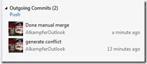
    

#### di [Gian Maria Ricci](http://mvp.microsoft.com/en-us/mvp/Gian%20Maria%20Ricci-4025635) – Microsoft MVP

