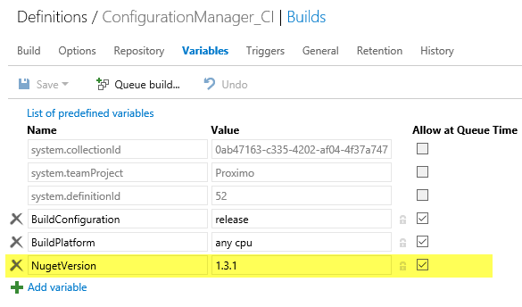
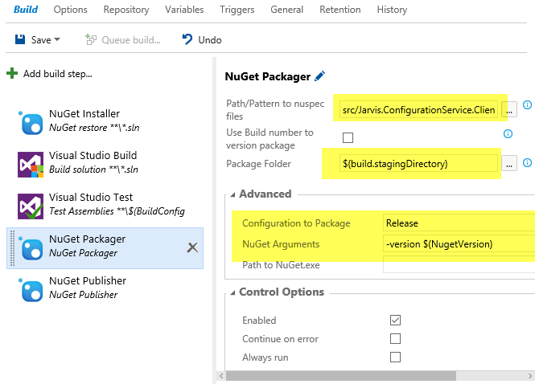
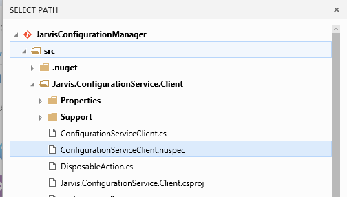
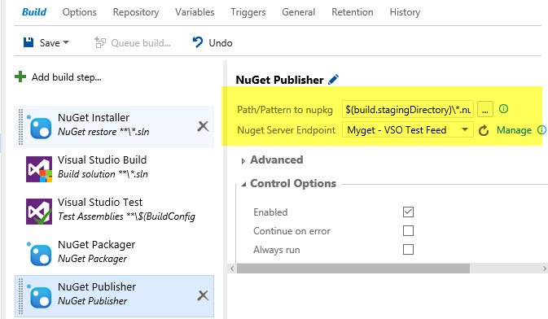
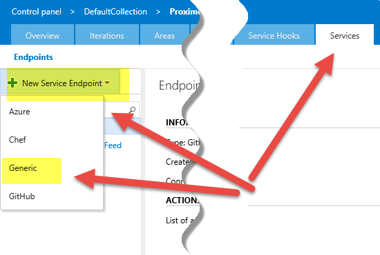
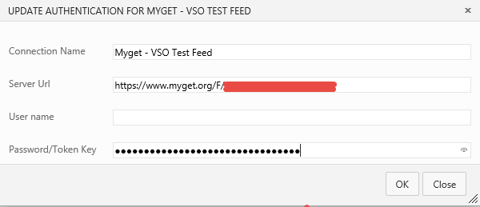
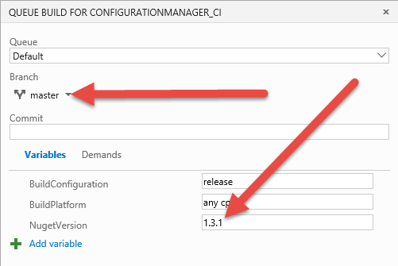
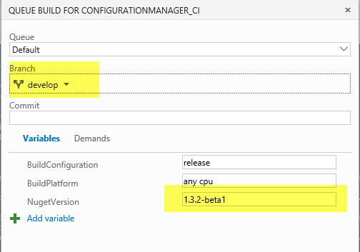
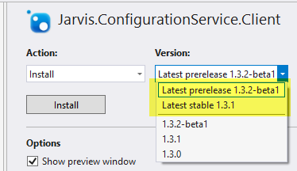

# Pubblicare un package nuget grazie alla build vNext di TFS / VSTS

di Gian Maria Ricci - Microsoft MVP
Blog inglese - [http://www.codewrecks.com](http://www.codewrecks.com)

Blog Italiano ALM - [http://www.getlatestversion.it/author/alkampfer/]
(http://www.getlatestversion.it/author/alkampfer/)

Blog Italiano - [http://blogs.ugidotnet.org/rgm](http://blogs.ugidotnet.org/rgm)

*Novembre 2015*

Grazie alle nuove funzionalità della build vNext di TFS2015 / VSTS, è
possibile con pochissimo sforzo pubblicare automaticamente un package
nuget in un feeed (che sia nuget o MyGet).

Prima di tutto è necessario creare un file .nuspec per ogni package che
si vuole pubblicare. Questo tipo di file contiene i dettagli necessari a
creare il pacchetto nuget; per chi non ne conoscesse il formato è
possibile consultare la documentazione online:
<https://docs.nuget.org/create/nuspec-reference>.

Una volta che il file è correttamente creato e salvato nel controllo di
codice sorgente, si può iniziare a personalizzare una build vNext
standard per la pubblicazione. Il primo passo consiste nell’andare nel
tab **Variables** per aggiungere una variabile chiamata NugetVersion,
come mostrato nella **Figura 1.**

**Figura 1:** *Introduzione di una nuova variabile che andrà a contenere
la versione di Nuget*

Specificare in questo modo il numero di versione è tipico di una build
che non ha abilitata l’integrazione continua, altrimenti ad ogni push
(git) o commit (TFVC) verso il repository centrale, verrebbe
ripubblicato un package con lo stesso numero di versione. In questo
esempio la build viene lanciata manualmente quando si vuole effettuare
una pubblicazione e per questa ragione, sempre in **Figura 1**, si può
notare che l’opzione “Allow at queue time” è stata spuntata, per
**permettere appunto all’utente di specificare la versione al momento di
accodare una nuova build**.

In questo scenario quindi, ogni qualvolta si vuole pubblicare una nuova
versione del package, si deve accodare manualmente una nuova build
specificando il numero di versione da usare. In un prossimo articolo
mostrerò come automatizzare la numerazione con il semantic versioning,
ma per questo esempio, il numero di versione viene gestito manualmente.

Naturalmente è consigliabile adottare una numerazione anche per gli
assembly, ma non è detto che essa debba corrispondere alla numerazione
del package nuget. Se si desidera versionare gli assembly nella build
vNext è possibile creare un semplice script PowerShell che va a
modificare i file Assemblyinfo.cs prima della build, come mostrato in un
articolo del mio blog inglese:
http://www.codewrecks.com/blog/index.php/2014/01/11/customize-tfs-2013-build-with-powershell-scripts/
. L’articolo in questione riguarda la build XAML, ma lo script è
perfettamente valido anche per una build vNext.

**Task per il packaging di Nuget**
----------------------------------

La build vNext in Visual Studio Online ha un task specifico per la
creazione del package nuget a partire dal file .nuspec. **Grazie a
questo task non è necessario andare ad includere nuget.exe nel
repository per poter creare il package**, perché è compito del task
stesso andare a configurare il build agent per scaricare tutto quello di
cui ha bisogno.

Se si è curiosi di come funziona il task, si può aprire la cartella dove
è installato l’agent di build vNext ed andare nella cartella Task, dove
si trova il NugetPackager. In questa cartella si possono trovare tutti
gli script PowerShell che verranno utilizzati dal task per creare il
file nupkg a partire dal file .nuspec.

**Figura 2:** *Aggiungere il task Nuget Packager per creare il file
.nupkg a partire dal nuspec durante la build.*

Naturalmente se sono presenti più file nuspec, (caso in cui sia
necessario pubblicare assieme una serie di packages), è possibile
specificare il wildcard \*\*\\\*.nuspec per eseguire il packaging di
ogni file .nuspec presente nel source control. In questo esempio è stato
deciso di pubblicare un unico package, ma la tecnica è esattamente la
stessa. Il prodotto dell’elaborazione di un file .nuspec è il package
nuget con estensione .nupkg che poi deve essere pubblicare in un feed.

Nel caso di pubblicazione di un singolo file, il bottone con le ellissi
permette di aprire una finestra di navigazione sul codice per
localizzare velocemente il file .nuspec che si desidera pubblicare.
Anche in questo caso si può apprezzare la flessibilità della build vNext
che fornisce una finestra di navigazione del codice sorgente
direttamente nella definizione della build. Il tutto fatto da un browser
web, non richiedendo più di avere Visual Studio installato per definire
una build, come per le vecchie build XAML.

**Figura 3:** *Navigazione nel source control per scegliere il file
.nuspec da pubblicare.*

Tra le opzioni da specificare nel task di packaging, particolare
importanza riveste la *package folder*, che rappresenta la cartella di
destinazione dove il task andrà a generare i file .nupkg. Il mio
consiglio è di usare la variabile di ambiente
**\$(Build.StagingDirectory)** in modo da utilizzare la *Staging
Directory,* una cartella speciale dove “parcheggiare” gli artefatti
prodotti dalle build e che viene cancellata prima di ogni build.

Se non si specifica questa opzione, i file nupkg vengono creati nella
stessa cartella del file .nuspec, e questa soluzione potrebbe generare
un problema se si sceglie di non effettuare un clean automatico dei
sorgenti durante la build. L’opzione di non eseguire un clean è spesso
usata per ridurre la banda, evitando di scaricare tutti i sorgenti ad
ogni build, ma purtroppo in questo modo si rischia che nella cartella di
lavoro dell’agent, si accumulino tutte le varie versioni di file .nupkg.
Se invece si sceglie la *staging directory* come target, si è sicuri che
dopo l’esecuzione del task, nella cartella si troveranno solamente i
.nupkg relativi alla build corrente.

Infine, nella sezione advanced, si possono specificare argomenti
aggiuntivi da passare a nuget.exe. Nel nostro caso è stata inserita la
riga di comando –version \$(NugetVersion) per usare il numero di
versione scelto dall’utente al momento dell’accodamento della build.

Pubblicazione su myget o nuget
------------------------------

L’ultimo passo che rimane da fare è aggiungere un task di tipo Nuget
Publisher, che ha lo scopo di effettuare il push del package .nupkg
sull’account nuget o myget designato.

**Figura 4:** *Lo step finale è usare il NuGet Publisher per effettuare
il push dei package.*

Avendo utilizzato la Staging Directory come cartella di destinazione per
i propri packages, come si può vedere in **Figura 4**, è sufficiente
indicare come target di pubblicazione il pattern
\$(Build.StagingDirectory)\\\*.nupkg in modo da pubblicare
automaticamente qualsiasi package che sia stato creato nei passi
precedenti. Se in futuro verranno aggiunti altri file .nuspec per creare
altri package, è sufficiente usare la Staging Directory come
destinazione ed il task di pubblicazione li pubblicherà tutti senza
necessità di cambiare configurazione.

La parte interessante di questo task è il NuGet Server Endpoint, che
identifica l’indirizzo del feed nuget o MyGet di destinazione. Non è
possibile specificare un qualsiasi testo in questo parametro, che invece
è costituito da una ComboBox a scelta multipla, per permette di
scegliere tra uno degli Endpoint configurati per l’account.

Se non si è ancora configurato l’endpoint per il proprio feed
NuGet/MyGet è sufficiente premere il bottone **Manage** alla destra
della ComboBox per essere ridirezionati nella sezione di gestione degli
Endpoint.

**Figura 5:** *Gestione degli endpoint in Visual Studio Online *

Gli endpoint non sono altro che la definizione di indirizzi esterni di
Servizi che si vogliono utilizzare dall’account di Visual Studio Online.
Alcuni tipi di endpoint specifici sono già presenti, ma dato che non
esiste nessun endpoint specifico per NuGet è necessario andare a creare
un nuovo endpoint di tipo **Generic. **

**Figura 6:** *Aggiunta di un endpoint di tipo generico verso il proprio
feed NuGet o MyGet.*

Oltre a usare un nome mnemonico per individuarlo è necessario indicare
una url e le credenziali di accesso. Per Nuget o MyGet si dovrà
utilizzare come url l’indirizzo del feed, lo UserName viene lasciato
vuoto ed infine è necessario specificare la API KEY nel campo Password /
Token Key. Una volta salvato l’endpoint nessuno sarà in grado di
recuperare la password, che verrà memorizzata in maniera sicura
all’interno di VSTS.

**Il vantaggio di questa tecnica è la possibilità di selezionare
l’endpoint nella definizione della build, senza dover conoscere la API
KEY del feed nuget**. Gli endpoint inoltre hanno la loro security, ed è
quindi possibile decidere gli utenti o i gruppi che possono utilizzare
l’endpoint stesso, garantendo così la massima sicurezza e flessibilità.

In questo modo chi è autorizzato ad usare l’endpoint può creare una
build che effettua la pubblicazione del package, senza conoscere però i
dettagli del feed, ed in particolare la API KEY, garantendo così una
maggiore sicurezza.

A questo punto la configurazione è finiza, si può quindi verificare che
tutto funzioni correttamente andando ad accodare una nuova build.

**Figura 7:** *Quando si accoda una nuova build è possibile selezionare
branch è versione.*

Grazie alla variabile di ambiente configurata è possibile selezionare il
numero di versione di nuget al momento di accodare la build. Se si
utilizza Git, si può inoltre decidere anche quale è la branch che si
vuole pubblicare. Se invece si utilizza TFVC non è possibile scegliere
la branch, che è invece definita del workspace specificato nella build.

Se la build riesce, si può andare a controllare nel proprio feed NuGet o
MyGet il risultato della pubblicazione.

**Figura 8:** *Il pacchetto è stato correttamente pubblicato nel feed
MyGet.*

Nella **Figura 7** è stata pubblicata la branch master utilizzando un
numero di versione come 1.3.1, che indica un package stabile, non in
pre-release. Se si adotta GitFlow o qualsiasi altro schema di branch,
per cui esiste una branch stabile ed una o piu branch di sviluppo non
stabili, è possibile pubblicare pacchetti in pre-releease.

Supponiamo di usare GitFlow e di avere una branch chiamata *develop*
dove solitamente il codice non è in uno stato stabile. Se si vuole
comunque pubblicare la branch develop con un pacchetto Nuget in
pre-release, è possibile schedulare una build sulla branch develop ed
adottare una numerazione di nuget tipica di un pacchetto pre-release,
come mostrato in **Figura 9**.

**Figura 9:** *Si può pubblicare una branch non stabile, come la
develop, semplicemente usando un numero di pacchetto NuGet pre-release.*

**In questo caso il suffisso al package è –beta1, che indica appunto un
pacchetto pre-release.** Una volta terminata la build, da Visual Studio
si verifica che effettivamente il pacchetto è stato correttamente
pubblicato con una versione in pre-release.

**Figura 10:** *Verifica in Visual Studio della corretta pubblicazione
della branch develop in pre-release.*

In questo modo si ha un modo semplice per pubblicare pacchetti in
versione non stabile per poter comunque effettuare test.

Grazie alla nuova build di VSTS / TFS, pubblicare un package nuget in
maniera semplice e sicura è questione di pochi click, mantenendo nello
stesso tempo la flessibilità nella pubblicazione contemporanea di
package in pre-release oppure in versione stabile.

Gian Maria.

