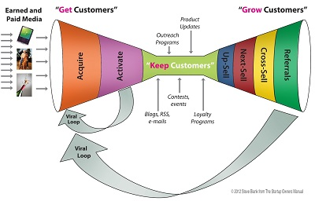
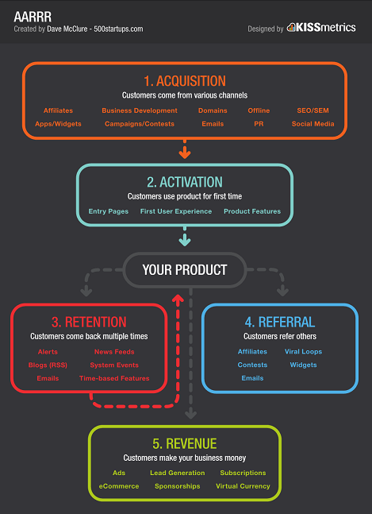

---
title: Jump Start (parte 3/3) - Growth Engine  
description: Jump Start (parte 3/3) - Growth Engine 
author: felicepescatore
ms.date: 08/01/2016
ms.topic: how-to-article
ms.service: ALM
ms.custom: CommunityDocs
---

# Jump Start (parte 3/3) - Growth Engine 

#### di [Felice Pescatore](https://mvp.microsoft.com/it-it/mvp/Felice%20%20Pescatore-5001016) - Microsoft MVP

Blog/Sito Personale: <www.felicepescatore.it>

ALM Blog: <http://www.getlatestversion.it/>

Lean Startup: Growth Engine
---------------------------

L’approccio scientifico proposto da *Lean
Startup* consente di validare le proprie ipotesi, accelerando quanto più
possibile il loop *build-measure-learn*. Finora abbiamo posto l’enfasi
sul creare il “giusto” prodotto/servizio in linea con la Vision,
rispondendo alla seguente domanda:

-   ***A value hypothesis**: What product or service will satisfy that
    demand?*

Ma la strategia scelta deve, inoltre, confutare una ulteriore e
fondamentale ipotesi:

-   ***A growth hypothesis**: How can growth be made sustainable so that
    it happens without requiring new funding?*

che ci proietta sulle questioni inerenti la crescita del proprio
business, andando a trasformare rapidamente, anche se gradualmente, il
nostro “esperimento” in un’azienda in grado di generare e sostenere
profitto.

Figura 12 - Strategy: 2 values

Si tratta di ricercare un modello di crescita dipendente dal contesto
che, per forza di cose, può evolvere in qualcosa di decisamente
complesso. Tale attività rientra nelle “cose noiose” che sono il succo
dell’*Innovation Accounting*, fondamentali per il successo del nuovo
business.

La crescita passa, banalmente, dall’acquisizioni di nuovi clienti. Tale
processo è ben rappresentato da *Steve Blank* (“*The Startup Owners
Manual*”) che definisce tre step fondamentali per attuarlo, andando a
coniare l’acronimo: **GKG**: **Get** (Customer) **Keep** (Customer)
**Grow** (Customer). In sintesi, l’obiettivo primario è quello di
acquisire (GET) un numero iniziale di clienti sufficienti a sostenere il
proprio business, creando le condizioni per fidelizzarli (Keep) e quelle
affinché si riesca ad ottenere una crescita sostenibile (Grow) che porti
nuove risorse finanziare da investire in nuovi esperimenti.

Durante la fase di crescita bisogna fare particolare attenzione ai nuovi
fattori, spesso in contrasto:

-   *esigenze dei clienti attuali;*

-   *ricerca di nuovi clienti;*

-   *gestione (aggiustamento) dell’attuale modello di business;*

-   *esplorazione di nuovi business model.*

Tali fattori (non esclusivi) vanno bilanciati attraverso pratiche di
gestione (anche qui, Innovation Accounting docet), come:

-   ***gestione oculata delle risorse, finite ma garantite**. Un budget
    eccessivo può portare a rilassarsi, mentre è fondamentale che quello
    allocato non venga tagliato al fine di garantire una tranquillità
    nelle attività;*

-   ***concedere autonomia nello sviluppo**. I Team impegnati nella
    sperimentazione devono essere relativamente liberi di organizzarsi e
    provare nuove soluzioni;*

-   ***stimolare e premiare i dipendenti**. Stock options e bonus sono
    un buono strumento per spronare i dipendenti a dare il meglio
    di se.*

Blank propone di approcciare al GKG secondo lo schema seguente:

Figura 13 - The Startup Owner’s Manual”: Get-Keep-Grow

in cui le varie fasi possono contare su una serie di tool e soluzioni,
ben riassunte nella figura seguente:

Figura 14 - GKG tools and solutions

La **crescita**, in particolare, garantisce la trasformazione della
startup in un’azienda consolidata, grazie alle revenue annesse e alla
possibilità di investire in nuovi progetti/iniziative/servizi. Non
sorprende, quindi, la sua trattazione esplicita in Lean Startup, che si
concentra sui cosiddetti **motori di crescita** (*Growth Engines*) da
applicare al proprio “esperimento” ed inquadrabili in due modelli
fondamentali:

-   **Jump-start Engine**, basati su azioni una tantum, come, ad
    esempio, l’acquisto di ADV slot sui più noti motori di ricerca;

-   **Sustainable Engine**, basati su azioni che generano un flusso
    continuativo di crescita.

Soprassedendo sul modello “Jump-start”, di facile comprensione, il
modello “sostenibile” è suddivisibile in tre specifiche categorie:

-   **Sticky**: i clienti che provano il prodotto/soluzione decidono di
    > utilizzarlo regolarmente (es. acquisti ripetuti o abbonamenti).
    > Questo modello di crescita spinge la startup a concentrarsi sui
    > clienti che ha già acquisito: un cliente felice vale più di 100
    > passaggi pubblicitari!

<!-- -->

-   **Viral**: basato sul passaparola (*word of mouth*), diretto
    o indiretto. Nel primo caso l’utente fa da promotore esplicito del
    prodotto, nel secondo è l’utilizzo implicito che contagia gli altri
    (*side effect*: l’esempio più ricorrente è il colore delle cuffie
    bianche dell’ipod che ne hanno spinto le vendite). La “misura del
    contagio” può essere fatta attraverso un *viral coefficient (VC)*,
    ovvero il numero dei nuovi utenti generati dai vecchi:

    -   *VC molto inferiore a 1, il trend di crescita è breve. Si
        immagini di avere VC=0.1, ciò significa che 100 utenti ne
        portano 10, quei 10 ne porteranno 1 e poi l’effetto virale
        termina;*

    -   *VC uguale (o molto vicini) ad 1, il trend di crescita è
        costante;*

    -   *VS maggiore di 1, crescita esponenziale.*

> L’ideale è che ogni cliente “contagi” almeno 1 nuovo utilizzatore
> (meglio più di uno, chiaramente) a provare il prodotto/servizio.
>
> Tale motore è particolarmente difficile da attuare perché richiede che
> il prodotto superi le attese stesse dei clienti e che il target di
> riferimento sia perfettamente inquadrato: in caso contrario l’effetto
> virale termina rapidamente e il numero di clienti tende presto a
> stagnarsi;

-   **Paid Growth**: ottenimento di nuovi clienti tramite
    > investimento diretto. La forma più comune di questo approccio è,
    > banalmente, la pubblicità, ma possiamo anche citare l’impiego dei
    > call center o l’apertura di sedi di rappresentanza in punti
    > strategici particolarmente trafficati. Il fattore predominante è
    > il *profitto marginale*, ovvero la differenza tra il *valore
    > totale del cliente* (*lifetime customer value*, il profitto legato
    > al cliente) e il *costo marginale* (costo di acquisizione
    > del cliente).

> Questo motore richiede che si verifichi costantemente la copertura dei
> costi: finché si ottiene un profitto su ogni cliente, è possibile
> investire i profitti stessi in ulteriore pubblicità per accelerare la
> crescita.

Ovviamente, i modelli di growth engine possono essere combinati, ma per
ottenere delle metriche specifiche che ne convalidino i risultati
(*Actionable Metrics*) è fondamentale che si riesca a misurare
puntualmente il loro effetto. Bisogna, inoltre, tener presente che un
growth engine va legato ad un breve/periodo di riferimento, dopodiché
può perdere rapidamente efficacia rendendo necessario un rinnovamento di
strategia o, in extremis, un PIVOT.

Prima di concludere è cruciale evidenziare che quando l’azienda passa da
uno stato di startup ad uno stato “consolidato”, non è ovviamente più
possibile fare esperimenti continui sul prodotto o sulla soluzione core,
dovendo garantire un alto livello di qualità ai propri clienti. In tal
caso è opportuno approcciare una (mini) divisione o un (mini) Team che
ha il compito di continuare a sperimentare soluzioni innovative
parallelamente al core business.
