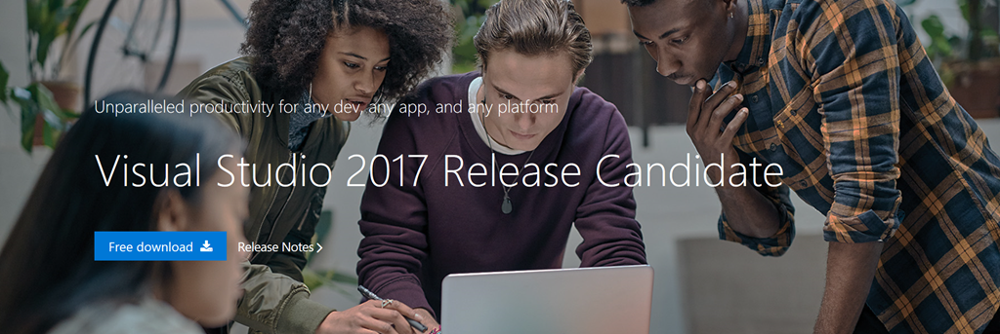
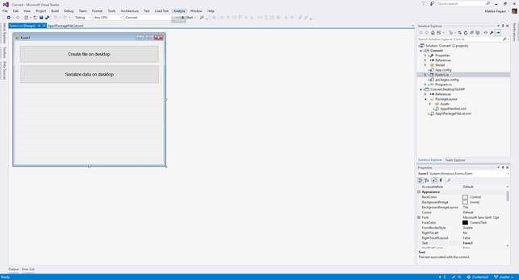
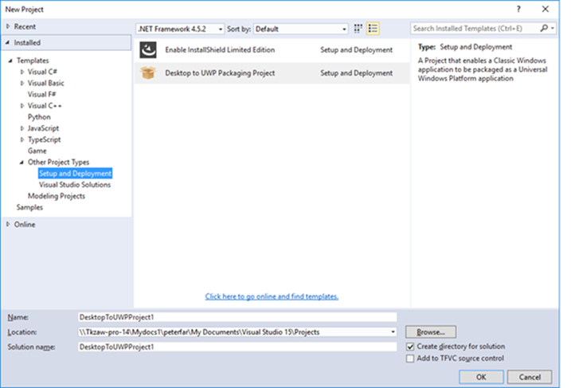
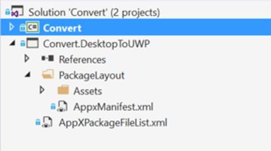
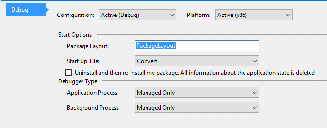
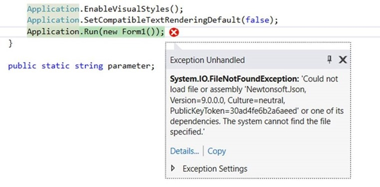

Desktop Bridge: convertire un’applicazione manualmente o con Visual Studio 2017
============================================================================================

Di [Matteo Pagani](http://twitter.com/qmatteoq), Windows AppConsult Engineer in
Microsoft

[Nell'articolo
precedente](desktop-bridge-utilizzare-il-desktop-app-converter.md)
abbiamo visto come, sfruttando il Desktop App Converter, sia possibile
convertire un installer (come un file MSI) in un pacchetto AppX, che può
essere installato manualmente su un altro computer, distribuito in
ambienti enterprise oppure pubblicato sullo Store come una normale
Universal Windows Platform app (previa autorizzazione da parte di
Microsoft).

In questo articolo, invece, vedremo la conversione di un’applicazione
desktop da un altro punto di vista: non più un installer tradizionale,
ma un semplice eseguibile o un vero e proprio progetto Visual Studio,
come ad esempio un’applicazione Windows Forms o WPF da noi realizzata e
della quale, di conseguenza, siamo in possesso del codice sorgente. Il
motivo principale per cui, solitamente, si vuole seguire questo
approccio rispetto all’uso di un installer è che non vogliamo limitarci
a pubblicare l’applicazione così com’è, ma vogliamo iniziare a
modificare il codice per iniziare a sfruttare alcune delle funzionalità
offerte dalla Universal Windows Platform, come supportare una live tile
o inviare una notifica toast.

Prima, però, di vedere come poter raggiungere questo obiettivo, facciamo
un passo indietro per poter approfondire le basi di come convertire
un’applicazione Win32 in un pacchetto AppX anche senza essere in
possesso di un installer.

### La procedura di conversione manuale

In realtà, [nell'articolo
precedente](desktop-bridge-utilizzare-il-desktop-app-converter.md),
abbiamo già potuto vedere un esempio di conversione manuale, anche se
non è stato esplicitamente indicato. Ricordate quando abbiamo cambiato
il contenuto della cartella **Assets** generata dal Desktop App
Converter, così da sostituire gli asset predefiniti con quelli reali
della nostra applicazione? In quel caso, dopo aver effettuato la
modifica, abbiamo sfruttato i tool **makeappx.exe** e **signtool.exe**
per ricreare il pacchetto e firmarlo con un certificato valido.

Questa procedura è esattamente la stessa che dobbiamo mettere in pratica
quando vogliamo convertire un semplice eseguibile sprovvisto di un
installer. La differenza principale è che, nell'articolo precedente, siamo
partiti da una cartella chiamata **PackageFiles** che il Desktop App
Converter aveva creato in automatico per noi: di conseguenza, avevamo
già una cartella con, al suo interno, il file di manifest, una
sottocartella con gli asset, ecc. Nel nostro caso, invece, dobbiamo
costruire tutto da zero. Partiamo, perciò, dal creare una nuova cartella
nel nostro computer, all’interno della quale andremo a ricreare una
struttura simile a quella generata dal Desktop App Converter. La prima
cosa che dobbiamo fare è recuperare l’eseguibile della nostra
applicazione (nel nostro esempio, è il file .exe che lancia
l’applicazione Windows Forms di prova che abbiamo usato nell’articolo
scorso) e copiarlo all’interno di questa cartella. Per lo scopo di
questo demo, andremo a riutilizzare la stessa applicazione Windows Forms
dell’altra volta, che potete trovare su GitHub all’indirizzo
<https://github.com/qmatteoq/DesktopBridge/tree/master/1.%20Desktop%20App%20Converter/HelloCentennial>

Potreste chiedervi il motivo per cui tutte le demo che ho preparato
siano basate su Windows Forms: in realtà, nessun motivo particolare, se
non per dimostrarvi che il Desktop Bridge è una tecnologia in grado di
funzionare non solo con le piattaforme più moderne e che potrebbero
avere più punti in comune con la Universal Windows Platform (come WPF,
con la quale condivide lo stack grafico basato su XAML), ma anche con
qualsiasi tecnologia Win32, anche le più datate come VB6 o Windows
Forms.

Dopo aver scaricato il progetto da GitHub e averlo compilato con Visual
Studio, quello che otterrete alla fine sarà un eseguibile di nome
**HelloCentennial.exe** all’interno della cartella **/bin/Debug**.
Prendetelo e copiatelo all’interno della cartella che avete creato nello
step precedente.

Il passaggio successivo è creare una sottocartella di nome **Assets**,
dove posizionare tutte le immagini che saranno utilizzate per
l’iconografia. Il requisito minimo è di avere almeno tre immagine alle
risoluzioni 150×150, 50×50 e 44×44. Se volete coprire tutti gli scenari
supportati dai vari asset (come il supporto a tutti i formati di tile e
a tutti i fattori di scala), potete aggiungere ulteriori asset, che poi
dovrete specificare nel file di manifest. Il modo più semplice per
raggiungere questo obiettivo è utilizzare un estensione di Visual Studio
che, partendo da un’immagine ad alta risoluzione, è in grado di generare
tutti gli asset necessari in tutti i formati. Potete installare
l’estensione dall’indirizzo
<https://visualstudiogallery.msdn.microsoft.com/09611e90-f3e8-44b7-9c83-18dba8275bb2>
e il suo utilizzo è molto semplice: create un progetto di tipo Universal
Windows Platform app vuoto, includete nella cartella **Assets** il logo
della vostra applicazione alla massima risoluzione possibile, poi
cliccateci sopra con il tasto destro e scegliete **Generate UWP Tiles**.
Il tool genererà per voi tutte le immagini e si farà carico anche di
aggiungerle all’interno del file di manifest. In realtà, voi potete
limitarvi a copiare tutte le immagini generate nella cartella **Assets**
del vostro progetto desktop che volete convertire, ignorando le
modifiche al file di manifest, dato che voi in realtà lavorerete su un
progetto differente (la cartella che pian piano stiamo costruendo da
convertire in un AppX).

L’ultimo passaggio è aggiungere il file di manifest vero e proprio,
creando un file di nome **AppxManifest.xml** usando un editor di testo
qualsiasi (Notepad, Visual Studio Code o Visual Studio tradizionale sono
solo alcuni esempi). Potete anche riutilizzare, per semplicità, il file
di manifest generato nell'articolo precedente tramite il Desktop App
Converter. Indipendentemente dalla vostra scelta, ecco come appare il
file di manifest che dovete creare:

```xml
<?xml version="1.0" encoding="utf-8"?>
<Package
   xmlns="http://schemas.microsoft.com/appx/manifest/foundation/windows10"
   xmlns:uap="http://schemas.microsoft.com/appx/manifest/uap/windows10"
xmlns:rescap="http://schemas.microsoft.com/appx/manifest/foundation/windows10/restrictedcapabilities">
  <Identity Name="***YOUR_PACKAGE_NAME_HERE***"
    ProcessorArchitecture="x64"
    Publisher="CN=***COMPANY_NAME***, O=***ORGANIZATION_NAME***, L=***CITY***, S=***STATE***, C=***COUNTRY***"
    Version="***YOUR_PACKAGE_VERSION_HERE***" />
  <Properties>
    <DisplayName>***YOUR_PACKAGE_DISPLAY_NAME_HERE***</DisplayName>
    <PublisherDisplayName>Reserved</PublisherDisplayName>
    <Description>No description entered</Description>
    <Logo>***YOUR_PACKAGE_RELATIVE_DISPLAY_LOGO_PATH_HERE***</Logo>
  </Properties>
  <Resources>
    <Resource Language="en-us" />
  </Resources>
  <Dependencies>
    <TargetDeviceFamily Name="Windows.Desktop" MinVersion="10.0.14393.0" MaxVersionTested="10.0.14393.0" />
  </Dependencies>
  <Capabilities>
    <rescap:Capability Name="runFullTrust"/>
  </Capabilities>
  <Applications>
    <Application Id="***YOUR_PRAID_HERE***" Executable="***YOUR_PACKAGE_RELATIVE_EXE_PATH_HERE***" EntryPoint="Windows.FullTrustApplication">
      <uap:VisualElements
       BackgroundColor="#464646"
       DisplayName="***YOUR_APP_DISPLAY_NAME_HERE***"
       Square150x150Logo="***YOUR_PACKAGE_RELATIVE_PNG_PATH_HERE***"
       Square44x44Logo="***YOUR_PACKAGE_RELATIVE_PNG_PATH_HERE***"
       Description="***YOUR_APP_DESCRIPTION_HERE***" />
    </Application>
  </Applications>
</Package>
```

Preceduti da una serie di asterischi trovate tutti i valori che dovete
cambiare affinché rispecchino quelli della vostra applicazione, come il
**Publisher** (che deve coincidere con il **Subject** del certificato
con cui firmerete l’applicazione o con quello che vi è stato assegnato
dal Dev Center, in caso di pubblicazione sullo Store) o i vari elementi
della sezione **Properties** (che rappresentano le informazioni che
saranno mostrate all’utente quando cercherà di installare la vostra app,
come il logo e il titolo).

La modifica più importante da effettuare, però, è quella relativa alla
sezione **Application**, nella quale dovete specificare il percorso del
processo Win32 che volete lanciare quando la vostra applicazione
convertita viene lanciata. Nel caso della nostra applicazione di esempio
che abbiamo compilato in precedenza, ecco come appare il file di
manifest:

```xml
<?xml version="1.0" encoding="utf-8"?>
<Package xmlns="http://schemas.microsoft.com/appx/manifest/foundation/windows10"
  xmlns:uap="http://schemas.microsoft.com/appx/manifest/uap/windows10"
  xmlns:uap3="http://schemas.microsoft.com/appx/manifest/uap/windows10/3" xmlns:rescap="http://schemas.microsoft.com/appx/manifest/foundation/windows10/restrictedcapabilities">
  <Identity Name="HelloCentennial" ProcessorArchitecture="x64" Publisher="CN=mpagani" Version="1.0.0.0" />
  <Properties>
    <DisplayName>Hello Centennial</DisplayName>
    <PublisherDisplayName>Matteo Pagani</PublisherDisplayName>
    <Logo>Assets\SampleAppx.150x150.png</Logo>
  </Properties>
  <Resources>
    <Resource Language="en-us" />
  </Resources>
  <Dependencies>
    <TargetDeviceFamily Name="Windows.Desktop" MinVersion="10.0.14393.0" MaxVersionTested="10.0.14393.0" />
  </Dependencies>
  <Capabilities>
    <rescap:Capability Name="runFullTrust" />
  </Capabilities>
  <Applications>
    <Application Id="HelloCentennial" Executable="HelloCentennial.exe" EntryPoint="Windows.FullTrustApplication">
      <uap:VisualElements DisplayName="HelloCentennial" Description="HelloCentennial" BackgroundColor="#777777"
    Square150x150Logo="Assets\SampleAppx.150x150.png" Square44x44Logo="Assets\SampleAppx.44x44.png" />
    </Application>
  </Applications>
</Package>
```

Come potete notare, abbiamo impostato gli attributi dell’elemento
**Application** nella maniera corretta:

-   **Id** è l’identificativo del nome dell’applicazione
-   **Executable** è il percorso completo dell’eseguibile che
    vogliamo lanciare. Dato che, in questo caso, il file è contenuto
    nella root della cartella, è sufficiente indicare solo il
    nome del’eseguibile.
-   **EntryPoint:** in questo caso si tratta di un valore fisso, ovvero
    **Windows.FullTrustApplication,** che indica il fatto che stiamo
    lanciando un’app che avrà diritti di full trust, ovvero di
    comportarsi come una normale applicazione Win32 ed effettuare
    operazioni che ad un’applicazione UWP tradizionale
    sarebbero precluse.

Alla fine del lavoro, dovremmo aver ottenuto una cartella simile alla
seguente:

 


Per comodità, se non volete ricreare manualmente tutta la struttura
preparata fino a qui, potete scaricare una copia della cartella
direttamente da GitHub all’indirizzo
<https://github.com/qmatteoq/DesktopBridge/tree/master/2.%20Manual/PackageLayout>,
da usare come punto di partenza per le fasi successive.

Il passaggio successivo è ricreare un pacchetto AppX partendo da questa
cartella e, per farlo, utilizzeremo lo stesso approccio manuale che
abbiamo visto [nell'articolo
precedente](desktop-bridge-utilizzare-il-desktop-app-converter.md)
quando abbiamo sostituito gli assett fittizi generati dal Desktop App
Converter con quelli reali della nostra applicazione. La prima
operazione da compiere è aprire un prompt dei comandi di Visual Studio e
sfruttare il tool **makeappx.exe** per creare il pacchetto AppX:

```
makeappx pack -d "C:\Centennial\PackageLayout" -p "C:\Centennial\Output\AppConverter.appx"
```

Nell'articolo precedente abbiamo scoperto il significato dei vari parameteri:
–**d** è il percorso della cartella con il contenuto del pacchetto,
mentre –**p** è il percorso completo del file .appx che vogliamo
generare. Al termine del processo, otterremo un file di nome
**AppConverter.appx,** che però non saremo in grado di installare
immediatamente in quanto non debitamente firmato con un certificato
valido. Anche in questo caso, dobbiamo utilizzare un altro tool di ci
abbiamo parlato nell'articolo precedente, chiamato **signtool.exe**. Potete
sfruttare il certificato generato automaticamente dal Desktop App
Converter oppure crearne uno manualmente, seguendo la procedura indicata
all’indirizzo
<https://msdn.microsoft.com/en-us/windows/uwp/porting/desktop-to-uwp-signing>

In entrambi i casi, una volta in possesso del certificato in formato
.pfx, potete procedere ad applicare la firma digitale lanciando il
seguente comando:

```
signtool.exe sign /a /v /fd SHA256 /f "auto-generated.pfx" /p "123456" "AppConverter.appx"
```

Vi ricordo il significato dei parametri più importanti, ovvero:

-   **/f** che è il percorso del certificato PFX con cui firmare il
    pacchetto
-   **/p**, che è la password utilizzata per proteggere il certificato
    PFX (se è stata specificata)
-   Il percorso del file .appx da firmare

Ci siamo! Ora abbiamo un pacchetto AppX che possiamo installare sulla
nostra macchina o condividere con altre persone, il quale si farà carico
di lanciare la nostra applicazione Windows Forms. Vi ricordo che, nel
caso in cui il vostro obiettivo sia la pubblicazione sullo Store, non è
necessario effettuare la firma digitale: ci penserà il Dev Center, in
fase di certificazione, a farlo per voi. Vi ricordo, però, che al
momento non è possibile pubblicare un’applicazione convertita tramite il
Desktop Bridge sullo Store senza previa autorizzazione di Microsoft: se
siete interessati a questa opportunità, perciò, dovete compilare il form
pubblicato all’indirizzo
<https://developer.microsoft.com/en-us/windows/projects/campaigns/desktop-bridge>
e, se la vostra applicazione rispetta i requisiti richiesti, verrete
contattati da una persona di un team dedicato che lavorerà con voi per
aiutarvi nel processo.

**Attenzione!** Nel file di manifest è necessario specificare il punto
di partenza dell’applicazione Win32 (nel nostro caso, l’eseguibile di
nome **HelloCentennial.exe**), ma dobbiamo ricordarci di includere nella
cartella che sarà convertita in AppX anche le DLL da cui dipende
l’applicazione (non importa se sono di terze parti o create direttamente
da voi), altrimenti otterrete un’eccezione a runtime.

Vediamo un esempio concreto, ipotizzando di voler aggiungere una nuova
funzionalità alla nostra applicazione Windows Forms: vogliamo
serializzare alcuni dati usando il formato JSON all’interno di un file
di testo che sarà salvato sul desktop dell’utente. Per rendere il
processo di serializzazione più semplice, sfrutteremo la popolare
libreria di terze parti Json.NET. Il primo passo, perciò, è fare clic
con il tasto destro sul nostro progetto Windows Forms, scegliere la voce
**Manage NuGet packages** e installare Json.NET, che troverete al primo
posto nell’elenco delle librerie disponibili. A questo punto, possiamo
aggiungere un pulsante nell’interfaccia che eseguirà il seguente codice:

```csharp
private void OnSerializeData(object sender, EventArgs e)
{
    Person person = new Person();
    person.Name = "Matteo";
    person.Surname = "Pagani";

    var json = JsonConvert.SerializeObject(person);
    string userPath = Environment.GetFolderPath(Environment.SpecialFolder.DesktopDirectory);
    string fileName = $"{userPath}\\person.txt";
    File.WriteAllText(fileName, json);
}
```

Se ora provassimo a compilare nuovamente il progetto in Visual Studio e
copiassimo all’interno della cartella **PackageLayout** solo il file
**HelloCentennial.exe** aggiornato, ma ci dimenticassimo di copiare
anche il file **Newtonsoft.Json.dll** (ovvero la libreria Json.NET
installata tramite NuGet) prima di creare il nuovo pacchetto AppX e
installarlo, otterremmo un’eccezione a runtime alla pressione del
pulsante, che porterà ad un crash della nostra applicazione.

Questo esempio, tra le altre cose, mette in evidenza alcuni limiti
dell’approccio manuale che abbiamo appena utilizzato per creare il
nostro pacchetto AppX:

1.  Ogni volta che facciamo delle modifiche al codice dell’applicazione
    Windows Forms, dobbiamo ricordarci di copiare tutti i file
    aggiornati nella cartella **PackageLayout** prima di creare un nuovo
    pacchetto AppX. Nell’applicazione di esempio utilizzata in
    precedenza, l’operazione è abbastanza semplice da portare a termine,
    dato che l’output di Visual Studio è solamente un eseguibile e una
    libreria di terze parti. Le cose sarebbero decisamente più
    complicate se avessimo invece a che fare con un progetto molto più
    complesso, composto da decide di librerie che possono essere
    modificate e aggiornate ogni volta che compiliamo una nuova build.
2.  Nel momento in cui abbiamo aggiunto un nuovo metodo per serializzare
    i dati, abbiamo aggiunto una dipendenza dalla libreria Json.NET,
    obbligandoci perciò a copiarla all’interno della cartella
    **PackageLayout** nel momento in cui dobbiamo creare il pacchetto.
    Se ci fossimo dimenticati di farlo, l’applicazione sarebbe
    semplicemente andata in crash, ma sarebbe stato complesso per noi
    identificarne il motivo. Se, infatti, avessimo provato a debuggare
    l’applicazione Windows Forms nativa, non avremmo avuto alcun
    problema: la serializzazione avrebbe funzionato alla perfezione. Il
    crash sarebbe sorto solamente nel momento in cui avessimo lanciato
    la versione convertita in AppX e, senza aver aggiunto del logging
    manuale (ad esempio, in un file di testo), sarebbe stato molto
    complesso trovare la causa dell’errore.
3.  Ogni volta che applichiamo delle modifiche al codice e vogliamo
    testare una versione aggiornata del pacchetto, dobbiamo tutte le
    volte ripetere i passaggi di creazione e firma tramite i tool
    **makeapp.exe** e **signtool.exe**.

Esiste un modo per migliorare l’esperienza di sviluppo?

### 

### Benvenuto Visual Studio 2017

Visual Studio 2017 (il cui nome ufficiale è stato recentemente svelato
durante l’evento Connect(), in precedenza era conosciuto con il nome in
codice di Visual Studio 15 Preview) rappresenta la prossima versione
dell’ambiente di sviluppo Microsoft, che sarà disponibile in versione
finale nel prossimo futuro e di cui, proprio durante Connect(), è stata
presentata la versione RC, che include anche una licenza go-live. Visual
Studio 2017 aggiunge molte nuove funzionalità e miglioramenti, come il
supporto alle novità di C\# 7.0 o l’opzione **XAML Edit and Continue**,
che consente di applicare modifiche al codice XAML di una pagina di
un’applicazione mentre è in esecuzione e di vederne, in tempo reale, i
cambiamenti. Inoltre, Visual Studio 2107 introduce un nuovo installer,
che vi permetterà di includere all’interno dell’ambiente di sviluppo
solo le funzionalità che vi servono veramente: in questo modo, una
installazione base impiegherà solamente pochi minuti per essere
completata, contro le numerose ore richieste dalle versioni precedenti.
E’ poi possibile, in maniera dinamica, aggiungere man mano moduli
aggiuntivi, in base alle vostre necessità.

Visual Studio 2017 supporta un’estensione specifica per il Desktop
Bridge, che permette di rendere l’esperienza di conversione e di debug
molto più semplice. In questo paragrafo raggiungeremo lo stesso
risultato di quello precedente (ovvero prendere un semplice eseguibile e
convertirlo in un’applicazione UWP), ma sfruttando questa volta Visual
Studio 2017 e l’apposita estensione.

Il primo passo è installare Visual Studio 2017 RC: nonostante la licenza
go-live, si tratta comunque di una versione non definitiva, perciò se
non vi sentite confidenti al 100%, sappiate che è possibile
tranquillamente installarla in parallelo a Visual Studio 2015,. E’
possibile scaricare la versione RC dal sito
<https://www.visualstudio.com/vs/visual-studio-2017-rc/>



Il passaggio successivo è scaricare e installare l’estensione dedicata
al Desktop Bridge, dato che non è inclusa automaticamente all’interno di
Visual Studio. La trovate all’interno della Visual Studio Gallery
all’indirizzo <http://go.microsoft.com/fwlink/?LinkId=797871>

Dopo aver installato tutto il necessario, possiamo iniziare a creare una
nuova applicazione Win32. Per la nostra demo, sfrutteremo nuovamente
l’applicazione Windows Forms che abbiamo convertito in precedenza, il
cui codice sorgente è disponibile su GitHub all’indirizzo
<https://github.com/qmatteoq/DesktopBridge/tree/master/3.%20Convert>

Come potete notare dall’immagine seguente, è la stessa applicazione che
abbiamo usato in precedenza: è composta da un semplice form con due
pulsanti, che creano alcuni file sul desktop dell’utente.



Se diamo uno sguardo più approfondito alla finestra contenente la
soluzione, però, potremo notare come, oltre al classico progetto Windows
Forms, ci sia anche un altro progetto, chiamato
**Convert.DesktopToUWP**. Tale progetto è stato creato utilizzando il
nuovo template di Visual Studio aggiunto dall’estensione che abbiamo
installato in precedenza. Per crearlo, è sufficiente fare clic con il
tasto destro sulla soluzione, scegliere **Add –&gt; New project** e,
nella sezione **Other project types –&gt; Setup and deployment**,
selezionare il template di nome **Desktop to UWP Packaging Project**.

 



Come impostazione predefinita, il nuovo progetto avrà il seguente
aspetto:


Il progetto contiene, inizialmente, un unico file, chiamato
**AppXPackageFileList.xml.** Si tratta del file che si fa carico di
effettuare il lavoro di deployment dei vari file dell’applicazione Win32
per conto nostro: descrive, infatti, quali sono i file (eseguibili e
DLL) che devono essere inclusi all’interno del pacchetto AppX. Ecco come
appare il file predefinito:

```xml
<?xml version="1.0" encoding="utf-8"?>
<Project ToolsVersion="14.0" xmlns="http://schemas.microsoft.com/developer/msbuild/2003">
  <!--
  <PropertyGroup>
    <MyProjectOutputPath>C:\MyProject\MyProject\bin</MyProjectOutputPath>
  </PropertyGroup>
  <ItemGroup>
    <LayoutFile Include="$(MyProjectOutputPath)\x86\Debug\MyProject.exe">
      <PackagePath>$(PackageLayout)\MyProject.exe</PackagePath>
    </LayoutFile>
  </ItemGroup>
-->
</Project>
```

Il contenuto del file è commentato, perché ha solo uno scopo
esemplificativo: andrà modificato con le informazioni reali in base alla
struttura della vostra applicazione.

-   L’elemento **MyProjectOutputPath** contiene il percorso della
    cartella in cui Visual Studio andrà a copiare i file che devono
    essere inclusi all’interno del pacchetto AppX (come gli exe e
    le DLL). Solitamente, si tratta dell’output dell’operazione di build
    dell’applicazione Win32, che vengono creati all’interno della
    cartella **bin** del progetto.
-   La sezione **ItemGroup** contiene uno o più elementi **LayoutFile,**
    uno per ciascuno dei file che deve essere incluso nel
    pacchetto AppX. Solitamente, ci sarà un elemento **LayoutFile** per
    ogni file .exe e .dll che è richiesto dall’applicazione Win32 per
    funzionare correttamente.

Prima di procedere con la configurazione del progetto, è importante
sottolineare una informazione molto importante: **questa estensione non
vi esenta dal dover creare manualmente una cartella che rappresenta il
pacchetto AppX**, ovvero quella che contiene, oltre all’applicazione
Win32, gli asset e il file di manifest, esattamente come abbiamo fatto
nel paragrafo precedente con l’approccio manuale. Questa operazione
rimane ancora a vostro carico: la differenza è che, questa volta, invece
di creare tale cartella in una posizione qualsiasi del vostro computer,
dovrete includerla all’interno del nuovo progetto di deployment che
abbiamo appena creato, come evidenziato nell’immagine seguente:



La cartella **PackageLayout** è esattamente la stessa cartella che
abbiamo creato all’inizio con l’approccio manuale: contiene una cartella
**Assets** (con le varie immagini usate per le tile e le icone) e lo
stesso file **AppxManifest.xml**. L’unica differenza è che, in questo
caso, non troverete più all’interno della cartella **PackageLayout** i
file **Convert.exe** e **Newtonsoft.Json.dll**: ci penserà il progetto
di deployment a copiarli per noi ogni volta che compiliamo una nuova
build.

Una volta aggiunta la cartella **PackageLayout** all’interno del
progetto di deploy UWP, dovrete impostare il suo percorso all’interno
del campo **Package Layout** che trovate nelle proprietà del progetto:



Questo campo, in realtà, non è una novità in senso assoluto specifica
del Desktop Bridge: troverete lo stesso campo anche in un normale
progetto UWP. Tipicamente, contiene il percorso alla cartella che
include tutti i file che saranno pacchettizzati all’interno dell’AppX
(che è proprio quello che vogliamo ottenere in questo caso).

Se abbiamo impostato correttamente il percorso della cartella, in
automatico si abiliterà il menu a tendina **Start Up Tile**, dal quale
potrete scegliere il nome del processo Win32 che sarà eseguito quando
l’applicazione UWP sarà lanciata (nel nostro caso, sarà **Convert**).
Una delle novità aggiunta recentemente dalla versione 0.2
dell’estensione è che, come Package Layout, possiamo specificare anche
un percorso relativo rispetto al progetto. Nel nostro caso, dato che la
cartella **PackageLayout** si trova nella root del progetto, potremo
includere semplicemente il nome della stessa all’interno del campo. In
questo modo, non avremo problemi anche nel caso in cui dovessimo
spostare il progetto in un’altra cartella del nostro computer.

L’ultimo passaggio è configurare in maniera opportuna il file
**AppXPackafeFileList.xml**, in modo che, ad ogni compilazione del
progetto di deploy, vengano automaticamente copiati i file necessari dal
progetto Windows Forms. Ecco come appare il nostro file XML:

```xml
<?xml version="1.0" encoding="utf-8"?>
<Project ToolsVersion="14.0" xmlns="http://schemas.microsoft.com/developer/msbuild/2003">
  <PropertyGroup>
    <MyProjectOutputPath>$(PackageLayout)\..\..\Convert\bin</MyProjectOutputPath>
  </PropertyGroup>
  <ItemGroup>
    <LayoutFile Include="$(MyProjectOutputPath)\Debug\Convert.exe">
      <PackagePath>$(PackageLayout)\Convert.exe</PackagePath>
    </LayoutFile>
    <LayoutFile Include="$(MyProjectOutputPath)\Debug\Newtonsoft.Json.dll">
      <PackagePath>$(PackageLayout)\Newtonsoft.Json.dll</PackagePath>
    </LayoutFile>
  </ItemGroup>
</Project>
```

All’interno della sezione **MyProjectOutputPath** abbiamo a disposizione
la parola chiave **\$(PackageLayout)**, la quale fa automaticamente
riferimento al percorso che abbiamo specificato nel campo **Package
Layout** nelle proprietà del progetto. In questo modo, possiamo
sfruttare percorsi relativi invece che assoluti quando dobbiamo
specificare, nelle sezioni successive, i vari file .exe o .dll da
copiare all’interno del pacchetto.

Il valore inserito all’interno dell’elemento **MyProjectOuputPath** ci
viene messo a disposizione tramite la keyword
**\$(MyProjectOutputPath)**, che possiamo sfruttare per creare un
elemento di tipo **LayoutFile** per ogni file presente nella cartella
**bin** dell’applicazione Windows Forms che vogliamo includere
all’interno del pacchetto AppX. Nel nostro caso, sono due i file da
includere: l’eseguibile vero e proprio (**Convert.exe**) e la DLL di
Json.NET (**Newtonsoft.Json.dll**).

Ora possiamo procedere, tramite Visual Studio, a compilare entrambi i
progetti e ad impostare, come progetto di avvio, quello di deployment e
non quello originale Windows Forms. Nel momento in cui facciamo il
deploy del progetto convertito, noteremo che, in automatico, all’interno
della cartella **PackageLayout** saranno stati copiati i file che ci
interessano: oltre alla cartella **Assets** e al file di manifest,
troveremo l’eseguibile e la libreria di Json.NET.


Inoltre, premendo F5 all’interno di Visual Studio, saremo in grado di
lanciare la nostra applicazione, ma non più come applicazione Windows
Forms nativa, bensì come applicazione convertita tramite il Desktop
Bridge, come se l’avessimo installata tramite il file AppX. Tutto ciò,
però, mantenendo intatta l’esperienza di debugging tradizionale: potremo
tranquillamente mettere dei breakpoint all’interno del codice
dell’applicazione Windows Forms, usare dei watcher, ecc.

Un esempio concreto di questo vantaggio è che possiamo intercettare
errori che non si verificano all’interno dell’applicazione Win32 nativa,
ma solamente nella versione convertita. Ricordate il crash che avevamo
citato all’iniziato nel caso in cui ci fossimo dimenticati di includere
nel pacchetto AppX la libreria di Json.NET? In questo caso, sfruttando
il progetto di deploy di Visual Studio 2017, avremmo potuto scoprire
immediatamente la causa, perché Visual Studio ci avrebbe fornito tutti i
dettagli dell’eccezione, come possiamo vedere nello screenshot seguente:



E’ importante però sottolineare come, al momento della stesura
dell’articolo, Visual Studio 2017 non includa ancora un processo
automatico per convertire un progetto di deployment in un pacchetto
AppX: ciò significa che, una volta che abbiamo terminato la fase di test
e debug della nostra applicazione convertita e siamo pronti per
preparare il file .appx da distribuire, dobbiamo ancora affidarci ai
tool manuali **makeappx.exe** e **signtool.exe** e creare manualmente il
pacchetto partendo dalla cartella **PackageLayout.**

### 

### In conclusione

Nel corso di questo articolo abbiamo imparato a sfruttare un altro
approccio offerto dal Desktop Bridge: invece di convertire un installer,
abbiamo convertito un eseguibile, in questo caso un’applicazione Windows
Forms da noi sviluppata. Per raggiungere questo obiettivo, abbiamo
dovuto creare manualmente una cartella con, al suo interno, tutti i file
necessari per ottenere un pacchetto AppX: gli asset, il file di manifest
e gli eseguibili e le librerie Win32 da lanciare.

Abbiamo, però, anche scoperto che esistono due modalità per raggiungere
il nostro scopo:

1.  Una manuale, che richiede di copiare all’interno della cartella del
    pacchetto tutti gli eseguibili e le DLL della nostra applicazione
    Win32 ogni volta che apportiamo una modifica.
2.  Una più automatica, che sfrutta Visual Studio 2017 ed una speciale
    estensione, che consente di copiare in automatico all’interno del
    pacchetto i file necessari ogni volta che ricompiliamo la soluzione.
    Questo approccio ci offre anche il vantaggio di avere a disposizione
    un’esperienza di debugging completa dell’applicazione convertita,
    ovvero che gira non come Win32 nativa ma all’interno del container
    della Universal Windows Platform. In questo modo, ci è più facile
    scoprire eventuali problemi legati non tanto all’applicazione in sè,
    ma alla sua esecuzione all’interno di un container.

Vi ricordo che trovate tutti i progetti di esempio utilizzati nel corso
del articolo sul mio repository GitHub all’indirizzo
<https://github.com/qmatteoq/DesktopBridge>. Nello specifico, i progetti
utilizzati in questo articolo sono:

-   <https://github.com/qmatteoq/DesktopBridge/tree/master/2.%20Manual>
    per quanto riguarda l’approccio manuale
-   <https://github.com/qmatteoq/DesktopBridge/tree/master/3.%20Convert>
    per quanto riguarda, invece, quello automatico. Vi ricordo che, per
    aprire questa soluzione, vi servirà la versione RC di Visual Studio
    2017 con l’apposita estensione installata, altrimenti non sarete in
    grado di aprire il progetto di deployment UWP.

Nel prossimo articolo partiremo da questa applicazione di esempio per
vedere un altro scenario consentito dal Desktop Bridge: l’integrazione
di API e feature della Universal Windows Platform.
