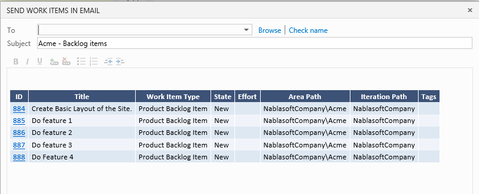
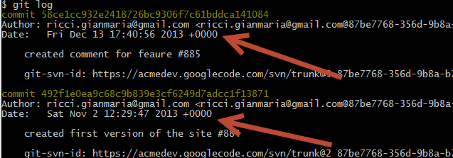
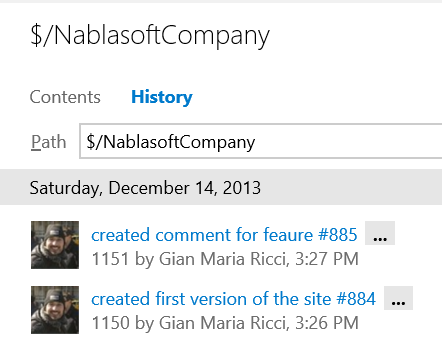
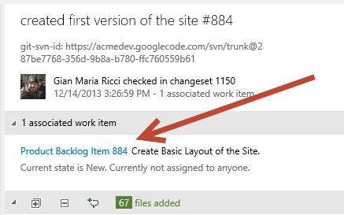

#### di [Gian Maria Ricci](http://mvp.microsoft.com/en-us/mvp/Gian%20Maria%20Ricci-4025635) – Microsoft MVP

Blog inglese: <http://www.codewrecks.com>

Blog Italiano ALM: <http://www.getlatestversion.it/author/alkampfer/>

Blog Italiano: http://blogs.ugidotnet.org/rgm

1.  {width="0.59375in" height="0.9375in"}

*Febbraio, 2014 *

Lo scenario
-----------

La ditta *Nablasoft* utilizza TFS (o Visual Studio Online) per la
gestione dei propri progetti ed ora deve assegnare del lavoro ad una
ditta esterna chiamata *Acme*. Supponiamo che tale ditta lavori in
Subversion (o Git) e che la ditta *Nablasoft* non voglia dare loro
accesso al TFS Aziendale. Per contratto infine la ditta *Acme* è tenuta
a fornire i sorgenti alla ditta *Nablasoft* perché essi sono di
proprietà di quest’ultima.

Sebbene questa situazione sembri strana, in realtà si presenta più
comunemente di quello che si pensa e soprattutto nel mondo .NET è molto
comune trovare piccole e grandi ditte che utilizzano Subversion o Git
come source control.

Le problematiche che si pongono sono le seguenti. In primo luogo spesso
la ditta *Nablasoft* non ha visibilità su quello a cui *Acme* sta
lavorando, ma al massimo richiederà un qualche stato di avanzamento
lavori. Quando il progetto termina solitamente *Acme* fornirà uno zip
con tutti i sorgenti, ma non fornirà la storia completa. Questi sorgenti
solitamente vengono inviati al TFS aziendale con un unico check-in al
termine dei lavori e risultano completamente scollegati dai Work Item
originali che *Acme* ha sviluppato.

Setup iniziale con la ditta *Acme*
----------------------------------

 Come primo passo *Acme* dovrà garantire a *Nablasoft* un accesso al
proprio Subversion (o Git) aziendale con un utenza appropriata. A questo
punto *Nablasoft* potrebbe creare un altro
[Team](http://blogs.ripple-rock.com/colinbird/2012/11/19/MultipleTeamsWithMicrosoftTeamFoundationServer2012VisualStudioScrumV2xUpdated1452013.aspx)
all’interno del proprio Team Project dove gestire il Backlog di *Acme*.
Se non siete familiari con il concetto di Team in TFS è sufficiente
avere una qualche modalità per distinguere le User Story (o PBI) ed i
relativi Task che andranno sviluppati da *Acme,* ad esempio si può
includere \#acme nel titolo della User Story e creare una semplice TFS
Query per recuperarli.

Il secondo passo è inviare la lista delle User Story ad *Acme* in modo
da assegnare a loro il lavoro da svolgere. La soluzione più immediata è
inviare una mail.

1.  {width="8.34375in"
    height="3.3854166666666665in"}

Il problema dell’invio per mail è però questo: se il destinatario, come
in questo caso, non ha accesso al tfs originale, dovete includere nella
mail stessa tutte le informazioni necessarie. Un’altra soluzione è
quella di caricare la query che individua il backlog di *Acme* in excel
ed inviare direttamente l’Excel ad *Acme.* In questo modo *Acme* può
anche cambiare stato ai work item, segnando l’avanzamento lavori e poi
può reinviarlo a *Nablasoft* periodicamente in modo che le modifiche
possano essere di nuovo Pubblicate sul TFS Aziendale.

Anche l’excel soffre dello stesso problema della mail, per cui il
consiglio è quello di aggiungere all’excel o mail un file word generato
importando il backlog di A*cme*, ad esempio utilizzando l’utility
gratuita [Word To TFS](http://www.aitgmbh.de/?id=222).

Gli sviluppatori di *Acme* dovranno porre ora attenzione ed includere in
ogni commit su subversion l’id del Work Item o dei Work Item correlati
nella forma \#WID (Hastag seguito dall’Id del work Item). Vedremo in
seguito perché questa regola tornerà molto utile per *Nablasoft*.

Utilizzare Git come Ponte tra Svn e TFS
---------------------------------------

A questo punto *Nablasoft* utilizzerà il tool **git svn** incluso con le
distribuzioni standard di Git per effettuare un clone completo del
repository Subversion di *Acme* in un repository Git locale. Il comando
è molto semplice ed è così composto.

     git svn clone https://acmedev.googlecode.com/svn/trunk c:\\Acme\\ReactiveSite
  -- -------------------------------------------------------------------------------

Una volta terminato *Nablasoft* avrà nella cartella
c:\\Acme\\ReactiveSite un repository Git con tutti i commit effettuati
sul Subversion di *Acme*. A questo punto è sufficiente [installare
git-tf](http://vimeo.com/57742458) per connettere lo stesso repository
Git locale ad una cartella del TFS aziendale basato su TFVC. Il comando
è molto semplice

     git-tf configure https://gianmariaricci.visualstudio.com/DefaultCollection \$/NablasoftCompany/Main/ReactiveSite
  -- ------------------------------------------------------------------------------------------------------------------

Questa semplice istruzione lega il repository locale Git alla cartella
\$/NablasoftCompany/Main/ReactiveSite del TFS aziendale *Nablasoft*. Si
può specificare qualsiasi percorso di source control a patto che sia
vuoto e che non contenga altri file all’interno. Grazie a Git si è
quindi effettuata una connessione tra un repository Subversion ed un
repository basato su TFVC.

Ora i comandi che verranno utilizzati saranno essenzialmente due, il
primo consente di scaricare nel repository Git locale i nuovi commit che
sono stati fatti sul Subversion di Acme, il comando è:

Git svn rebase

Dopo avere aggiornato il proprio repository Git locale si possono
inviare tutti i nuovi commit a TFS con il comando.

git-tf checkin –deep

A questo punto tutte le modifiche compresa la storia dei commit
originali di Subversion è stata trasferita nel TFS aziendale di
Nablasoft. Come ultimo passo potete utilizzare delle semplici utility
basate sulle API di TFS per scansionare tutti i Changeset importati ed
associarli ai corrispettivi Work Item sapendo che gli id sono inclusi
nei commenti con lo schema \#WID.

Se non sapete come utilizzare le API per effettuare questa operazione
potete trovare uno spunto in un mio post sul blog inglese: associate
check-ins to Work Items based on comment content.

Esempio di operatività
----------------------

Supponiamo che Acme abbia effettuato un paio di commit sul proprio
repository Subversion, come visibile nella history sottostante. Il primo
checkin è quello di creazione della struttura iniziale cartelle e non
contiene in realtà nessun dato interessante.

1.  {width="11.34375in" height="1.65625in"}

A questo punto dopo avere effettuato il git svn rebase il repository Git
locale di Nablasoft si presenterà in questo modo:

1.  {width="6.864583333333333in"
    height="0.8645833333333334in"}

Come si può notare nel repository git locale sono stati preservati i
commenti ed ogni commit in subversion ha un corrispondente commit in
Git. L’aspetto interessante è che Git ha preservato anche le date
originali dei commit come visibile nella figura sottostante.

1.  {width="6.634587707786527in"
    height="2.3226268591426074in"}

Lo sfasamento di un’ora dipende dal fatto che le date in Git sono state
memorizzate come UTC, infatti come si può vedere abbiamo un +0000 al
termine della data. Quando osservo la history con Tortoise SVN ho invece
la data automaticamente convertita al mio Timezone (Rome GTM +1).

1.  {width="5.759697069116361in"
    height="1.260259186351706in"}

A questo punto l’istruzione git-tf checkin --deep eseguirà il
trasferimento dei commit su TFVC, come si può vedere dalla history del
Team Project

1.  {width="4.604166666666667in"
    height="3.6354166666666665in"}

Ora è sufficiente eseguire l’utility che associa i Work Item ai
changeset id utilizzando la convenzione \#WID nei commenti ed il
trasferimento è finito.

1.  {width="4.551514654418198in"
    height="2.8433945756780403in"}

L’aspetto interessante è che nel commento, oltre al commento originale
Subversion è presente anche una riga in cui Git-Svn include l’id reale
del commit Subversion da cui questo changeset è stato creato. Questo
risultato è quasi uguale a quello che si avrebbe forzando *Acme* a
lavorare con il proprio TFS.

Lo svantaggio maggiore di questo approccio è l’effetto di “time
compression”, visibile nella penultima figura, da dove si vede
chiaramente che le date dei changeset non corrispondono. In TFS infatti
ogni changeset ha un numero incrementale e la successione temporale deve
essere preservata. Questo significa che quando l’utility git-tf effettua
il checkin dei nuovi commit, la data dei corrispettivi changeset è la
data in cui si sta effettuando il checkin, non la data originale del
commit Git. Per minimizzare questo problema è necessario effettuare
l’importazione abbastanza di frequente, magari scriptandola
semplicemente con uno script batch o powershell.

Conclusioni
-----------

Grazie a Git e agli strumenti che lo rendono compatibile con Subversion
(git svn) e con TFVC (git-tf) è possibile mantenere sincronizzato un
repository Subversion Esterno con un TFVC interno all’azienda. Nel caso
*Acme* avesse utilizzato un altro tipo di source control, affinché
questa tecnica sia applicabile è sufficiente l’esistenza di un Git-XX
che permetta di convertire tale repository in Git. *Acme* avrebbe
infatti potuto utilizzare anche un TFS interno aziendale; in questo caso
invece di utilizzare git svn si sarebbe utilizzato git-tf (in questo
caso è necessario utilizzare un ulteriore repository Git, dato che
git-tf ammette la connessione con un solo TFS).

Se invece *Nablasoft* avesse utilizzato direttamente Git nel proprio
TFS, non sarebbe stato nemmeno necessario utilizzare git-tf ne l’utility
personalizzata per associare i changeset ai Work Item. Dopo avere
importato con Git Svn il repository Subversion di Acme, sarebbe stato
sufficiente creare un nuovo repository Git associato al Team Project ed
impostarlo come Remote del Repository Git Importato.

Grazie a questa tecnica, nonostante *Acme* non abbia nessun accesso al
TFS di *Nablasoft* e voglia sviluppare con un proprio Source Control
come Subversion, *Nablasoft* è stata comunque in grado di creare questo
flusso:

1\) Inviare ad *Acme* il backlog delle cose da fare grazie
all’importazione Excel e Word To TFS\
2) Far si che gli sviluppatori di *Acme* fossero comunque in grado di
collegare un commit di subversion ad un Work Item di TFS grazie alla
notazione \#WID\
3) Importare in maniera progressiva gli incrementi di codice di *Acme*
nel proprio TFS e ricreare la connessione ai Work Item grazie alla
notazione \#WID

#### di [Gian Maria Ricci](http://mvp.microsoft.com/en-us/mvp/Gian%20Maria%20Ricci-4025635) – Microsoft MVP

Blog inglese: <http://www.codewrecks.com>

Blog Italiano ALM: <http://www.getlatestversion.it/author/alkampfer/>

Blog Italiano: <http://blogs.ugidotnet.org/rgm>
